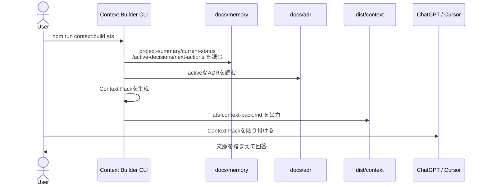
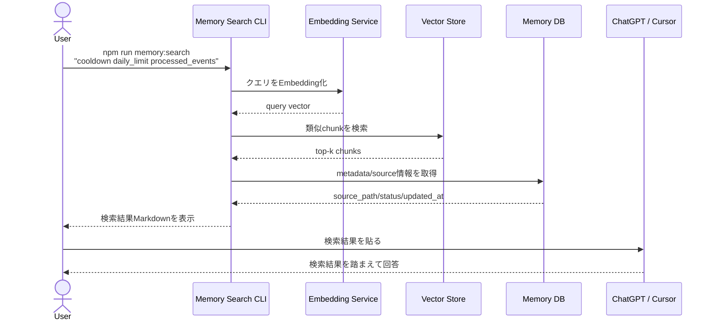
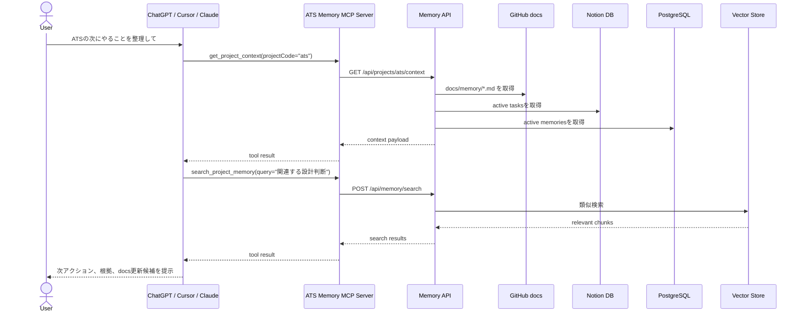

# Project Mnemosyne：AI外部記憶基盤を作る

## 企画書ドラフト

## 1. プロジェクト概要

**Project Mnemosyne** は、AIチャットとの会話・設計判断・タスク・ドキュメント・記事メモなどを外部記憶として整理し、AIが必要な文脈を再利用できるようにするための個人開発向け基盤である。

読み：**プロジェクト・ムネモシュネ**
由来：ギリシャ神話の「記憶の女神」
副題：**AI外部記憶基盤を作る**

このプロジェクトの目的は、AIにすべてを覚えさせることではない。
GitHub docs、ADR、Notion、PostgreSQL、RAG、MCP、API、Agentを組み合わせて、AIが参照できる「外部記憶」を構築することである。

---

## 2. 背景

現在、Adventure Token System、note記事、動画制作、設計ドキュメント作成など、複数の活動をAIと相談しながら進めている。

しかし、AIチャットは会話が長くなるほど以下の問題が発生する。

* 毎回プロジェクトの前提説明が必要になる
* 過去の設計判断を再説明する必要がある
* 以前決めたことと新しい会話が混ざりやすい
* 会話ログがそのまま流れていき、設計資産として残りにくい
* 「どこまで決定済みで、どこからが未決定か」が曖昧になる
* AIが古い情報や仮説を確定事項のように扱う可能性がある

特にATSでは、すでに以下のような設計思想がある。

```text
PostgreSQL = 正本DB
Notion = 副本・可視化
docs = 設計の正
ADR = 重要判断の記録
```

この考え方を、AIとの作業全体にも拡張する。

---

## 3. 解決したい課題

Project Mnemosyneで解決したい課題は、次の通り。

| 課題        | 内容                                            |
| --------- | --------------------------------------------- |
| 前提説明の重複   | 毎回ATSや各プロジェクトの背景を説明する必要がある                    |
| 判断履歴の散逸   | なぜその設計にしたのかが会話ログに埋もれる                         |
| タスクの分断    | 会話で出た次アクションがNotionやdocsに反映されない                |
| AI文脈の不安定さ | AIがどの情報を正として見ているか分からない                        |
| 会話ログのノイズ  | 生ログをそのまま保存しても再利用しづらい                          |
| 情報鮮度の問題   | 古い方針と新しい方針が混在する                               |
| ツール分散     | GitHub、Notion、ChatGPT、Cursor、Obsidianなどが分断される |

---

## 4. コンセプト

Project Mnemosyneのコンセプトは以下。

```text
AIに記憶を持たせるのではなく、
AIが参照できる記憶基盤を作る。
```

もう少し実務寄りに言うと、

```text
会話を流さず、設計資産に変換する。
```

ATS開発で使っている「正本・副本」の考え方を、AI活用全体に適用する。

---

## 5. 基本方針

## 5.1 正本と副本を分ける

Project Mnemosyneでは、情報の正本と副本を明確に分ける。

| 種別                      | 役割               |
| ----------------------- | ---------------- |
| GitHub docs             | 設計の正本            |
| ADR                     | 設計判断の正本          |
| PostgreSQL              | 構造化記憶・状態管理の正本    |
| Notion                  | 運用ビュー・タスク管理・記事管理 |
| Vector Store / pgvector | RAG検索用の副本        |
| Context Pack            | AIに渡すための生成物      |
| AIチャット履歴                | 一次メモ             |
| MCP Server              | AIクライアント向け接続口    |

重要なのは、**RAGやMCPを正本にしない**こと。

```text
正本:
GitHub docs / ADR / PostgreSQL

副本:
Notion / Vector Store / Context Pack

接続口:
CLI / API / MCP
```

---

## 5.2 会話ログをそのまま正本にしない

会話ログは一次メモとして扱う。

そのまま外部記憶に入れると、以下の問題が出る。

* 仮説と決定事項が混ざる
* 感情ログと設計判断が混ざる
* 古い方針が残る
* AIがノイズを拾いやすくなる

そのため、会話ログは次のように変換する。

```text
会話ログ
  ↓
要約
  ↓
Decision / Task / Issue / Idea に分類
  ↓
docs / ADR / Notion / DB に反映
```

---

## 5.3 AIに自由書き込みさせない

最初からAIにNotionやGitHub docsを書き換えさせるのは危険。

基本方針は以下。

```text
read: 許可
draft: 許可
write: 人間承認後
delete: 原則禁止
```

つまり、AIは更新案を作る。
最終反映は人間が確認して行う。

---

## 6. 用語整理

## 6.1 ADR

**ADR = Architecture Decision Record**

重要な設計判断の理由を残す記録。

例：

```text
ADR-001: docsを設計の正とする
ADR-002: PostgreSQLを正本DB、Notionを副本とする
ADR-003: Controllerに業務ロジックを置かない
ADR-004: processed_eventsで冪等性を保証する
```

ADRには以下を書く。

* 何を決めたか
* なぜ決めたか
* 他の選択肢
* その結果の影響
* 現在のステータス

---

## 6.2 RAG

**RAG = Retrieval-Augmented Generation**

大量のドキュメントを検索し、関連する情報だけをAIに渡して回答させる仕組み。

イメージ：

```text
Markdown / PDF / 会話要約
  ↓
チャンク分割
  ↓
Embedding化
  ↓
Vector DBに保存
  ↓
質問と近いチャンクを検索
  ↓
AIに渡して回答
```

RAGは「要約する仕組み」ではなく、**関連文書を探す仕組み**である。
要約・判断はAIが行う。

---

## 6.3 Vector DB / pgvector

文章の意味を数値配列として保存し、意味的に近い文章を検索するためのDB。

例：

```text
「processed_eventsで冪等性を保証する」
↓
[0.012, -0.082, 0.334, ...]
```

PostgreSQLに `pgvector` を追加すれば、通常のDBとベクトル検索を同居させられる。

---

## 6.4 MCP

**MCP = Model Context Protocol**

AIクライアントが外部ツールや外部情報源に接続するための仕組み。

イメージ：

```text
ChatGPT / Cursor / Claude
  ↓
MCP Server
  ↓
GitHub docs / Notion / DB / RAG
```

Project Mnemosyneでは、最終的に複数のAIクライアントから同じ外部記憶を参照できるようにするために使う。

---

## 6.5 Agent

Agentは、LLMに加えて、外部ツール呼び出し・検索・判断・実行手順を持つ作業主体。

Project MnemosyneにおけるAgentは、以下を行う。

* プロジェクト状況を確認する
* 関連docsを検索する
* ADRを参照する
* Notionタスクを確認する
* 次アクションを整理する
* docs更新案を作成する

---

## 7. 想定アーキテクチャ

最終形のイメージは以下。

```text
ChatGPT / Cursor / Claude
        ↓
   MCP Server
        ↓
   Memory API
        ↓
 ┌───────────────┬───────────────┬───────────────┐
 │ GitHub docs   │ Notion         │ PostgreSQL     │
 │ 設計の正       │ 運用ビュー       │ 状態・履歴       │
 └───────────────┴───────────────┴───────────────┘
        ↓
   Vector Search / RAG
        ↓
関連する記憶だけをAIに渡す
```

---

## 8. フェーズ構成

## Phase 1：Memory Foundation

### 副題：記憶の器を作る

### 目的

AI外部記憶の正本構造を作る。

### 実施内容

* `docs/memory` を作る
* `docs/adr` を整備する
* NotionにProject / Task / Decision DBを作る
* 会話ログを要約してDecision / Taskへ分解する

### 成果物

```text
docs/memory/project-summary.md
docs/memory/current-status.md
docs/memory/active-decisions.md
docs/memory/next-actions.md
docs/memory/ai-entrypoint.md
docs/memory/memory-policy.md

docs/adr/ADR-001-docs-as-source-of-design.md
docs/adr/ADR-002-memory-source-of-truth.md
docs/adr/ADR-003-human-approved-memory-update.md
```

### 位置づけ

自動化前の土台作り。
最も重要なフェーズ。

---

## Phase 2：Context Forge

### 副題：AIに渡す文脈を鍛造する

### 目的

AIに渡す文脈を1つのContext Packとして生成する。

### 実施内容

```bash
npm run context:build ats
```

出力：

```text
dist/context/ats-context-pack.md
```

### Context Packの中身

```md
# ATS Context Pack

## Project Summary
...

## Current Status
...

## Active Decisions
...

## Next Actions
...

## Relevant Docs
...
```

### 成果物

```text
scripts/context-build.ts
dist/context/ats-context-pack.md
```

### 位置づけ

ChatGPTやCursorに貼るだけで、プロジェクト文脈を復元できるようにするフェーズ。

---

## Phase 3：Recall Engine

### 副題：必要な記憶を呼び戻す

### 目的

GitHub docsや記事メモから、必要な情報を意味検索できるようにする。

### 実施内容

```bash
npm run memory:index
npm run memory:search "cooldown daily_limit processed_events"
```

### 対象

* `docs/domain-rules.md`
* `docs/usecase-contracts.md`
* `docs/repository-contracts.md`
* `docs/adr/*.md`
* `docs/review/*.md`
* note記事メモ
* 重要な会話要約

### 成果物

```text
memory_chunks
embeddings
search results markdown
```

### 位置づけ

大量の設計資産から、関連する記憶を検索するフェーズ。

---

## Phase 4：Memory Gateway

### 副題：記憶への入口をAPI化する

### 目的

CLIだけでなく、外部アプリや将来のMCP Serverから記憶を取得できるようにする。

### API例

```http
GET /api/projects/ats/context
POST /api/memory/search
```

### 実施内容

* Memory APIを作る
* Context Serviceを作る
* Search Serviceを作る
* GitHub Docs Serviceを作る
* Notion Serviceを作る
* Memory Repositoryを作る
* Vector Search Serviceを作る

### 成果物

```text
Memory API
Context Service
Search Service
Memory Repository
```

### 位置づけ

外部記憶をHTTP経由で使えるようにするフェーズ。

---

## Phase 5：MCP Nexus

### 副題：AIクライアントと記憶基盤を接続する

### 目的

ChatGPT / Cursor / Claude などから、共通の外部記憶基盤を利用できるようにする。

### 実施内容

ATS Memory MCP Serverを作る。

### MCP Tool候補

```text
get_project_context
get_current_status
list_active_decisions
search_project_memory
list_next_actions
get_related_adrs
create_doc_update_draft
```

### 初期MVP対象

```text
get_project_context
search_project_memory
list_active_decisions
list_next_actions
```

### 成果物

```text
ATS Memory MCP Server
MCP Tool definitions
Memory API integration
```

### 位置づけ

AIクライアントから外部記憶を自然に呼び出せるようにするフェーズ。

---

## 9. シーケンス概要

## 9.1 Phase 2：Context Pack生成



---

## 9.2 Phase 3：RAG検索



---

## 9.3 Phase 5：MCP経由での利用



---

## 10. データ設計の初期イメージ

## 10.1 projects

```text
id
project_code
project_name
description
status
created_at
updated_at
```

## 10.2 memories

```text
id
project_id
memory_type
title
content
status
source_type
source_path
created_at
updated_at
```

### memory_type候補

```text
fact
decision
task
preference
constraint
issue
idea
article_note
conversation_summary
test_result
```

### status候補

```text
active
draft
deprecated
superseded
archived
```

---

## 10.3 conversation_summaries

```text
id
project_id
summary_date
title
summary
topics
created_at
updated_at
```

---

## 10.4 document_chunks

```text
id
project_id
source_type
source_path
chunk_index
chunk_text
content_hash
status
created_at
updated_at
```

---

## 10.5 document_embeddings

```text
id
chunk_id
embedding
embedding_model
created_at
```

---

## 11. 初期ディレクトリ構成案

```text
project-mnemosyne/
  docs/
    project-plan.md
    architecture.md
    memory-policy.md
    roadmap.md
    adr/
      ADR-001-memory-source-of-truth.md
      ADR-002-human-approved-write-policy.md
    phases/
      phase-1-memory-foundation.md
      phase-2-context-forge.md
      phase-3-recall-engine.md
      phase-4-memory-gateway.md
      phase-5-mcp-nexus.md

  src/
    cli/
      context-build.ts
      memory-index.ts
      memory-search.ts
    services/
      contextBuilderService.ts
      ragSearchService.ts
      embeddingService.ts
      githubDocsService.ts
      notionService.ts
    repositories/
      memoryRepository.ts
      documentChunkRepository.ts
    api/
      routes/
        projectRoutes.ts
        memoryRoutes.ts
    mcp/
      server.ts
      tools/
        getProjectContext.ts
        searchProjectMemory.ts
        listActiveDecisions.ts
```

---

## 12. MVPスコープ

現時点ではATS優先のため、Project Mnemosyneは企画段階に留める。

将来着手する場合の最小MVPは以下。

```text
Phase 1 + Phase 2
```

### MVP成果物

```text
docs/memory/project-summary.md
docs/memory/current-status.md
docs/memory/active-decisions.md
docs/memory/next-actions.md
docs/memory/ai-entrypoint.md
docs/memory/memory-policy.md

docs/adr/ADR-001-docs-as-source-of-design.md
docs/adr/ADR-002-memory-source-of-truth.md
docs/adr/ADR-003-human-approved-memory-update.md

scripts/context-build.ts
dist/context/ats-context-pack.md
```

### MVPでやらないこと

```text
RAG検索
Memory API
MCP Server
自動Notion更新
自動GitHub docs更新
Webアプリ化
```

---

## 13. 将来拡張

将来的には、以下の用途に拡張できる。

| 対象      | 用途                    |
| ------- | --------------------- |
| ATS     | 開発文脈、設計判断、タスク継続       |
| TapLog  | 要件定義、技術仕様、実装タスク管理     |
| note発信  | 記事メモ、記事シリーズ、投稿戦略      |
| 動画制作    | カット割り、台本、素材管理         |
| 仕事の業務改善 | 業務フロー、課題、改善案、標準化メモ    |
| 個人開発全体  | プロジェクト横断のSecond Brain |

最終的には、個人用のAI開発支援基盤として機能させる。

---

## 14. リスクと対策

| リスク       | 内容                         | 対策                                   |
| --------- | -------------------------- | ------------------------------------ |
| 情報が散らかる   | Notion/GitHub/DBに同じ情報が重複する | 正本・副本ルールを明確化                         |
| 古い記憶を拾う   | RAGがdeprecatedな情報を返す       | status管理、updated_at、superseded_byを持つ |
| AIが誤更新する  | 勝手にdocsを書き換える              | AIはdraftまで。反映は人間承認                   |
| 作り込みすぎる   | ATSよりこちらが主目的化する            | 当面は企画メモに留める                          |
| 会話ログがノイズ化 | 生ログを大量保存して検索品質が落ちる         | 要約・分類してから保存                          |
| MCPが重い    | 初期実装負荷が高い                  | CLI → RAG → API → MCPの順に進める          |

---

## 15. 優先順位

現時点の優先順位は以下。

| 優先度 | 内容                            |
| --- | ----------------------------- |
| P0  | ATS開発を優先する                    |
| P1  | Project Mnemosyneは企画メモとして保存する |
| P2  | ATSが落ち着いたらPhase 1を検討する        |
| P3  | Context Pack生成CLIを試作する        |
| P4  | RAG / API / MCPは将来拡張とする       |

---

## 16. プロジェクトコピー

```text
毎回説明しないための、AI用プロジェクト記憶基盤。
```

```text
AIに記憶を持たせるのではなく、AIが参照できる記憶基盤を作る。
```

```text
会話を流さず、設計資産に変換する。
```

---

## 17. 現時点の結論

Project Mnemosyneは、今すぐ実装するプロジェクトではない。

現在はATSを優先する。
ただし、ATS開発・note発信・動画制作・今後の個人開発を継続する上で、外部記憶基盤の必要性は高い。

そのため、現時点では以下の位置づけとする。

```text
Project Mnemosyne
= 将来着手候補の個人用AI外部記憶基盤
= ATS開発の思想を拡張したメタプロジェクト
= 企画段階メモとして保存
```

最初に着手する場合は、RAGやMCPではなく、まず以下から始める。

```text
docs/memory を作る
ADRを作る
Context Pack生成CLIを作る
```

これにより、毎回AIに同じ前提を説明する負荷を下げ、プロジェクトの続きを効率よく進められる状態を作る。
