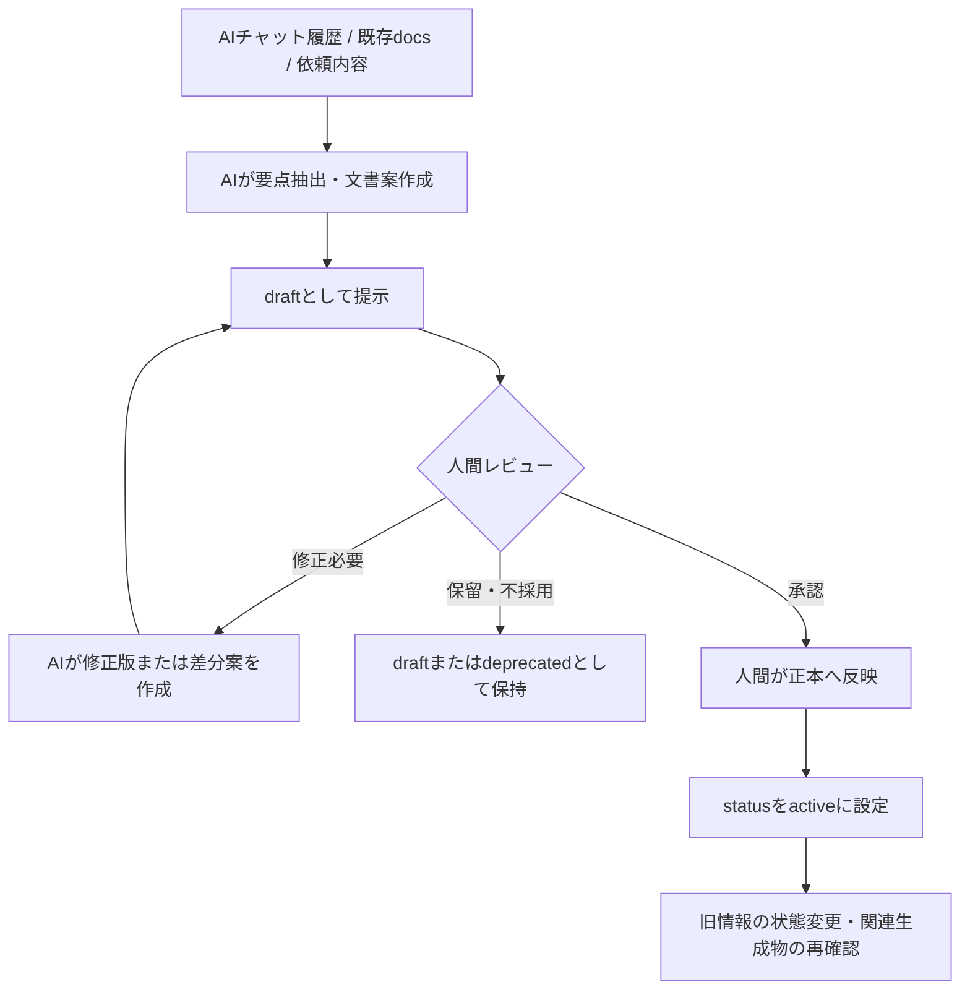

# ADR-003: Human-Approved Memory Update

## 1. Status

`active`

---

## 2. Context

Project Mnemosyneでは、AIを利用して、会話要約、記憶候補の分類、文書ドラフト、差分案、ADR案、矛盾候補の指摘等を効率化する。

一方、正本へ保存された情報は、将来のAI回答、Context Pack、検索結果、Agent判断の入力となる。AIが未承認の案、古い情報、推測、誤解を正本へ直接反映すると、誤りが後続作業へ連鎖する。

Phase 1の目的は自動更新の実装ではなく、安全に運用可能な記憶更新ルールを確立することである。このため、AIの活用範囲と、人間が保持すべき更新責任を明確に定義する。

---

## 3. Decision

Phase 1では、AIは**正本文書の参照および更新ドラフトの作成まで**を担う。

正本文書への反映は、人間がドラフトを確認・承認した後に、**人間が実施する**。

AIによる正本ファイルへの直接書き込み、自動反映、自動削除はPhase 1では許可しない。

### 3.1 AI操作権限

| 操作 | 内容 | Phase 1でのAI権限 | 正本反映主体 |
|---|---|---:|---|
| `read` | 正本、一次メモ、生成物を参照する | 許可 | 該当なし |
| `draft` | 新規文書案、修正案、差分案、分類案、ADR案を作成する | 許可 | 該当なし |
| `write` | 正本文書へ確定内容を反映する | 不可 | 人間 |
| `delete` | 正本、判断履歴、記憶文書を削除する | 不可 | 人間が例外的に判断。原則は状態変更 |

---

## 4. Permission Rules

### 4.1 `read`

AIは、以下の目的で情報を参照してよい。

- 現在有効な方針および状況の確認
- 文書ドラフトまたは差分案の作成
- 判断理由の確認
- 矛盾候補および更新漏れ候補の検出
- 会話からの記憶化候補抽出

AIは、情報の状態に応じて扱いを変える。

| 状態 | AIの扱い |
|---|---|
| `draft` | 検討中として扱い、確定事項と断定しない |
| `active` | 現在有効な情報として参照する |
| `superseded` | 置換済みの履歴としてのみ扱う |
| `deprecated` | 現在の判断根拠に用いない |
| `archived` | 必要な履歴確認時のみ参照する |

### 4.2 `draft`

AIは、以下をドラフトとして作成してよい。

| ドラフト種別 | 例 |
|---|---|
| 新規文書案 | Memory Policy、ADR、テンプレート |
| 修正案 | 既存文書の置き換え案、追記案 |
| 差分案 | 現行方針と修正案の差異一覧 |
| 要約案 | 会話内容の構造化サマリー |
| 分類案 | Fact / Decision / Task / Issue / Idea等への分類 |
| 状態変更案 | `active` から `superseded` への変更候補等 |
| 矛盾解消案 | 正本文書同士の不整合修正候補 |
| ADR案 | 新しい設計判断または変更判断の記録案 |

AIがドラフトを作成する場合、以下を守る。

- ドラフトまたは更新案であることを明示する。
- 未承認の内容を確定事項として扱わない。
- 既存正本と異なる内容を含む場合、変更点を提示する。
- 重要判断の追加または変更がある場合、ADR作成・更新の要否を提示する。
- 推測をFactまたはDecisionとして無断で正本化しない。

### 4.3 `write`

Phase 1では、AIは正本文書へ直接書き込まない。

人間がAIドラフトを承認した場合でも、AIの権限が `write` に拡張されるわけではない。承認後の正本反映作業は、人間が行う。

#### 人間が正本へ反映する前の確認事項

- [ ] 反映内容をレビューし、採用判断を行ったか
- [ ] 既存の `active` な正本文書と矛盾しないか
- [ ] 新しい重要判断であり、ADR追加または更新が必要ではないか
- [ ] 旧情報を `superseded` または `deprecated` に変更する必要がないか
- [ ] 関連する正本文書へ反映漏れがないか
- [ ] 将来のContext Pack等の再生成対象となるか

### 4.4 `delete`

Phase 1では、AIは正本または判断履歴を削除しない。

古い情報や採用されなかった案は、原則として物理削除ではなく状態変更により管理する。

| 状況 | 推奨する状態変更 |
|---|---|
| 新しい判断へ置換された | `superseded` |
| 採用しない、または利用非推奨となった | `deprecated` |
| 完了後に保管する | `archived` |

---

## 5. Human Approval Workflow

### 5.1 基本フロー

### 5.2 会話から記憶を更新する場合

| 手順 | 実施内容 | 担当 |
|---:|---|---|
| 1 | 会話内容から再利用価値のある情報を抽出する | AI |
| 2 | 情報を分類する | AI |
| 3 | 既存正本との重複・矛盾候補を整理する | AI |
| 4 | 更新案またはADR案をdraftとして提示する | AI |
| 5 | 採用・修正・保留を判断する | 人間 |
| 6 | 承認された内容を正本へ反映する | 人間 |
| 7 | 必要に応じて旧情報の状態を変更する | 人間 |
| 8 | Context Pack等の生成物が存在する場合、再生成要否を判断する | 後続運用 |

### 5.3 ADR化を提案すべき変更

以下に該当する場合、AIは単なる文書修正案に留めず、ADR作成または既存ADR更新を提案する。

- 正本と副本の境界を変更する
- AIの操作権限を変更する
- 記憶配置方針を変更する
- Context階層またはContext生成方針を変更する
- AgentとProject Contextの責務境界を変更する
- PostgreSQL等を新たな正本として採用する
- 既存の重要判断を置換する

---

## 6. Rationale

### 6.1 正本汚染を防ぐため

AIが誤った推測や未承認の内容を正本へ反映すると、その誤りが後続のAI利用へ継承される。正本反映主体を人間に限定することで、確定情報の品質を制御する。

### 6.2 AIの効率化効果を活用するため

AIによる要約、分類、差分抽出、文書案作成は運用負担を下げる。AIを参照・ドラフト作成へ積極的に用いながら、確定責任を人間に残すことで、安全性と効率を両立する。

### 6.3 将来の自動化へ安全に接続するため

後続PhaseでPull Request生成や同期支援を導入する場合も、人間承認の原則を保持すれば、正本品質を守りながら自動化範囲を段階的に検討できる。

---

## 7. Alternatives Considered

### 7.1 AIに正本への直接writeを許可する

**却下。** 未承認内容の混入、判断根拠の不透明化、誤りの連鎖拡大が発生し得る。Phase 1では過剰な自動化である。

### 7.2 AIはreadのみとし、draftも作成させない

**却下。** 会話からの抽出・文書化の負荷が高くなり、AI外部記憶基盤を整備する効率が低下する。

### 7.3 軽微な正本更新のみAIの自動反映を許可する

**保留。** 軽微な更新の境界と誤更新時の影響が検証されていない。運用実績が蓄積された後、別ADRで判断する。

---

## 8. Consequences

### 8.1 Positive Consequences

- AIによる誤った正本更新を防止できる。
- 未確定案と確定情報を明確に分離できる。
- 判断変更の説明責任と履歴を維持できる。
- AIのドラフト作成能力を活用できる。

### 8.2 Negative Consequences

- 正本更新ごとに人間の反映作業が必要となる。
- 未レビューのドラフトが滞留する可能性がある。
- 小規模な更新も自動反映できない。

### 8.3 Mitigation

- 更新案は差分が分かる形式で提示する。
- `memory-update-flow.md` で更新手順を標準化する。
- 更新チェックリストを整備する。
- 将来、AIが差分案またはPull Request相当の提案を作成し、人間が承認する方式を検討する。

---

## 9. Phase Boundary

Phase 1で確定することは、AI操作権限と人間承認原則を文書化し、手動運用へ適用できる状態にすることである。

Phase 1では以下を実施しない。

- AIによる正本文書への直接書き込み
- AIによるGitHubコミットまたはPull Request作成の自動運用
- AIによるNotionまたはDBへの自動更新
- 自動承認
- 自動削除
- 自動同期

これらの自動化を導入する場合は、後続Phaseで安全性、承認フロー、責務境界を検討し、必要に応じて新たなADRを作成する。

---

## 10. Related Decisions

| ADR | 関係 |
|---|---|
| `ADR-001-docs-as-source-of-memory.md` | 人間が保護・更新する正本を定義する |
| `ADR-002-memory-source-of-truth-boundary.md` | AIが扱う情報源の区分と境界を定義する |

---

## 11. Review Record

| Item | Result |
|---|---|
| AIの `read` 権限 | 採用 |
| AIの `draft` 権限 | 採用 |
| AIの正本 `write` 権限 | Phase 1では不採用。人間が反映する |
| AIの `delete` 権限 | 不採用。原則状態変更で履歴を残す |
| 将来の半自動更新 | Phase 1では確定せず、別ADR対象とする |

---

## 12. Change History

| Version | Date | Status | Summary |
|---|---|---|---|
| 0.1.0 | 2026-06-04 | draft | AI更新権限と人間承認ルールの初版ドラフトを作成 |
| 1.0.0 | 2026-06-04 | active | AIの正本writeをPhase 1では不可と明確化し、人間反映主体を固定してActive化 |
