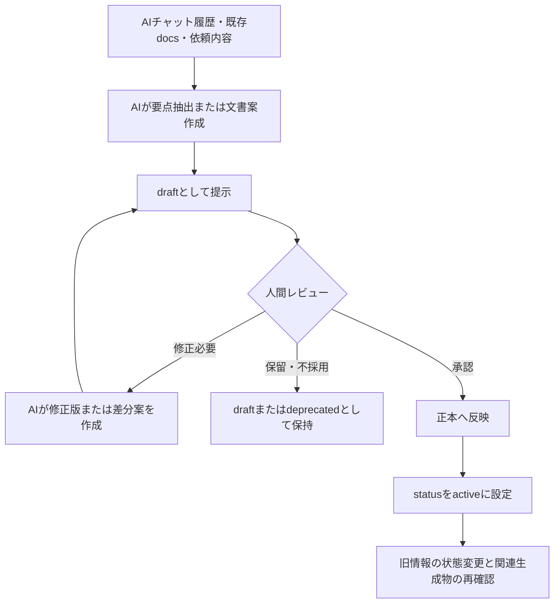

---

title: "ADR-003: Human-Approved Memory Update"
document_id: "docs/adr/ADR-003-human-approved-memory-update.md"
adr_id: "ADR-003"
status: "draft"
version: "0.1.0"
created_at: "2026-06-04"
updated_at: "2026-06-04"
phase: "Phase 1: Memory Foundation"
milestone: "M1-1: Memory Policy定義"
decision_scope: "AI Update Permission and Human Approval"
related_documents:

* "docs/phases/phase-1-memory-foundation.md"
* "docs/memory/memory-policy.md"
* "docs/adr/ADR-001-docs-as-source-of-memory.md"
* "docs/adr/ADR-002-memory-source-of-truth-boundary.md"
  supersedes: null
  superseded_by: null

---

# ADR-003: Human-Approved Memory Update

## 1. Status

`draft`

本ADRは、レビューおよび承認後に `active` へ変更する。

---

## 2. Context

Project Mnemosyneでは、AIを利用して以下の作業を効率化することを想定している。

* 会話内容の要約
* Fact / Decision / Task / Issue / Idea 等の抽出
* 文書ドラフトの作成
* 既存文書との差分提案
* ADR案の作成
* 更新候補の洗い出し
* 古い情報や矛盾候補の指摘
* Context Packの作成

これらの作業はAIと相性がよい一方、AIが正本へ自由に書き込む運用には重大なリスクがある。

AIは、会話内の仮説、未承認の案、古い情報、誤った推測、表現上の曖昧さを、確定事項として整理してしまう可能性がある。

特にProject Mnemosyneでは、正本に保存された情報が、将来のAI回答、Context Pack、検索結果、Agent判断の入力になる。正本の誤更新は、後続作業へ連鎖的に影響する。

したがって、Phase 1では、AIの利便性を活用しつつ、正本の更新責任を人間が保持する運用を定義する必要がある。

---

## 3. Decision

Phase 1において、AIの記憶関連操作権限を以下のとおり定義する。

| 操作       | 内容                              | Phase 1での扱い             |
| -------- | ------------------------------- | ----------------------- |
| `read`   | 正本、副本、一次メモ、生成物を参照する             | 許可                      |
| `draft`  | 新規文書案、修正案、差分案、要約案、分類案、ADR案を作成する | 許可                      |
| `write`  | 正本文書へ確定内容を反映する                  | AI単独では禁止。人間確認・承認後のみ実施可能 |
| `delete` | 正本、判断履歴、記憶データを削除する              | 原則禁止                    |

### 3.1 基本判断

AIは、**更新案を作る主体**として利用する。

人間は、**正本へ反映する内容を承認し、最終的な更新責任を持つ主体**とする。

---

## 4. Permission Rules

### 4.1 `read`

AIは、以下の目的で情報を参照してよい。

* 現在有効な方針の確認
* プロジェクト状況の把握
* 文書ドラフトの作成
* 既存文書との差分整理
* 判断理由の確認
* 矛盾候補の検出
* 記憶化候補の抽出
* Context Pack作成用の入力確認

#### `read` 時の制約

AIは、参照対象の情報状態を考慮する。

| 状態           | AIの扱い                  |
| ------------ | ---------------------- |
| `draft`      | 検討中の情報として扱い、確定事項と断定しない |
| `active`     | 現在有効な情報として優先参照する       |
| `superseded` | 置換済みの履歴としてのみ扱う         |
| `deprecated` | 原則として現在の判断根拠に使わない      |
| `archived`   | 完了経緯や履歴確認時のみ参照する       |

---

### 4.2 `draft`

AIは、以下の内容をドラフトとして作成してよい。

| ドラフト種別 | 例                                                    |
| ------ | ---------------------------------------------------- |
| 新規文書案  | `memory-policy.md`、ADR、各種テンプレート                      |
| 修正案    | 既存文書の置き換え案、追記案                                       |
| 差分案    | 現行文書と新方針の差異一覧                                        |
| 要約案    | 会話内容の構造化サマリー                                         |
| 分類案    | Fact / Decision / Task / Issue / Idea 等への分類          |
| 状態変更案  | `draft` から `active`、`active` から `superseded` 等への変更候補 |
| 矛盾解消案  | 正本文書同士の不整合に対する修正候補                                   |
| ADR案   | 新しい設計判断を固定するための文書案                                   |

#### `draft` 時の必須条件

AIがドラフトを作成する場合、以下を守る。

* ドラフトであることを明示する。
* 未承認の内容を確定事項として記述しない。
* 既存正本と異なる内容を含む場合、変更点を明示する。
* 重要判断の追加または変更がある場合、ADR作成または更新の要否を示す。
* 推測や提案をFactまたはDecisionとして無断で確定しない。

---

### 4.3 `write`

AIは、正本へ自律的に内容を反映してはならない。

#### 正本への反映が許容される条件

以下のいずれかを満たした場合に限り、正本への反映作業を進めてよい。

| 条件                          | 例                              |
| --------------------------- | ------------------------------ |
| 人間がドラフトを確認し、採用を明示した         | 「この内容で確定してください」「この方針で反映してください」 |
| 人間が修正点を指定し、修正版の作成または反映を指示した | 「この箇所を修正した版を正として作成してください」      |
| 人間が既存文書の置換を明示した             | 「旧版を置き換える最終版を作成してください」         |

#### 正本反映前の確認事項

正本へ反映する際は、以下を確認する。

* [ ] 反映対象の内容は人間により承認されているか
* [ ] 既存の `active` 文書またはADRと矛盾しないか
* [ ] 新しい設計判断としてADR化が必要ではないか
* [ ] 旧判断を `superseded` または `deprecated` にする必要がないか
* [ ] 関連する正本文書の更新漏れがないか
* [ ] 副本またはContext Packの更新・再生成が必要ではないか
* [ ] 文書状態が適切に設定されているか

---

### 4.4 `delete`

AIは、正本および判断履歴を原則として削除しない。

#### 削除ではなく状態変更を優先する理由

Project Mnemosyneでは、過去の判断経緯も再利用可能な記憶である。

古い文書や採用されなかった案を物理的に削除すると、以下が確認できなくなる。

* なぜ方針を変更したか
* 何を比較して現在の判断に至ったか
* 同じ検討を過去に行っていないか
* 旧方針を参照してしまった原因は何か

#### 推奨対応

| 状況            | 推奨対応               |
| ------------- | ------------------ |
| 新しい判断へ置換された   | `superseded` に変更する |
| 今後利用すべきでない    | `deprecated` に変更する |
| 完了後に参照頻度が下がった | `archived` に変更する   |
| 誤記が判明した       | 修正履歴を残して訂正する       |
| 重複文書が存在する     | 統合案を作成し、人間承認後に整理する |

---

## 5. Human Approval Workflow

### 5.1 基本フロー

---

### 5.2 会話から記憶を更新する場合

| 手順 | 実施内容                                         | 主担当         |
| -: | -------------------------------------------- | ----------- |
|  1 | 会話内容から再利用価値のある情報を抽出する                        | AI          |
|  2 | Fact / Decision / Task / Issue / Idea 等に分類する | AI          |
|  3 | 既存正本との重複・矛盾を確認する                             | AI支援 + 人間確認 |
|  4 | 更新案またはADR案を作成する                              | AI          |
|  5 | 採用・修正・保留を判断する                                | 人間          |
|  6 | 承認内容を正本へ反映する                                 | 人間管理下の更新    |
|  7 | 必要に応じて旧情報の状態を変更する                            | 人間承認        |
|  8 | Context Pack等の生成物を再生成する                      | 後続運用        |

---

### 5.3 ADRを追加または変更する場合

以下に該当する場合、AIは通常文書の修正だけで済ませず、ADR作成または更新を提案する。

* 正本と副本の境界を変更する
* AI権限を変更する
* 文書配置方針を変更する
* Context階層を変更する
* AgentとProject Contextの責務境界を変更する
* PostgreSQL等を新たな正本として採用する
* 既存の重要判断を置換する

---

## 6. Rationale

### 6.1 正本汚染を防ぐため

AIが誤った推測や未確定の内容を正本へ書き込むと、それが後続AI作業の根拠になり、誤りが増幅する。

人間承認を必須にすることで、正本へ入る情報の品質を制御する。

### 6.2 AIの強みを失わないため

AIによるドラフト、要約、分類、差分抽出は、文書運用の負担を大きく下げる。

書き込みを全面禁止するのではなく、**draftまでは積極的に利用し、確定責任だけを人間に残す**ことで、安全性と効率を両立する。

### 6.3 判断責任を明確にするため

Project Mnemosyneは、複数プロジェクトへ展開可能な記憶基盤を目指している。

正本へ何を登録するかの責任を人間が持つことで、後から判断根拠を説明しやすくなる。

### 6.4 将来の自動化へ安全に接続するため

Phase 7等で更新案生成や同期処理を半自動化する場合でも、人間承認を基本原則として残しておけば、自動化範囲を段階的に広げられる。

---

## 7. Alternatives Considered

### 7.1 AIに正本への自由書き込みを許可する

#### 概要

AIが判断した内容を自動的に正本文書へ反映する。

#### 却下理由

* 誤った判断が正本へ混入する
* 未確定案が確定事項化する
* 矛盾した文書が自動生成される可能性がある
* 後から責任所在と判断経緯を追いにくい
* Phase 1としては自動化が過剰である

---

### 7.2 AIは参照のみとし、ドラフトも作らせない

#### 概要

AIは正本を読むだけで、文書更新案や要約は人間のみが作成する。

#### 却下理由

* 会話からの情報抽出負担が大きい
* 文書整備の継続性が下がる
* AIを活用した記憶基盤という目的に対して効率が低い

---

### 7.3 重要文書のみ人間承認とし、軽微な更新は自動反映する

#### 概要

Task更新や状態更新など、一部をAIが自動反映する。

#### 保留理由

* 現時点では「軽微な更新」の境界が定義されていない
* 誤更新時の影響範囲が検証されていない
* Phase 1では、まずすべての正本更新を承認対象とした方が安全である

将来、運用実績が蓄積された場合に、別ADRで再検討する。

---

## 8. Consequences

### 8.1 Positive Consequences

* AIによる誤った正本更新を防止できる
* 未確定の検討事項と確定情報を分離できる
* 判断変更の説明責任を維持できる
* 会話要約や文書案作成による効率化は活用できる
* 将来自動化する場合の安全基盤となる

### 8.2 Negative Consequences

* 正本更新のたびに人間レビューが必要となる
* 確認待ちのドラフトが蓄積する可能性がある
* 小さな更新でも即時自動反映はできない

### 8.3 Mitigation

以下の文書・運用により、レビュー負荷を抑える。

* 更新内容を差分形式で提示する
* `memory-update-flow.md` で更新手順を標準化する
* 更新チェックリストを整備する
* Decision / Task / Issue等の分類基準を標準化する
* 将来的に、人間レビューを維持したままPR生成等を自動化する

---

## 9. Implementation Guidance

### 9.1 AIが文書作成時に明示すべき内容

AIが正本候補のドラフトを作成する場合、以下を明示する。

| 項目    | 内容                |
| ----- | ----------------- |
| 文書状態  | `draft`           |
| 作成目的  | 何を確定するための文書案か     |
| 根拠    | どの正本または依頼内容に基づくか  |
| 変更点   | 既存方針からの追加・変更・置換内容 |
| 未確定事項 | 人間判断が必要な論点        |
| 関連文書  | 更新または確認が必要な正本・ADR |

### 9.2 承認後に実施すること

人間がドラフトを承認した場合、以下を行う。

1. 文書状態を `active` に変更する。
2. 置換される旧文書または旧判断がある場合、`superseded` へ変更する。
3. 非推奨化される案がある場合、`deprecated` として整理する。
4. `active-decisions.md` や `current-status.md` への反映要否を確認する。
5. Context Pack等の生成物が存在する場合、再生成要否を確認する。

---

## 10. Phase 1 Boundary

Phase 1で実施することは、AI操作権限および人間承認ルールを文書化し、手動運用で確認することである。

Phase 1では、以下を実施しない。

* AIによるGitHub docsへの自動コミット
* AIによるNotion自動更新
* AIによるDB自動更新
* 自動承認
* 自動削除
* 自動同期
* PR生成を含む更新自動化

これらは、運用ルールが安定した後に後続フェーズで検討する。

---

## 11. Related Decisions

| ADR                                          | 関係                    |
| -------------------------------------------- | --------------------- |
| `ADR-001-docs-as-source-of-memory.md`        | 人間承認によって保護すべき正本を定義する  |
| `ADR-002-memory-source-of-truth-boundary.md` | AIが扱う情報源の区分と優先順位を定義する |

---

## 12. Review Checklist

* [ ] AIの `read` を許可することに問題がないか
* [ ] AIの `draft` を許可する範囲に不足または過剰がないか
* [ ] AI単独の `write` を禁止する方針に問題がないか
* [ ] `delete` を原則禁止とする方針に問題がないか
* [ ] 人間承認フローが実務上運用可能か
* [ ] 状態変更により履歴を保持する方針に問題がないか
* [ ] 後続の自動化判断へ必要な余地を残しているか

---

## 13. Change History

| Version | Date       | Status | Summary                                           |
| ------- | ---------- | ------ | ------------------------------------------------- |
| 0.1.0   | 2026-06-04 | draft  | AIによる記憶更新はドラフト作成までを基本とし、正本反映には人間承認を必要とする初版ドラフトを作成 |
