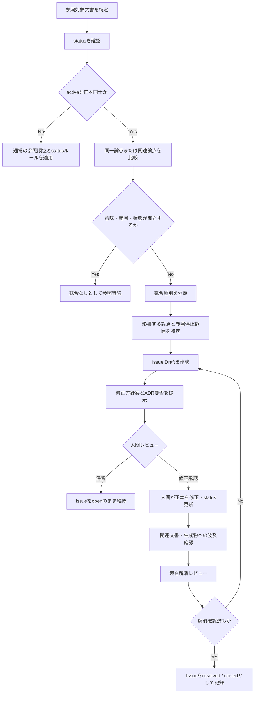
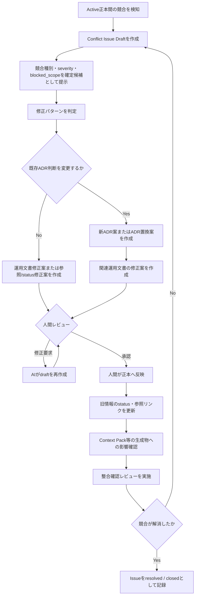

---

title: "Project Mnemosyne Context Source Priority"
document_id: "docs/memory/context-source-priority.md"
status: "draft"
version: "0.1.0"
created_at: "2026-06-04"
updated_at: "2026-06-04"
approved_at: null
phase: "Phase 1: Memory Foundation"
milestone: "M1-2: Memory Taxonomy定義"
related_documents:

* "docs/phases/phase-1-memory-foundation.md"
* "docs/memory/memory-policy.md"
* "docs/memory/memory-taxonomy.md"
* "docs/memory/memory-update-flow.md"
* "docs/adr/ADR-001-docs-as-source-of-memory.md"
* "docs/adr/ADR-002-memory-source-of-truth-boundary.md"
* "docs/adr/ADR-003-human-approved-memory-update.md"

---

# Project Mnemosyne Context Source Priority

## 1. 目的

本書は、Project Mnemosyneにおいて、複数の情報源に同一論点または関連論点の記載が存在する場合に、**AIおよび人間がどの情報を参照し、矛盾をどのように検知し、どのように修正へ進めるか**を定義する。

Project Mnemosyneでは、Markdown docsおよびADRをPhase 1における正本として扱う。一方で、正本であっても、更新漏れ、状態変更漏れ、責務の重複、判断変更時の反映不足により、Activeな文書同士が競合する可能性がある。

本書は、単なる参照順位表ではなく、以下を実現するための運用規約である。

1. 情報源の信頼性と役割に応じた参照順序を明確にする。
2. 一次メモ、生成物、副本、古い文書を現在判断の根拠として誤用しない。
3. Active ADRとActive運用文書の競合を検知できるようにする。
4. 競合が存在する論点を、AIが独自に確定判断しないようにする。
5. 競合を `issue` として記録し、修正案、ADR要否、人間承認、解消確認まで追跡可能にする。
6. Phase 2以降のContext Pack生成およびPhase 3以降の検索処理で、安全な参照制御を再利用できるようにする。

---

## 2. 適用範囲

### 2.1 対象

本書は、以下の情報源を参照して、回答、文書更新案、Context Pack、検索結果、レビュー結果等を作成する場合に適用する。

| 情報源                  | 例                                                                                |
| -------------------- | -------------------------------------------------------------------------------- |
| Activeな運用正本文書        | `memory-policy.md`、`memory-taxonomy.md`、`context-source-priority.md`             |
| Activeなプロジェクト記憶文書    | `project-summary.md`、`current-status.md`、`active-decisions.md`、`next-actions.md` |
| ADR                  | `ADR-001-docs-as-source-of-memory.md` 等                                          |
| Review文書             | Phaseレビュー、差分レビュー、整合確認記録                                                          |
| Test Result文書        | 適用検証結果、確認結果                                                                      |
| Conversation Summary | レビュー済みまたは未レビューの会話要約                                                              |
| AIチャット履歴             | 生の相談・議論・作業記録                                                                     |
| Context Pack         | Phase 2以降の生成物                                                                    |
| Notion等の副本           | 将来導入される場合の可視化・一覧情報                                                               |

### 2.2 対象外

本書では、以下を詳細には定義しない。

| 対象外                       | 委譲先または判断時期                          |
| ------------------------- | ----------------------------------- |
| Memory Typeの定義            | `docs/memory/memory-taxonomy.md`    |
| 正本・副本・一次メモ・生成物の基本境界       | `docs/memory/memory-policy.md`      |
| 会話から記憶を抽出し正本へ反映する通常フロー    | `docs/memory/memory-update-flow.md` |
| Context Packの構造および生成処理    | Phase 2成果物                          |
| 検索結果のランキング・chunk制御・鮮度警告実装 | Phase 3成果物                          |
| APIまたはMCP経由での参照制御         | Phase 4以降                           |

---

## 3. 前提方針

## 3.1 情報源の区分

Project Mnemosyneでは、情報源を以下の区分で扱う。

| 区分   | 定義                            | 代表例                     |
| ---- | ----------------------------- | ----------------------- |
| 正本   | 内容の正しさを判断する際の公式な情報源           | Markdown docs、ADR       |
| 副本   | 正本を補助する可視化用・一覧用・検索用の複製または整理情報 | Notion、将来の検索インデックス      |
| 一次メモ | 未整理、未承認、検討中の情報を含む入力材料         | AIチャット履歴、人間メモ           |
| 生成物  | 正本等から作成され、必要に応じて再生成する成果物      | Context Pack、AI文書案、検索結果 |
| 接続手段 | 情報源へアクセスする仕組み                 | API、MCP                 |

## 3.2 情報状態

本書では、以下のstatusを使用する。

| status       | 意味              | 通常参照での扱い     |
| ------------ | --------------- | ------------ |
| `draft`      | 作成済みだが未承認、検討中   | 確定根拠として扱わない  |
| `active`     | 人間承認済みで現在有効     | 主要な参照根拠とする   |
| `superseded` | 新しい判断または文書へ置換済み | 履歴確認時のみ参照する  |
| `deprecated` | 非推奨または不採用       | 現在判断の根拠に用いない |
| `archived`   | 完了済みまたは保管対象     | 必要時のみ参照する    |

承認済みで現在有効な文書は `active` とし、`accepted` を独立したstatusとしては使用しない。

## 3.3 AIの操作境界

Phase 1では、AIは以下の範囲で本書を適用する。

| 操作            | AI権限 | 本書における扱い          |
| ------------- | ---: | ----------------- |
| 正本文書の参照       |   許可 | 参照順位および競合確認を行う    |
| 競合候補の検知       |   許可 | Issue化候補を提示する     |
| Issueドラフト作成   |   許可 | 人間レビュー用に作成する      |
| 修正文書案・ADR案の作成 |   許可 | `draft` として提示する   |
| 正本文書への反映      |   不可 | 人間が承認後に実施する       |
| 文書status変更    |   不可 | 人間が判断・実施する        |
| 正本文書の削除       |   不可 | 原則行わず、必要時は人間が判断する |

---

## 4. 基本参照原則

## 4.1 参照優先の原則

| ID       | 原則                                                                           |
| -------- | ---------------------------------------------------------------------------- |
| CSP-P-01 | `active` な正本文書を、一次メモ、副本、生成物より優先する。                                           |
| CSP-P-02 | `draft` の情報は、提案または検討中の情報として扱い、現在有効な判断の根拠にしない。                                |
| CSP-P-03 | `superseded`、`deprecated`、`archived` の情報は、通常の現在判断の根拠にしない。                    |
| CSP-P-04 | 副本または生成物が正本と矛盾する場合、`active` な正本を優先し、副本または生成物を修正・再生成対象とする。                    |
| CSP-P-05 | 生のAIチャット履歴のみを根拠として、現在有効なDecisionまたはConstraintを確定しない。                         |
| CSP-P-06 | Conversation Summaryは文脈復元に利用できるが、`active` な正本文書またはADRより優先しない。                |
| CSP-P-07 | `active` なADRと`active` な運用正本文書が同一論点で競合する場合、AIは一方を自動採用せず、競合を `issue` として提示する。 |
| CSP-P-08 | 競合中の論点は、人間が解消を承認するまで「確定済みの現在ルール」として再利用しない。                                   |
| CSP-P-09 | 競合のない範囲については、競合文書が存在しても参照を継続してよい。                                            |
| CSP-P-10 | 重要判断の変更により運用正本文書を修正する場合、ADRの追加・置換・状態変更要否を同時に確認する。                            |

---

## 4.2 初期参照順位

情報源が同一論点について記載を持つ場合、通常の参照開始順序は以下とする。

```text
1. active なADRおよびactive な共通運用正本文書
2. active-decisions.md
3. current-status.md
4. プロジェクト固有の設計docs
5. review文書 / test result文書
6. reviewed済みのconversation summary
7. draft文書またはAI生成案
8. 生のAIチャット履歴
9. 副本または再生成可能な生成物
```

ただし、この順位は「上位文書が常に下位文書を機械的に上書きする」という意味ではない。

特に、`active` なADRと`active` な運用正本文書は、いずれも正本であり、担当する責務が異なる。両者が同一論点で矛盾した場合は、優先順位による自動解決ではなく、競合解消フローを適用する。

---

## 5. 正本文書の責務分担

## 5.1 ADRの責務

ADRは、重要な判断について、背景、採用理由、却下案、影響および変更履歴を記録する正本文書である。

| ADRが主に答える問い   | 例                           |
| ------------- | --------------------------- |
| なぜその方針を採用したか  | なぜMarkdown docsとADRを正本とするのか |
| どの選択肢を比較したか   | Notion正本案、DB正本案をなぜ採用しなかったか  |
| 重要な境界をどう定めたか  | AIのwrite権限をどこまで許可するか        |
| 以前の判断を何が置換したか | 新ADRが旧ADRをsupersedeしたか      |

## 5.2 運用正本文書の責務

運用正本文書は、現在実際に適用するルール、分類、参照方法、作業手順および状態を記録する正本文書である。

| 運用正本文書が主に答える問い | 文書例                          |
| -------------- | ---------------------------- |
| 現在どのルールで運用するか  | `memory-policy.md`           |
| 情報をどう分類するか     | `memory-taxonomy.md`         |
| どの情報を優先して参照するか | `context-source-priority.md` |
| 現在有効な判断一覧は何か   | `active-decisions.md`        |
| 現在の状況・課題は何か    | `current-status.md`          |
| 次に行う作業は何か      | `next-actions.md`            |

## 5.3 責務が異なる記載は直ちに競合とはしない

ADRと運用正本文書で表現が異なっていても、担当責務が異なり、意味上整合している場合は競合としない。

### 競合ではない例

| ADR記載                      | 運用文書記載                                 | 判定                      |
| -------------------------- | -------------------------------------- | ----------------------- |
| AIは正本へ直接writeしない方針を採用する。   | AIは文書ドラフトおよび差分案を作成してよい。                | 競合なし。運用文書が許可範囲を具体化している。 |
| Markdown docsとADRを初期正本とする。 | `active-decisions.md` は現在有効な判断一覧を保持する。 | 競合なし。正本文書の役割を具体化している。   |

---

## 6. 競合の定義

## 6.1 競合とは

本書における競合とは、同一論点または同一判断範囲について、複数の参照対象が**同時に成立しない内容**を示している状態をいう。

特に、`active` な正本同士の競合は、現在の運用判断を誤らせる可能性があるため、解消必須の `issue` として扱う。

## 6.2 競合判定の対象単位

競合は文書単位ではなく、原則として**論点単位**で判定する。

| 論点単位の例    | 内容                                  |
| --------- | ----------------------------------- |
| 正本境界      | Markdown、ADR、Notion、DB等の位置づけ        |
| AI操作権限    | read / draft / write / delete の許可範囲 |
| status定義  | `active`、`draft` 等の意味               |
| 文書配置      | プロジェクト記憶の保存場所                       |
| Context参照 | Context Packへ含める情報の条件               |
| Phase境界   | どのPhaseで何を実装するか                     |

文書内の一部論点で競合が見つかった場合、競合の影響範囲は当該論点へ限定する。文書全体を直ちに無効とみなしてはならない。

---

## 7. 競合分類

競合候補は、以下の種別で分類する。

| conflict_type                  | 定義                            | 例                                    | 通常対応               |
| ------------------------------ | ----------------------------- | ------------------------------------ | ------------------ |
| `semantic_conflict`            | 同一論点について意味が両立しない              | ADRではAI write不可、運用文書では軽微修正なら自動write可 | Issue化し、判断または修正が必要 |
| `status_conflict`              | 参照状態が不整合である                   | 運用文書が `superseded` ADRを現在根拠として参照している | 参照・status・リンクを修正   |
| `scope_conflict`               | 適用範囲が矛盾する                     | ADRではPhase 1対象外、運用文書ではPhase 1必須とする   | Issue化し、Phase境界を修正 |
| `responsibility_overlap`       | ADRと運用文書が同じ規範を重複定義し、片方だけ更新された | 両方に異なるstatus一覧が記載される                 | 正本責務を整理し、同期修正      |
| `omission_risk`                | 重要なADR判断が運用文書に反映されていない        | AI write禁止がADRのみにあり、操作手順に欠落          | 必要性を評価し、運用文書へ追記    |
| `terminology_mismatch`         | 用語差により意味が不明確または誤解のおそれがある      | `accepted` と `active` が混在            | 用語統一案を作成           |
| `generated_artifact_staleness` | 生成物が最新正本と一致しない                | 古いContext Packが旧方針を含む                | 正本は変更せず、生成物を再生成    |

---

## 8. 競合ではない差異

以下は、原則として競合とは扱わない。ただし、誤解を生む場合は改善候補として記録してよい。

| 差異                              | 判定                | 例                         |
| ------------------------------- | ----------------- | ------------------------- |
| ADRの判断理由を運用文書が省略している            | 原則競合なし            | ADRに比較理由、Policyに適用ルールのみ記載 |
| 運用文書がADRを具体的な手順へ展開している          | 原則競合なし            | AI write不可を、ドラフト作成手順へ具体化  |
| Review文書が未対応事項を指摘している           | 競合ではなく `issue` 候補 | 正本の更新漏れをレビューが指摘           |
| Conversation Summaryが古い経緯を残している | 原則競合なし            | 履歴として残るが現在判断には使わない        |
| Draft文書がActive方針と異なる案を示している     | 競合ではなく提案          | Draftは採用前の変更案             |

---

## 9. 競合検知ルール

## 9.1 検知を実施するタイミング

以下の場合、参照対象間の競合確認を行う。

| タイミング                                 | 確認目的                     |
| ------------------------------------- | ------------------------ |
| 新しい運用正本文書をActive化する前                  | 既存ADRおよび正本文書との整合確認       |
| ADRを新規作成またはActive化する前                 | 既存運用ルールへの影響確認            |
| 既存Active文書を修正する前                      | 変更により他正本と矛盾しないか確認        |
| Conversation SummaryからDecisionを正本化する前 | 既存Decisionとの重複・矛盾確認      |
| Phase完了レビュー時                          | 成果物一式の整合確認               |
| Context Pack生成前または再生成時                | 競合中の情報を確定Contextへ混入させない  |
| Phase 3の索引・検索対象登録前                    | 競合または古い情報を通常検索対象へ誤混入させない |
| AIまたは人間が矛盾を疑った時                       | 随時確認                     |

## 9.2 検知対象の組合せ

| 優先度 | 比較対象                                     | 主な確認内容                             |
| --: | ---------------------------------------- | ---------------------------------- |
|  P0 | Active ADR × Active運用正本文書                | 判断境界、権限、Phase範囲、status定義の競合        |
|  P0 | Active ADR × Active ADR                  | 同一decision_scopeでの判断競合、supersede漏れ |
|  P0 | Active運用正本文書 × Active運用正本文書              | 同一ルールの不一致、文書責務の重複                  |
|  P1 | Active正本 × Active Decisions一覧            | 重要判断の一覧反映漏れ                        |
|  P1 | Active正本 × Current Status / Next Actions | 現在地・作業内容との不整合                      |
|  P1 | Active正本 × Review / Test Result          | 指摘済み問題や検証結果の未反映                    |
|  P2 | Active正本 × Reviewed Conversation Summary | 文脈要約の古さまたは誤反映                      |
|  P2 | Active正本 × Draft / AIチャット履歴              | 正本更新候補の比較                          |
|  P2 | Active正本 × Context Pack / 副本             | 再生成・同期要否                           |

## 9.3 検知観点

Active ADRとActive運用正本文書を比較する際は、最低限以下を確認する。

|  No. | 確認観点    | 検知内容                                             |
| ---: | ------- | ------------------------------------------------ |
| C-01 | 判断対象    | 同一論点を扱っているか                                      |
| C-02 | status  | 両文書が現在有効として扱われているか                               |
| C-03 | 適用Phase | 対象Phaseが一致しているか                                  |
| C-04 | 権限境界    | AI、人間、生成物の操作権限に矛盾がないか                            |
| C-05 | 正本境界    | 正本、副本、一次メモ、生成物の区分が一致しているか                        |
| C-06 | 用語      | `active` 等の用語が統一されているか                           |
| C-07 | 参照関係    | related documents、supersedes、superseded_by が正しいか |
| C-08 | 更新反映    | ADRの重要判断が運用手順へ必要十分に反映されているか                      |
| C-09 | 旧情報処理   | 置換済み情報がActiveのまま残っていないか                          |
| C-10 | 後続生成物   | Context Pack等の再生成対象が存在しないか                       |

---

## 10. 競合検知フロー



---

## 11. 競合検知時の参照制御

## 11.1 基本ルール

Activeな正本同士の競合を検知した場合、AIは以下のように扱う。

| 対象                | 扱い                      |
| ----------------- | ----------------------- |
| 競合する論点            | 現在有効な確定情報として断定しない       |
| 競合のない同文書内の情報      | 通常どおり参照可能               |
| 競合文書全体            | 直ちに無効化しない               |
| 競合に依存するTaskまたは判断案 | 競合解消待ちであることを明示する        |
| Context Packへの収録  | 競合警告付きで除外または保留する        |
| 検索結果への表示          | 後続Phaseでは競合警告付きで表示対象とする |
| 正本修正              | AIは修正案まで。反映は人間が行う       |

## 11.2 参照停止範囲

競合検知時は、文書全体ではなく、影響する論点を `blocked_scope` として記録する。

### 例

```yaml
blocked_scope:
  - "AI write permission in Phase 1"
  - "Whether minor wording fixes may be auto-applied"
```

この場合、正本境界や分類ルール等、競合と無関係な内容は参照を継続できる。

## 11.3 AI回答時の表現ルール

競合中の論点について回答またはドラフトを作成する場合、以下を明示する。

```text
この論点については、Activeな正本文書間に競合があります。
現時点で確定方針として断定できません。
競合内容、影響範囲、および修正案をIssueとして整理します。
```

---

## 12. Issue化ルール

## 12.1 Issue化すべき条件

以下のいずれかに該当する場合、競合を `issue` として記録する。

| ID    | 条件                                                           |
| ----- | ------------------------------------------------------------ |
| IS-01 | Active ADRとActive運用正本文書で、同一論点の規範内容が両立しない                     |
| IS-02 | 同一decision_scopeのActive ADRが複数存在し、どちらが現行判断か不明である             |
| IS-03 | Active運用文書が、`superseded` または `deprecated` のADRを現在根拠として参照している |
| IS-04 | 重要なADR判断が運用正本文書へ反映されず、実運用で誤解が生じ得る                            |
| IS-05 | status語、Phase境界、正本区分、AI権限等の中核ルールが文書間で一致しない                   |
| IS-06 | 競合によりContext Packまたは検索結果へ安全に情報を供給できない                        |
| IS-07 | 競合解消に新しい重要判断または既存判断の変更が必要である                                 |

## 12.2 Issueのstatus

競合Issueには、Memory Typeのstatusとは別に、解消作業の進行状態として以下を使用できる。

| conflict_status | 意味                   |
| --------------- | -------------------- |
| `open`          | 競合を検知し、未解決である        |
| `under_review`  | 修正方針を人間が確認中である       |
| `resolved`      | 正本修正または判断により競合が解消された |
| `closed`        | 解消確認と関連反映確認まで完了した    |

### 注意

* `memory_type: issue` と `conflict_status: open` は、情報分類と対応進捗を分けるための項目である。
* 正本文書自体のstatusである `active` / `superseded` 等と混同しない。

---

## 13. Conflict Issue Draftフォーマット

Active正本間の競合を検知した場合、以下の形式でIssue Draftを作成する。

```md
# Conflict Issue Draft

## 1. Issue Metadata

- issue_id:
- title:
- memory_type: issue
- conflict_status: open
- detected_at:
- detected_by: AI | Human
- phase:
- severity: critical | high | medium | low
- blocked_scope:

## 2. Conflicting Sources

### Source A
- source_path:
- document_role:
- status:
- version:
- updated_at:
- related_adr:
- relevant_section:

Relevant Statement:
> ...

### Source B
- source_path:
- document_role:
- status:
- version:
- updated_at:
- related_adr:
- relevant_section:

Relevant Statement:
> ...

## 3. Conflict Classification

- conflict_type:
- decision_scope:
- conflict_summary:
- why_both_cannot_be_applied:

## 4. Impact Assessment

- impacted_rules:
- impacted_documents:
- impacted_context_generation:
- impacted_future_search:
- risk_if_unresolved:

## 5. Temporary Reference Handling

- use_as_confirmed_rule: false
- temporarily_reliable_information:
- temporarily_blocked_information:
- warnings_to_show:

## 6. Correction Options

### Option A
- correction_policy:
- documents_to_update:
- adr_required: yes | no
- consequence:

### Option B
- correction_policy:
- documents_to_update:
- adr_required: yes | no
- consequence:

## 7. Recommended Resolution Draft

- recommended_option:
- reason:
- proposed_document_changes:
- proposed_status_changes:
- proposed_adr_action:

## 8. Human Review

- review_status: pending
- reviewer:
- decision:
- reviewed_at:
- notes:

## 9. Resolution Confirmation

- corrected_documents:
- corrected_adr:
- status_changes_completed:
- generated_artifacts_to_refresh:
- validation_result:
- closed_at:
```

---

## 14. Severity判定

競合Issueの優先度は、以下の基準で判定する。

| severity   | 判定条件                                 | 例                      | 対応                 |
| ---------- | ------------------------------------ | ---------------------- | ------------------ |
| `critical` | 正本性、AI権限、安全境界に直接影響し、誤参照により正本汚染が起こり得る | AI write可否が競合          | 当該論点の利用を停止し、最優先で修正 |
| `high`     | Phase範囲、重要Decision、Context生成内容へ影響する  | Phase 1対象外機能が必須扱いされている | Context利用前に解消する    |
| `medium`   | 実運用で誤解または作業手戻りが生じ得る                  | 文書配置方針の記載が不一致          | 次回更新前に解消する         |
| `low`      | 表現差、参照リンク漏れ、軽微な用語揺れ                  | 文書名の旧称が残る              | 通常レビューで修正する        |

---

## 15. 修正方針の判断ルール

## 15.1 修正パターン一覧

Active ADRとActive運用正本文書が競合した場合、修正方針は以下のいずれかに分類する。

| pattern                       | 状況                         | 基本対応                | ADR対応                                   |
| ----------------------------- | -------------------------- | ------------------- | --------------------------------------- |
| `operational_doc_correction`  | ADRの判断は維持し、運用文書のみが誤っている    | 運用文書をADRに整合するよう修正   | 新ADR不要。必要に応じADR参照を追記                    |
| `adr_supersession`            | 運用側の新方針を正式採用し、既存ADR判断を変更する | 新方針に基づき運用文書を整備      | 新ADR作成または既存ADRを置換し、旧ADRを `superseded` 化 |
| `both_documents_correction`   | ADRと運用文書の双方が不十分または曖昧       | 両文書を整合する形で修正        | 重要判断変更があればADR更新または新ADR                  |
| `status_reference_correction` | 内容ではなくstatusまたは参照リンクの不整合   | status、参照先、置換リンクを修正 | 原則新ADR不要                                |
| `generated_artifact_refresh`  | 正本は整合しており、生成物のみ古い          | 生成物を再生成または破棄        | ADR不要                                   |
| `no_conflict_clarification`   | 責務差による表現差であり、実質競合ではない      | 必要なら説明または相互参照を追加    | ADR不要                                   |

## 15.2 ADR作成・更新が必要となる条件

以下に該当する修正では、単なる運用文書修正に留めず、ADRの追加、更新または置換を検討する。

| ID       | 条件                                      |
| -------- | --------------------------------------- |
| ADR-R-01 | 既存ADRで採用した判断を変更する                       |
| ADR-R-02 | 正本、副本、一次メモ、生成物の境界を変更する                  |
| ADR-R-03 | AIのread / draft / write / delete権限を変更する |
| ADR-R-04 | Project記憶の配置方式または正本管理主体を変更する            |
| ADR-R-05 | Context Packまたは検索結果の正本性・利用境界を変更する       |
| ADR-R-06 | Phaseスコープに継続的な影響を与える方針変更を行う             |
| ADR-R-07 | 既存の重要判断を明示的に置換する必要がある                   |

## 15.3 ADRを新規作成しない修正

以下は、既存判断を変更しない限り、原則として新規ADRを必要としない。

* 誤記修正
* 用語を既存方針へ統一する修正
* ADRで既に決定済みの内容を運用文書へ反映する追記
* `related_documents` または参照リンクの補正
* 旧生成物の再生成
* Reviewチェック項目の補足
* 既存ルールの表現明確化。ただし意味を変更しない場合に限る。

---

## 16. 修正手順

## 16.1 基本修正フロー



## 16.2 詳細手順

| Step | 実施内容         | AIの役割                   | 人間の役割         | 成果物                  |
| ---: | ------------ | ----------------------- | ------------- | -------------------- |
|    1 | 競合候補を検知する    | 文書比較、差異抽出               | 必要に応じ検知依頼     | 競合候補一覧               |
|    2 | 競合か差異かを分類する  | conflict_type候補を提示      | 判定確認          | Conflict Issue Draft |
|    3 | 影響範囲を特定する    | `blocked_scope`、関連文書を提示 | 妥当性確認         | 影響評価                 |
|    4 | 一時参照ルールを決める  | 確定扱い不可の範囲を提示            | 採用判断          | 暫定扱い記録               |
|    5 | 修正パターンを提案する  | 修正文書案、ADR要否を提示          | 方針決定          | 修正案                  |
|    6 | 正本修正案をレビューする | 修正版draftを作成             | 承認・修正要求       | 承認済み修正内容             |
|    7 | 正本へ反映する      | 実施しない                   | 文書更新、status変更 | 更新済み正本               |
|    8 | 関連文書を同期確認する  | 反映漏れ候補を検出               | 追加反映判断        | 整合確認結果               |
|    9 | 生成物への影響を確認する | 再生成対象を提示                | 再生成実施判断       | 更新対象一覧               |
|   10 | Issueを完了記録する | 解消確認案を作成                | `closed` 判断   | 解消記録                 |

---

## 17. Active ADRとActive運用文書の競合対応

## 17.1 原則

Active ADRとActive運用文書が競合した場合、以下を適用する。

| 原則   | 内容                                                               |
| ---- | ---------------------------------------------------------------- |
| A-01 | ADRと運用文書は、ともにPhase 1の正本である。                                      |
| A-02 | ADRは判断理由・境界・履歴、運用文書は現在適用するルール・手順を担う。                             |
| A-03 | 同一論点で意味が両立しない場合、AIは「ADRが正しい」「運用文書が正しい」と独断で決めない。                  |
| A-04 | 競合論点は、解消完了まで現在有効な確定ルールとして利用しない。                                  |
| A-05 | 既存ADRの判断を維持する修正か、判断変更を伴う修正かを人間が決定する。                             |
| A-06 | 判断変更を伴う場合は、ADRの新規作成または置換を行った上で運用文書を整合させる。                        |
| A-07 | 解消後は、関連するActive Decisions、Current Status、Context Pack等への影響を確認する。 |

## 17.2 判断マトリクス

| 確認事項                    | Yesの場合                     | Noの場合                |
| ----------------------- | -------------------------- | -------------------- |
| ADRの判断内容は現在も維持するか       | 運用文書修正を基本とする               | 新ADRまたはADR置換を検討する    |
| 運用文書の記載は単なる反映漏れ・誤記か     | 運用文書のみ修正する                 | 判断変更または両文書修正を検討する    |
| 競合はAI権限・正本境界へ影響するか      | `critical` として扱う           | 影響度に応じてseverityを設定する |
| 競合論点がContext Packへ含まれるか | 解消前は警告付き除外または保留            | 通常の参照継続              |
| 旧情報を置換する必要があるか          | `superseded` 等のstatus変更を実施 | 変更不要                 |
| 生成物が旧方針を含むか             | 再生成対象として記録                 | 影響なし                 |

---

## 18. 競合対応例

## 18.1 例1：AIの正本write権限が競合した場合

### 検知対象

| Source                                    | 記載                                 |
| ----------------------------------------- | ---------------------------------- |
| `ADR-003-human-approved-memory-update.md` | AIによる正本文書への直接writeはPhase 1では許可しない。 |
| `memory-update-flow.md`                   | 軽微な表記修正であればAIが正本へ自動反映してよい。         |

### 判定

| 項目                    | 内容                         |
| --------------------- | -------------------------- |
| conflict_type         | `semantic_conflict`        |
| severity              | `critical`                 |
| blocked_scope         | Phase 1におけるAIの正本文書write権限  |
| use_as_confirmed_rule | `false`                    |
| 理由                    | 正本汚染防止に直接関係する権限境界が矛盾しているため |

### 修正方針A：ADR判断を維持する場合

| 対応    | 内容                               |
| ----- | -------------------------------- |
| 修正文書  | `memory-update-flow.md`          |
| 修正内容  | AIは軽微修正であってもdraft提示までとし、反映は人間が行う |
| ADR対応 | 新ADR不要                           |
| 生成物対応 | 旧ルールを含むContext Packが存在すれば再生成     |

### 修正方針B：AIの軽微修正自動反映を採用する場合

| 対応       | 内容                                         |
| -------- | ------------------------------------------ |
| 修正文書     | `memory-update-flow.md`、`memory-policy.md` |
| ADR対応    | ADR-003を置換する新ADRが必要                        |
| status変更 | 旧ADRを `superseded` とする                     |
| 注意       | Phase 1の既存安全境界を変更するため、単なる運用文書修正では不可        |

---

## 18.2 例2：status語が競合した場合

### 検知対象

| Source             | 記載                             |
| ------------------ | ------------------------------ |
| `memory-policy.md` | 承認済みで現在有効な文書は `active` とする。    |
| 旧ドラフト由来の運用文書       | 承認済み判断を `accepted` として検索対象にする。 |

### 判定

| 項目            | 内容                                             |
| ------------- | ---------------------------------------------- |
| conflict_type | `terminology_mismatch` または `semantic_conflict` |
| severity      | `high`                                         |
| blocked_scope | 有効情報のstatus判定および検索条件                           |
| リスク           | `active` 情報が検索・Context生成から漏れる可能性がある            |

### 推奨修正

| 対応    | 内容                                    |
| ----- | ------------------------------------- |
| 修正方針  | Phase 1では `active` に統一する              |
| 修正文書  | `accepted` を含む運用文書、検索方針案、テンプレート案      |
| ADR対応 | 既存判断を変更しない限り新ADR不要                    |
| 後続確認  | Phase 3検索metadata仕様へ `active` 統一を反映する |

---

## 18.3 例3：生成物のみが古い場合

### 検知対象

| Source                  | 記載                    |
| ----------------------- | --------------------- |
| Active ADRおよびActive運用文書 | AIは正本へ直接writeしない。     |
| 古いContext Pack          | AIは承認後に正本へ自動writeできる。 |

### 判定

| 項目            | 内容                             |
| ------------- | ------------------------------ |
| conflict_type | `generated_artifact_staleness` |
| severity      | `high`                         |
| 正本間競合         | なし                             |
| blocked_scope | 古いContext Packを用いたAI作業         |

### 推奨修正

| 対応     | 内容                      |
| ------ | ----------------------- |
| 正本修正   | 不要                      |
| 生成物対応  | Context Packを破棄または再生成する |
| Issue化 | 誤参照影響がある場合はIssueとして記録する |
| ADR対応  | 不要                      |

---

## 19. 文書種別ごとの競合時処理

| 競合する情報源                         | 通常判断                   | 競合時の処理                         |
| ------------------------------- | ---------------------- | ------------------------------ |
| Active ADR × Active運用正本文書       | 両者を役割に応じて参照            | 同一論点で矛盾すればIssue化し、自動採用停止       |
| Active ADR × Active ADR         | decision_scopeと置換関係を確認 | どちらが現行か不明ならIssue化。必要に応じ新ADRで整理 |
| Active運用文書 × Active運用文書         | 文書責務に応じて参照             | 同一ルールが矛盾すればIssue化し、反映元を確認      |
| Active正本 × Draft                | Active正本を優先            | Draftを変更提案として扱う                |
| Active正本 × Superseded文書         | Active正本を優先            | Superseded側は履歴のみ               |
| Active正本 × Conversation Summary | Active正本を優先            | Summaryを修正候補とする                |
| Active正本 × AIチャット履歴             | Active正本を優先            | 会話は抽出元としてのみ扱う                  |
| Active正本 × Context Pack         | Active正本を優先            | Context Packを再生成対象とする          |
| Active正本 × Notion副本             | Active正本を優先            | 副本同期方針に基づき修正候補とする              |
| Review / Test Result × Active正本 | Reviewまたは検証結果を事実として確認  | 正本更新が必要かIssue化して判断する           |

---

## 20. Context Packおよび後続検索への接続

## 20.1 Context Pack生成時の制御

Phase 2以降でContext Packを生成する場合、本書に基づき以下を適用する。

| 条件                                  | Context Packへの扱い                     |
| ----------------------------------- | ------------------------------------ |
| Active正本で競合なし                       | 通常Contextとして含める                      |
| Active正本間に競合あり                      | 競合論点を確定情報として含めない                     |
| 競合情報を作業上参照する必要がある                   | `Warnings` または `Open Issues` として明示する |
| Draft情報を含める必要がある                    | 未承認候補として明示する                         |
| Superseded / Deprecated情報を参照する必要がある | 履歴比較目的であることを明示する                     |
| 古いContext Packが存在する                 | 再生成対象として扱う                           |

### Context Pack警告記載例

```md
## Warnings

- Activeな正本文書間で「AI write permission」に競合が存在する。
- 本Context Packでは、当該論点を現在有効な制約として確定記載しない。
- 関連Issue: CSP-ISS-001
```

## 20.2 Phase 3検索時の制御要件

Phase 3で正本文書を索引化・検索する場合、本書から以下の要件を引き継ぐ。

| 引継ぎ要件                       | 内容                                            |
| --------------------------- | --------------------------------------------- |
| status filtering            | 通常検索では `active` を主要対象とする                      |
| conflict metadata           | 競合中のchunkまたは論点を識別できること                        |
| warning output              | 競合中情報が検索結果に含まれる場合、警告を表示する                     |
| blocked usage               | 競合中のDecisionまたはConstraintを、無警告でContextへ組み込まない |
| source traceability         | ADR、運用文書、該当section、Issueを追跡可能にする              |
| generated artifact boundary | 検索結果自体を正本として扱わない                              |

---

## 21. 競合解消後の確認

## 21.1 解消確認チェックリスト

競合修正を実施した後、以下を確認する。

|  No. | 確認項目                                                         | 判定  |
| ---: | ------------------------------------------------------------ | --- |
| V-01 | 競合していた論点について、Active正本間の意味が整合したか                              | 未確認 |
| V-02 | 採用した判断と修正文書の責務が明確か                                           | 未確認 |
| V-03 | ADR変更が必要な場合、ADRの追加・置換・status変更が完了したか                         | 未確認 |
| V-04 | 旧情報を `superseded` または `deprecated` とする必要がある場合、反映済みか          | 未確認 |
| V-05 | `related_documents`、`supersedes`、`superseded_by` 等の参照関係が正しいか | 未確認 |
| V-06 | `active-decisions.md` に反映すべき判断変更が漏れていないか                     | 未確認 |
| V-07 | `current-status.md` または `next-actions.md` に残課題・追加作業を反映したか    | 未確認 |
| V-08 | Conversation Summary等に古い確定表現が残っていないか                         | 未確認 |
| V-09 | Context Pack等の生成物を再生成または破棄すべきか確認したか                          | 未確認 |
| V-10 | Phase 3以降の検索対象・metadata・警告条件へ影響がないか確認したか                     | 未確認 |
| V-11 | Issueの `conflict_status` を `resolved` または `closed` へ更新可能か    | 未確認 |
| V-12 | 解消後の情報をAIが現在有効な根拠として安全に利用できるか                                | 未確認 |

## 21.2 解消判定

| 判定            | 条件                                              |
| ------------- | ----------------------------------------------- |
| `resolved`    | 競合する正本文書の修正または判断更新が完了し、論点上の矛盾が解消している            |
| `closed`      | `resolved` に加えて、関連文書、status、生成物、引継ぎ事項の確認が完了している |
| `remain_open` | 修正方針未決定、承認未完了、または関連文書に競合が残っている                  |

---

## 22. AIが競合レビューを実施する際の出力形式

AIが文書レビューで競合候補を確認する場合、以下の出力構成を基本とする。

```md
# Context Source Conflict Review

## 1. Review Scope
- reviewed_documents:
- review_purpose:
- reviewed_at:
- reviewer: AI

## 2. Summary Judgement
- judgement: No Conflict | Conflict Found | Clarification Needed
- conflict_count:
- highest_severity:

## 3. Confirmed Consistencies
- ...

## 4. Detected Conflicts

### Conflict 1
- conflict_type:
- severity:
- source_a:
- source_b:
- decision_scope:
- conflict_summary:
- blocked_scope:
- current_usage_allowed: yes | partial | no
- recommended_pattern:
- adr_required: yes | no

## 5. Required Corrections
- ...

## 6. Related Document Updates
- ...

## 7. Human Approval Required
- yes
- review_points:
  - ...
```

---

## 23. Review Checklist

本書をActive化する前に、以下を確認する。

|  No. | 確認項目                                         | 判定  |
| ---: | -------------------------------------------- | --- |
| R-01 | `memory-policy.md` の正本境界およびAI操作権限と整合しているか    | 未確認 |
| R-02 | `memory-taxonomy.md` の第12章に示した最低原則を具体化できているか | 未確認 |
| R-03 | ADRと運用正本文書を単純な上下関係として誤定義していないか               | 未確認 |
| R-04 | Active正本同士の競合時にAIが自動決定しないルールが明確か             | 未確認 |
| R-05 | 競合検知タイミングと比較対象が明確か                           | 未確認 |
| R-06 | conflict_typeとseverityにより問題を分類できるか           | 未確認 |
| R-07 | `blocked_scope` により影響範囲を限定できるか               | 未確認 |
| R-08 | Issue化フォーマットが運用可能な粒度になっているか                  | 未確認 |
| R-09 | 修正パターンとADR要否判断が明確か                           | 未確認 |
| R-10 | 解消確認チェックリストが定義されているか                         | 未確認 |
| R-11 | Context PackおよびPhase 3検索への引継ぎが明確か            | 未確認 |
| R-12 | AIはdraft提示まで、人間が正本反映する原則を維持しているか             | 未確認 |

---

## 24. M1-2完了条件への対応

| M1-2完了条件                     | 本書での対応                                         |
| ---------------------------- | ---------------------------------------------- |
| 任意の会話内容をどの分類に置くか判断できる        | `memory-taxonomy.md` を参照し、本書では分類済み情報の参照制御を定義する |
| 仮説をDecisionとして誤登録しないルールがある   | Draftおよび一次メモを確定根拠にしない原則を定義する                   |
| 古い会話ログよりADRを優先するルールが明文化されている | 第4章および第19章でActive正本を会話履歴より優先する                 |
| Active ADRとActive運用文書の競合を扱える | 第6章から第18章で検知、Issue化、修正、解消確認を定義する               |
| 人間承認境界が維持されている               | 第3章、第16章、第22章でAIはdraftまで、人間が反映すると定義する          |
| 後続Phaseで再利用できる               | 第20章でContext Packおよび検索制御への引継ぎを定義する             |

---

## 25. 後続文書への引継ぎ

## 25.1 `memory-update-flow.md` へ引き継ぐ内容

| 引継ぎ事項              | 内容                                |
| ------------------ | --------------------------------- |
| 通常の会話記憶化手順         | Conversation Summaryから正本候補を抽出する手順 |
| 正本更新チェックリスト        | 承認後に反映すべき文書とstatus変更確認            |
| Conflict Issueの保存先 | Issue Draftをどの文書またはディレクトリへ記録するか   |
| Human Approval記録方式 | 承認者、承認日、反映対象の管理方式                 |
| 変更後の生成物確認          | Context Pack等の再生成運用               |

## 25.2 M1-3 Template整備へ引き継ぐ内容

| テンプレート                             | 追加を検討する項目                                       |
| ---------------------------------- | ----------------------------------------------- |
| `active-decisions.template.md`     | `related_adr`、`decision_scope`、`supersedes`     |
| `current-status.template.md`       | `open_issues`、`blocked_scope`、`conflict_status` |
| `next-actions.template.md`         | 競合解消Task、承認待ちTask                               |
| `conversation-summary.template.md` | 正本矛盾候補、反映候補、ADR要否                               |
| `test-result.template.md`          | 正本整合確認結果、判定、残課題                                 |

## 25.3 Phase 2およびPhase 3へ引き継ぐ内容

| Phase   | 引継ぎ事項                                                         |
| ------- | ------------------------------------------------------------- |
| Phase 2 | Context Pack生成時に競合中論点を警告または除外する制御                             |
| Phase 3 | 検索結果へstatus、source path、conflict warning、related issueを保持する制御 |
| Phase 4 | API経由の返却内容に競合警告を含める方式                                         |
| Phase 5 | MCP経由で競合情報を確定ルールとして誤提示しない制御                                   |

---

## 26. 未決定事項

| ID         | 論点                                                       | 現時点の扱い         | 判断時期                        |
| ---------- | -------------------------------------------------------- | -------------- | --------------------------- |
| CSP-OI-001 | Conflict Issueの正式な保存先                                    | 本書ではフォーマットのみ定義 | `memory-update-flow.md` 作成時 |
| CSP-OI-002 | `conflict_status` をMarkdown metadataとして持つか、Issue一覧で管理するか | 未確定            | Template整備時                 |
| CSP-OI-003 | Context Packで競合情報を完全除外するか、警告付きで含めるか                      | 要件のみ提示         | Phase 2設計時                  |
| CSP-OI-004 | Phase 3検索索引へ競合中chunkを登録するか                               | 警告制御が必要        | Phase 3設計時                  |
| CSP-OI-005 | 競合検知を手動レビューのみとするか、将来CLIで補助するか                            | Phase 1では手動運用  | 後続Phase                     |
| CSP-OI-006 | Severityごとの解消期限または運用優先度                                  | 定義しない          | 実運用検証後                      |

---

## 27. Change History

| Version | Date       | Status | Summary                                                    |
| ------- | ---------- | ------ | ---------------------------------------------------------- |
| 0.1.0   | 2026-06-04 | draft  | M1-2用初版。参照順位、Active正本間競合の検知、Issue化、修正方針、解消確認、後続Phase引継ぎを定義 |
