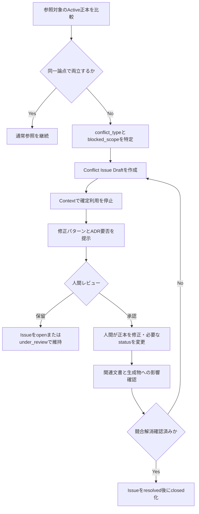

# Project Mnemosyne Context Source Priority

## 1. 目的

本書は、Project Mnemosyneにおいて複数の情報源に関連記載が存在する場合に、どの情報源から確認を開始し、どの状態の情報を根拠として利用し、矛盾をどのように検知・Issue化・修正・解消確認するかを定義する。

本書は単純な「順位表」ではない。Markdown docsおよびADRはいずれもPhase 1の正本であり、役割が異なる。したがって、Activeな正本同士が同一論点で競合する場合は、一方を機械的に優先せず、確定利用を停止した上で人間判断へ戻す。

---

## 2. 適用範囲

### 2.1 対象

- ActiveなMarkdown運用正本文書
- ActiveなADR
- プロジェクト記憶文書
- Review文書およびTest Result文書
- Conversation Summary
- AIチャット履歴および人間メモ
- Context Pack等の生成物
- 将来の検索副本および検索結果

### 2.2 委譲事項

| 対象 | 委譲先 |
|---|---|
| `memory_type`、`status`、`task_status`、`review_status` の定義 | `docs/memory/memory-taxonomy.md` |
| 正本・副本・一次メモ・生成物の境界 | `docs/memory/memory-policy.md` |
| 正本反映の通常作業フロー | `docs/memory/memory-update-flow.md` |
| Context Pack形式および生成処理 | Phase 2成果物 |
| 索引・検索・metadata実装 | Phase 3成果物 |

---

## 3. M1-2で確定する設計判断

| ID | 決定事項 |
|---|---|
| CSP-D-001 | 参照先は確認目的に応じて選択し、単一の絶対順位のみで運用しない。 |
| CSP-D-002 | ActiveなMarkdown docsおよびActiveなADRは、一次メモ、副本、生成物より優先する。 |
| CSP-D-003 | Active ADRとActive運用正本文書が同一論点で競合する場合、AIは自動採用せず `issue` として扱う。 |
| CSP-D-004 | 競合の影響範囲は文書全体ではなく `blocked_scope` によって論点単位で限定する。 |
| CSP-D-005 | 正本間競合IssueのPhase 1における正式記録先は `docs/review/context-source-conflicts/{issue_id}.md` とする。 |
| CSP-D-006 | 競合Issue IDは共通方針文書の競合を `CSP-ISS-{NNN}`、プロジェクト固有文書を含む競合を `{project_code}-CSP-ISS-{NNN}` とする。 |
| CSP-D-007 | 通常のContext Packでは、競合中のDecisionまたはConstraintを確定情報セクションへ収録しない。 |
| CSP-D-008 | Context Packには競合Issueの存在、Issue ID、`blocked_scope` および関連正本を `Warnings` または `Open Issues` として収録できる。 |
| CSP-D-009 | 競合比較自体がTaskの目的である場合に限り、競合する両記載を「未解決情報」と明示してContextへ含めてよい。 |
| CSP-D-010 | Conversation Summaryは `review_status` に基づき参照し、Summary単独をActive DecisionまたはConstraintの根拠としない。 |

---

## 4. 情報源の区分と責務

| 区分 | 情報源 | 主な責務 | 通常の根拠性 |
|---|---|---|---|
| 正本 | Markdown運用docs | 現在適用するルール、状態、判断一覧、作業 | `active` の場合に根拠となる |
| 正本 | ADR | 重要判断の背景、理由、影響、変更履歴 | `active` の場合に根拠となる |
| 整理記録 | Review / Test Result | 指摘、確認結果、適用結果 | 状況・結果の根拠。方針化は別途必要 |
| 整理記録 | Conversation Summary | 会話経緯、抽出候補 | 第9章の条件付き参照 |
| 一次メモ | AIチャット履歴、人間メモ | 抽出元 | 確定根拠にしない |
| 副本 | Notion、将来の検索インデックス | 可視化、検索補助 | 元正本を確認する |
| 生成物 | Context Pack、AIドラフト、検索結果 | AI作業用またはレビュー用 | 正本ではない |

---

## 5. 確認目的別の参照ルーティング

参照は、確認したい内容に応じて開始先を選ぶ。上位文書が常に下位文書を上書きする、という意味での単一順位は採用しない。

| 確認目的 | 最初に参照する正本 | 補助参照 | 競合時の扱い |
|---|---|---|---|
| 共通の現在運用ルール | `memory-policy.md`、`memory-taxonomy.md`、`context-source-priority.md` | 関連ADR | 同一論点の矛盾はIssue化 |
| 重要判断の理由・比較案・変更履歴 | 関連ADR | 関連運用文書、`active-decisions.md` | 同一論点の矛盾はIssue化 |
| Projectで現在有効な判断 | `active-decisions.md` | 関連ADR、設計docs | 矛盾はIssue化 |
| 現在地、進行状況、ブロッカー | `current-status.md` | Review / Test Result | 正本更新要否をIssue化 |
| 次に実施すべき作業 | `next-actions.md` | `current-status.md`、Phase文書 | 不整合は修正候補化 |
| 会話の経緯、抽出元の確認 | `review_status: reviewed` または `reflected` のConversation Summary | Active正本、必要時のみ生チャット | Active正本を優先 |
| 検証済みの結果確認 | Test Result文書 | 関連正本、Review文書 | 結果が方針に影響する場合はIssue化 |
| AI入力用文脈の確認 | Context Pack | 参照元のActive正本 | 矛盾時はContextを使用停止・再生成 |

---

## 6. Statusおよび参照可否

| 情報の状態 | 通常参照での扱い |
|---|---|
| `active` | 現在有効な根拠候補として参照する。ただしActive正本間競合時は第10章を適用する。 |
| `draft` | 検討候補としてのみ扱い、確定根拠にしない。 |
| `superseded` | 置換履歴の確認時のみ参照する。 |
| `deprecated` | 現在判断の根拠にしない。 |
| `archived` | 履歴または監査上必要な場合のみ参照する。 |

### 6.1 基本参照原則

| ID | 原則 |
|---|---|
| CSP-P-001 | `active` な正本文書を、一次メモ、副本、生成物より優先する。 |
| CSP-P-002 | `draft` の内容を現在有効なDecisionまたはConstraintとして扱わない。 |
| CSP-P-003 | `superseded`、`deprecated`、`archived` を通常の現在判断の根拠にしない。 |
| CSP-P-004 | 副本または生成物が正本と矛盾する場合、正本を優先し、副本・生成物を更新または再生成対象とする。 |
| CSP-P-005 | 生のAIチャット履歴のみを根拠に現在有効な判断を確定しない。 |
| CSP-P-006 | Active正本同士が矛盾する場合、AIは判断を確定せずIssue化する。 |

---

## 7. 適用範囲の評価

同一用語または類似ルールが異なる文書に存在しても、適用範囲が異なれば競合でない場合がある。比較時には、以下の `applicability_scope` を確認する。

| applicability_scope | 意味 | 例 |
|---|---|---|
| `common` | 全Projectへ適用する共通ルール | AIはPhase 1で正本へ直接writeしない |
| `project` | 特定Project内に限るルール | ATSの行動登録における冪等性 |
| `phase` | 特定Phaseのみに適用するルール | Phase 1ではContext Pack CLIを実装しない |
| `task` | 特定の作業またはレビューのみに適用する条件 | 競合比較作業では両文書をContextへ含める |

### 7.1 競合評価ルール

- 同一 `applicability_scope` または包含関係にあるscopeで、内容が両立しない場合は競合候補とする。
- Project固有ルールが共通Constraintを緩和または否定する場合は、明示的な例外DecisionまたはADRがない限り競合とする。
- Phase限定ルールが終了後の運用まで意図せず適用されている場合は、鮮度またはscope不整合として確認する。

---

## 8. 競合と整合性警告の分類

### 8.1 正本間競合 `conflict_type`

正本間競合は、Activeな正本同士について、同一論点の内容が同時に成立しない場合に記録する。

| conflict_type | 定義 | 例 |
|---|---|---|
| `semantic_conflict` | 規範内容または判断内容が両立しない | ADRはAI write不可、運用文書は自動write可 |
| `status_conflict` | 正本の有効状態または置換関係が不整合 | Active一覧がSuperseded ADRを現行判断として参照 |
| `scope_conflict` | 適用Project、Phase、Task範囲が両立しない | Phase 1対象外機能をPhase 1必須と記載 |
| `terminology_conflict` | 用語差により有効判定または処理が分岐する | `active` と `accepted` が現在状態として混在 |

### 8.2 整合性警告 `consistency_warning_type`

以下は必ずしもActive正本間競合ではないが、修正または再生成要否を確認すべき警告である。

| consistency_warning_type | 定義 | 通常対応 |
|---|---|---|
| `reflection_gap` | ADR判断が必要な運用文書へ反映されていない | 追記要否を確認する |
| `generated_artifact_staleness` | Context Pack等の生成物が最新正本と一致しない | 再生成する |
| `summary_staleness` | Conversation SummaryがActive正本と一致しない | Summary修正または履歴扱い |
| `reference_link_gap` | related ADRまたは置換リンクが不足している | 参照関係を修正する |

整合性警告のみで正本判断が不可能になる場合は、Issueへ格上げし、必要に応じて `blocked_scope` を設定する。

---

## 9. Conversation Summaryの参照条件

Conversation Summaryの参照は、`memory-taxonomy.md` で定義した `review_status` に従う。

| review_status | 参照可否 | 利用目的 | 禁止事項 |
|---|---:|---|---|
| `draft` | 不可 | なし | 通常Contextまたは検索根拠に使用しない |
| `reviewed` | 条件付き可 | 経緯把握、更新候補の抽出 | Decision / Constraintの根拠にしない |
| `reflected` | 可 | 文脈復元、反映履歴の確認 | 根拠は必ず反映先Active正本で確認する |
| `archived` | 履歴確認時のみ | 過去経緯の確認 | 現在判断に使用しない |

---

## 10. Active正本間競合の検知と参照制御

### 10.1 検知タイミング

| タイミング | 確認内容 |
|---|---|
| 新規運用正本文書またはADRをActive化する前 | 既存Active正本との競合 |
| Active正本文書を変更する前 | 変更影響とADR要否 |
| Conversation Summaryから正本更新案を採用する前 | 既存Decisionとの競合 |
| Context Packを生成または再生成する前 | 競合中情報の混入防止 |
| Phase完了レビュー時 | 成果物一式の整合 |
| Phase 3の索引対象を定義する前 | 競合情報の通常検索混入防止 |

### 10.2 検知観点

| No. | 観点 | 内容 |
|---:|---|---|
| C-01 | Decision Scope | 同一判断対象か |
| C-02 | Status | Active同士か、置換漏れがないか |
| C-03 | Applicability Scope | 共通、Project、Phase、Taskの範囲が一致するか |
| C-04 | Source Boundary | 正本、副本、一次メモ、生成物の境界が一致するか |
| C-05 | AI Permission | `read / draft / write / delete` の範囲が一致するか |
| C-06 | Terminology | 状態語、分類語、文書役割が統一されているか |
| C-07 | References | 関連ADR、置換先、関連Issueを追跡できるか |
| C-08 | Context Impact | Context Packへ確定情報として渡せるか |

### 10.3 競合時の参照制御

| 対象 | 既定動作 |
|---|---|
| 競合するDecision | 解消まで確定Decisionとして利用しない |
| 競合するConstraint | 解消まで確定Constraintとして利用しない |
| 競合のない同一文書内情報 | 参照継続可能 |
| 競合Issue | WarningまたはOpen Issueとして参照可能 |
| 正本文書status | AIは変更しない。人間判断後に変更する |
| 正本修正 | AIは修正案まで、人間が反映する |

### 10.4 `blocked_scope`

競合が見つかった場合は、文書全体ではなく、確定利用を停止する論点を `blocked_scope` に記録する。

```yaml
blocked_scope:
  - "Phase 1におけるAIの正本文書write権限"
  - "Context PackでAI write policyを表示する箇所"
```

---

## 11. Conflict Issueの正式記録

### 11.1 保存先

Phase 1では、Active正本間の競合Issueを以下へ記録する。

```text
docs/review/context-source-conflicts/
  CSP-ISS-001.md
  CSP-ISS-002.md
  ats-CSP-ISS-001.md
```

| 対象 | ID形式 | 保存先 |
|---|---|---|
| 共通方針文書・Mnemosyne基盤文書の競合 | `CSP-ISS-{NNN}` | `docs/review/context-source-conflicts/{issue_id}.md` |
| 特定Projectの記憶または設計docsを含む競合 | `{project_code}-CSP-ISS-{NNN}` | `docs/review/context-source-conflicts/{issue_id}.md` |

### 11.2 正本文書との関係

Conflict Issue文書は、競合の検知内容、修正判断、解消確認を記録するReview文書である。

- Conflict Issue文書自体は、競合中DecisionまたはConstraintの代替正本ではない。
- 影響を受けるProjectの `current-status.md` には、Issue ID、severity、`blocked_scope` を参照として記載する。
- 修正作業が必要な場合は、`next-actions.md` にTaskを記録し、`task_status` で進捗管理する。
- 重要判断の変更を伴う場合は、ADRを新規作成または置換する。

### 11.3 Issue進捗

| conflict_status | 意味 |
|---|---|
| `open` | 競合検知済みで未解決 |
| `under_review` | 修正方針をレビュー中 |
| `resolved` | 正本修正または判断更新により競合論点が解消済み |
| `closed` | 関連文書、status、生成物、引継ぎ確認まで完了 |

---

## 12. Conflict Issueフォーマット

```md
---
title:
issue_id:
memory_type: "issue"
conflict_status: "open"
status: "active"
created_at:
updated_at:
severity:
applicability_scope:
affected_projects:
blocked_scope:
related_documents:
---

# Context Source Conflict Issue

## 1. Summary
- conflict_type:
- decision_scope:
- conflict_summary:

## 2. Conflicting Active Sources

### Source A
- source_path:
- status:
- relevant_section:
- relevant_statement:

### Source B
- source_path:
- status:
- relevant_section:
- relevant_statement:

## 3. Impact Assessment
- impacted_rules:
- impacted_documents:
- impacted_context_sections:
- risk_if_unresolved:

## 4. Temporary Reference Handling
- confirmed_use_allowed: false
- blocked_scope:
- warnings_to_show:

## 5. Resolution Options

### Option A
- correction_policy:
- documents_to_update:
- adr_required:
- consequences:

### Option B
- correction_policy:
- documents_to_update:
- adr_required:
- consequences:

## 6. Approved Resolution
- selected_option:
- reviewer:
- approved_at:
- documents_to_update:
- adr_action:
- status_changes:

## 7. Resolution Confirmation
- corrected_documents:
- generated_artifacts_to_refresh:
- validation_result:
- conflict_status:
- closed_at:
```

---

## 13. 競合解消フロー



---

## 14. 修正パターンとADR要否

| pattern | 状況 | 修正内容 | ADR対応 |
|---|---|---|---|
| `operational_doc_correction` | ADR判断を維持し、運用文書が誤記または反映漏れ | 運用文書を修正 | 原則不要 |
| `adr_supersession` | 既存ADR判断を変更する | 新判断へ運用文書を更新 | 新ADRまたは置換ADRが必要 |
| `both_documents_correction` | 双方が曖昧で、判断の明確化が必要 | ADRと運用文書を整合修正 | 判断変更または追加判断なら必要 |
| `status_reference_correction` | statusまたは参照リンクのみが不整合 | status、`supersedes`、参照リンクを修正 | 原則不要 |
| `artifact_refresh` | 正本は整合し、生成物のみ古い | Context Pack等を再生成 | 不要 |
| `clarification_only` | 責務差による表現差で実質競合でない | 必要に応じ相互参照を追記 | 不要 |

### 14.1 ADRが必要な条件

- 既存ADRで採用した判断を変更する
- 正本、副本、一次メモ、生成物の境界を変更する
- AIの操作権限を変更する
- 記憶配置方式または正本管理主体を変更する
- Context Packまたは検索結果の利用境界を変更する
- 既存の重要判断を明示的に置換する

---

## 15. Context Packへの受け渡し

### 15.1 通常Context Packの既定動作

競合中情報をAIへ確定ルールとして渡さないことを、Phase 2以降のContext Pack生成における既定動作とする。

| 情報 | 通常Context Packでの扱い |
|---|---|
| 競合中のDecision | `Active Decisions` セクションへ収録しない |
| 競合中のConstraint | `Constraints and Write Policy` 等の確定制約セクションへ収録しない |
| 競合Issueの存在 | `Warnings` または `Open Issues` セクションへ収録する |
| `blocked_scope` | Warningとともに収録する |
| 競合していないActive情報 | 通常どおり収録する |
| 解消済み情報 | 更新済みActive正本から再生成したContextへ収録する |

### 15.2 警告形式

```md
## Warnings

### Context Source Conflict
- issue_id: CSP-ISS-001
- severity: critical
- blocked_scope:
  - Phase 1におけるAIの正本文書write権限
- related_sources:
  - docs/adr/ADR-003-human-approved-memory-update.md
  - docs/memory/memory-update-flow.md
- handling:
  - 当該論点をActive DecisionまたはConstraintとして使用しない。
  - Issue解消後にContext Packを再生成する。
```

### 15.3 例外：競合比較Task

競合解消レビューや文書整合レビューのように、競合内容自体を比較することがTaskの目的である場合は、競合する両記載をContextへ含めてよい。

この場合、以下を必須とする。

- `task_purpose: conflict_review` 等で比較目的を明示する。
- 両記載を `Conflicting Sources` セクションに隔離する。
- どちらも確定方針として扱わない旨を明記する。
- AI出力は修正案またはIssue整理案までとし、正本更新を行わない。

---

## 16. Phase 3検索への引継ぎ

Phase 3のRecall Engineは、本書の原則を検索metadataおよび検索結果制御へ引き継ぐ。

| 要件 | 内容 |
|---|---|
| status統一 | 通常検索の有効状態は `active` とし、`accepted` は使用しない |
| draft統一 | 未承認提案は `draft` とし、`proposed` は使用しない |
| summary filtering | Conversation Summaryは `review_status: reviewed` または `reflected` のみ条件付き検索対象とする |
| conflict metadata | `related_issue`、`conflict_status`、`blocked_scope` を保持できるようにする |
| normal retrieval | 競合中Decision / Constraintのchunkを通常の確定Contextとして組み込まない |
| conflict review retrieval | 競合比較Taskの場合のみ、警告付きで取得可能とする |
| traceability | 出典文書、section、status、Issue IDを追跡可能にする |

---

## 17. 解消確認チェックリスト

| No. | 確認項目 | 判定 |
|---:|---|---|
| V-01 | 競合論点について、Active正本間の意味が整合したか | 未確認 |
| V-02 | 競合解消に伴うADR追加・置換・status変更が完了したか | 未確認 |
| V-03 | `active-decisions.md` に判断変更の反映漏れがないか | 未確認 |
| V-04 | `current-status.md` と `next-actions.md` にIssueおよび対応状況が反映されているか | 未確認 |
| V-05 | Conversation Summaryに旧方針を確定表現として残していないか | 未確認 |
| V-06 | Context Pack等の生成物を再生成または破棄したか | 未確認 |
| V-07 | Phase 3検索metadataまたは要件へ影響を反映したか | 未確認 |
| V-08 | Issue本文の `Resolution Confirmation` を更新したか | 未確認 |
| V-09 | `conflict_status` を `resolved` または `closed` に変更可能か | 未確認 |
| V-10 | AIが解消後のActive正本を安全に参照可能か | 未確認 |

---

## 18. M1-2完了条件への対応

| 完了条件 | 対応 |
|---|---|
| 仮説をDecisionとして誤登録しない | `draft` とActive正本の参照境界を第6章、第9章で定義 |
| 古い会話ログよりADRを優先する | 第4〜6章で一次メモよりActive正本を優先 |
| Active ADRとActive運用文書の競合を扱える | 第8〜14章で検知、Issue化、修正、解消を定義 |
| 競合Issueの記録先が決まっている | 第11章で正式記録先およびIDを確定 |
| 競合情報のContext扱いが決まっている | 第15章で通常除外・Warning収録・比較Task例外を確定 |
| Phase 3へ安全に接続できる | 第16章で検索引継ぎ条件を確定 |

---

## 19. Change History

| Version | Date | Status | Summary |
|---|---|---|---|
| 0.1.0 | 2026-06-04 | draft | 参照順位、Active正本間競合の検知、Issue化、修正方針、解消確認を定義 |
| 1.0.0 | 2026-06-04 | active | 目的別参照ルーティング、Conflict Issue保存先、競合中情報のContext Pack既定処理、Conversation Summary参照条件、Phase 3状態語引継ぎを確定しActive化 |
