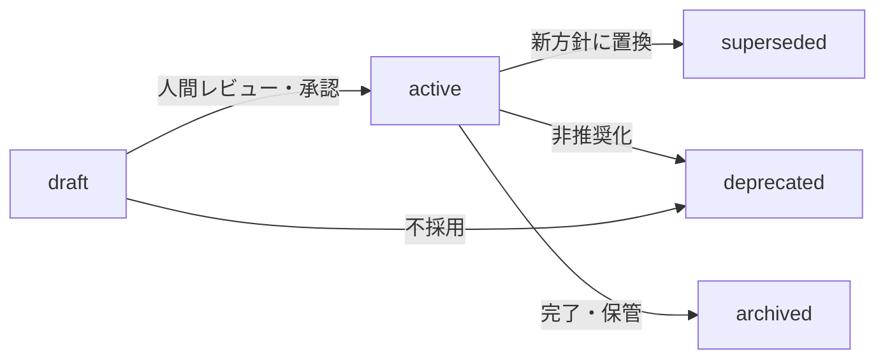
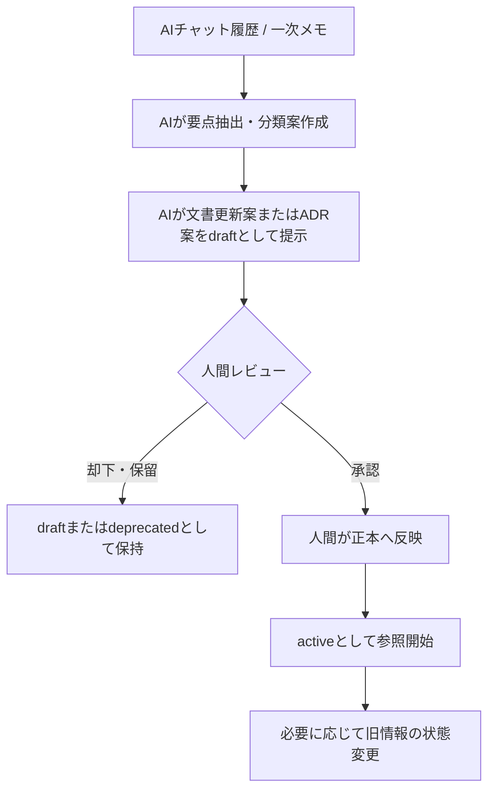

# Project Mnemosyne Memory Policy

## 1. 目的

本書は、Project Mnemosyneにおいて、**どの情報をどこに残し、どの情報を正しい情報源として扱うか**を定義する。

Project Mnemosyneは、AIとの会話・設計判断・タスク・課題・記事メモ等を、後続のAI利用で再参照可能な外部記憶として整理する基盤である。情報源の役割を区別しない場合、仮説や古い方針が現在有効な判断として参照される危険がある。

本書は、Phase 1における以下の基本方針を確定する。

1. 正本・副本・一次メモ・生成物の区分
2. AIに許可する操作範囲
3. 情報の状態および鮮度管理
4. 会話や生成物を正本へ反映する原則
5. Phase 1で確定する範囲と、後続Phaseへ委譲する範囲

---

## 2. 適用範囲

### 2.1 対象

本書は、Phase 1で扱う以下の情報に適用する。

- プロジェクト概要
- 現在状況
- 有効な設計判断
- 次アクション
- 課題および未解決事項
- アイデアおよび検討候補
- 会話要約
- ADR
- AIが作成する文書案、修正案、差分案
- 将来のContext Packに入力される情報の正本性

### 2.2 Phase 1の対象外

Phase 1では、以下の実装または運用自動化を対象外とする。

- Context Packの生成処理およびCLI実装
- PostgreSQLによる構造化記憶管理
- Vector Store / RAGによる検索基盤
- Memory API
- MCP Server
- AIによる正本文書への直接書き込み
- AIによる正本文書の自動削除
- Notionとの自動同期
- GitHub Pull Request等による自動更新フロー

Context Packの**位置づけ**は本書で定義するが、生成方式・出力先・運用手順はPhase 2以降で定義する。

---

## 3. 基本原則

### 3.1 AIが参照できる記憶基盤を作る

Project Mnemosyneは、特定のAIチャットやAIサービスの内部記憶へ依存しない。人間が確認可能で、再利用可能で、変更履歴を追跡できる形で情報を管理し、必要な作業時にAIへ参照させる。

### 3.2 会話ログをそのまま正本にしない

AIチャット履歴には、確定事項、仮説、未整理のアイデア、感情的なメモ、作業依頼、後に否定された案が混在する。

したがって、AIチャット履歴は**一次メモ**として扱い、正本として残すべき内容は整理・分類・レビューを経てMarkdown docsまたはADRへ反映する。

### 3.3 正本・副本・生成物を分離する

Phase 1では、Markdown docsおよびADRを正本とする。Notionは利用する場合も任意の副本であり、Context Packは正本から生成されるAI入力用の生成物である。

### 3.4 AIはドラフトを作成し、正本反映は人間が行う

AIは、参照、整理、抽出、文書案作成、差分案作成を行ってよい。Phase 1では、AIによる正本への直接書き込みは許可しない。正本への反映は、人間が内容を確認・承認した後に、人間が実施する。

### 3.5 現在有効な情報と履歴情報を区別する

情報は削除を前提とせず、状態を付与して管理する。AIが通常参照すべき情報は、原則として `active` 状態の正本である。

---

## 4. 用語定義

| 用語 | 定義 |
|---|---|
| Memory | AIが後続作業で参照できるよう整理された情報単位 |
| 正本 | 内容の正しさを判断する際に基準とする公式な情報源 |
| 副本 | 正本を補助するための可視化用・一覧管理用・検索用の複製または整理情報 |
| 一次メモ | 検討途中・未整理の情報を含み、そのままでは正本として扱わない情報 |
| 生成物 | 正本等を入力として作成され、必要に応じて再生成可能な成果物 |
| ADR | Architecture Decision Record。重要判断と理由・影響・履歴を記録する正本文書 |
| Context Pack | AIへ渡すために正本文書等から必要な文脈を抽出・加工した生成物 |
| Human Approval | 人間がドラフト内容を確認し、正本への反映可否を判断すること |
| Status | 情報が現在有効か、検討中か、置換済みかを示す状態 |

---

## 5. 情報源の区分

### 5.1 Phase 1における位置づけ

| 情報種別 | Phase 1での役割 | 区分 | AI参照時の扱い |
|---|---|---|---|
| Markdown docs | プロジェクト概要、状態、判断一覧、タスク、運用ルールの記録 | 正本 | `active` の内容を優先参照する |
| ADR | 重要設計判断、理由、代替案、影響、変更履歴の記録 | 正本 | 判断根拠確認時に参照する |
| AIチャット履歴 | 考察、相談、未整理情報、作業過程の記録 | 一次メモ | 確定事項として扱わず、抽出元として扱う |
| Context Pack | AI作業用に加工された文脈 | 生成物 | 元となる正本との整合が取れている場合のみ使用する |
| Notion | 可視化、一覧、運用補助 | 任意の副本 | 正本と矛盾する場合は正本を優先する |
| PostgreSQL | 将来の構造化状態管理候補 | Phase 1対象外 | 正本判定に使用しない |
| Vector Store / RAG | 将来の検索副本・検索機構 | Phase 1対象外 | 使用しない |
| API / MCP | 将来の接続インターフェース | Phase 1対象外 | 情報源ではなく接続手段とする |

### 5.2 正本の役割分担

| 正本 | 主な責務 |
|---|---|
| Markdown docs | 現在の運用ルール、現在状況、次アクション、整理済み記憶を示す |
| ADR | 重要判断の背景、採用理由、却下理由、影響、変更履歴を示す |

Markdown docsは現在の運用状態を示し、ADRは重要判断の根拠と履歴を示す。両者が矛盾する場合、AIは独自に一方を正として確定せず、矛盾をIssueとして提示し、人間による修正判断を必要とする。

### 5.3 一次メモの扱い

一次メモは重要な入力材料であるが、正本ではない。

- 会話内の記述だけを根拠に現在有効な判断を断定しない。
- 再利用価値のある情報は、分類・整理・レビュー後に正本へ反映する。
- 採用されなかった案でも、重要判断の比較材料となる場合はADRへ残してよい。

### 5.4 生成物の扱い

| 生成物 | 用途 | Phase 1での扱い |
|---|---|---|
| AIによる文書ドラフト | 人間がレビューするための文書案 | `active` な正本ではない |
| AIによる差分案 | 既存文書の修正候補 | 正本反映前は提案に留める |
| 会話要約案 | 記憶化候補の抽出結果 | 人間承認前は一次整理結果とする |
| Context Pack | AI作業用の文脈資料 | 位置づけのみ定義。生成実装はPhase 2対象 |

生成物が正本と矛盾する場合、正本を優先し、生成物は修正または再生成対象とする。

---

## 6. 参照優先の基本原則

M1-1では、参照優先の基本原則のみを確定する。詳細な選択手順、同一状態の正本文書間の競合解決、矛盾検出時の処理は、後続成果物 `docs/memory/context-source-priority.md` で定義する。

| 原則 | 内容 |
|---|---|
| P-01 | `active` な正本文書を、一次メモ・副本・生成物より優先する |
| P-02 | `draft` の内容を確定事項として扱わない |
| P-03 | `superseded` / `deprecated` の情報を現在判断の根拠にしない |
| P-04 | 副本または生成物が正本と矛盾する場合、正本を優先する |
| P-05 | `active` な正本文書同士が矛盾する場合、AIは自動決定せずIssue化する |

---

## 7. AI操作権限

### 7.1 Phase 1での権限定義

| 操作 | 内容 | AIの権限 | 人間の役割 |
|---|---|---:|---|
| `read` | 正本文書、一次メモ、生成物を参照する | 許可 | 必要に応じて参照対象を確認する |
| `draft` | 新規文書案、修正案、差分案、要約案を作成する | 許可 | 採否・修正要否を判断する |
| `write` | 正本文書へ確定内容を反映する | 不可 | 承認後に人間が反映する |
| `delete` | 正本または判断履歴を削除する | 不可 | 原則は状態変更で対応し、必要時のみ判断する |

### 7.2 AIが行ってよいこと

- `active` な正本を参照して回答またはドラフトを作成する
- `draft` の内容を検討案として整理する
- 会話から記憶化候補を抽出・分類する
- 文書案、差分案、ADR案を作成する
- 矛盾候補、古い情報候補、更新漏れ候補を指摘する
- 状態変更案を提示する

### 7.3 AIが行ってはならないこと

- AIチャット履歴だけを根拠に正本を確定または変更する
- `draft` の情報を承認済みの判断として断定する
- Context PackやNotionを正本より優先する
- Phase 1において正本文書へ直接書き込む
- 正本または判断履歴を自動削除する
- 矛盾のある正本文書から独自に正しい方針を確定する

---

## 8. 情報の状態および鮮度管理

### 8.1 状態一覧

Phase 1では、Markdown docsおよびADRに共通の状態語を使用する。承認済みで現在有効な文書は `active` とし、`accepted` を別状態値としては使用しない。

| 状態 | 意味 | AI参照時の扱い |
|---|---|---|
| `draft` | 検討中、レビュー前、未承認 | 確定事項として扱わない |
| `active` | 現在有効であり、参照すべき情報 | 優先参照する |
| `superseded` | より新しい判断または文書へ置換済み | 履歴としてのみ参照する |
| `deprecated` | 非推奨であり、現在の根拠に用いない | 原則参照根拠にしない |
| `archived` | 完了済みまたは保管対象 | 必要時のみ参照する |

### 8.2 状態遷移



---

## 9. 正本化ルール

### 9.1 正本化の定義

正本化とは、一次メモまたは生成物に含まれる情報を、人間が確認したうえで、現在参照すべき情報としてMarkdown docsまたはADRへ反映することである。

### 9.2 正本化候補となる情報

| 情報 | 正本化先の例 |
|---|---|
| プロジェクトの目的・範囲・前提 | `project-summary.md` |
| 現在の進行状況・ブロッカー | `current-status.md` |
| 現在有効な判断の一覧 | `active-decisions.md` |
| 次に行う作業 | `next-actions.md` |
| AIが最初に読むべき文脈 | `ai-entrypoint.md` |
| 重要な設計判断と理由 | ADR |
| 記憶分類ルール | `memory-taxonomy.md` |
| 更新運用手順 | `memory-update-flow.md` |
| 詳細な参照優先・矛盾解決手順 | `context-source-priority.md` |

### 9.3 正本化フロー



---

## 10. 記憶文書の初期配置方針

### 10.1 Phase 1の検証用初期配置

Phase 1では、Mnemosyne自身およびATSを用いたテンプレート検証のため、以下の配置を**検証用初期配置**として用いる。

```text
docs/projects/{project_code}/memory/
  project-summary.md
  current-status.md
  active-decisions.md
  next-actions.md
  ai-entrypoint.md
```

### 10.2 最終配置方式は確定しない

上記はPhase 1の検証を円滑に進めるための初期配置であり、将来の最終的な正本配置方式を確定するものではない。

Phase 2以降で、以下の方式を比較して判断する。

| 案 | 概要 |
|---|---|
| 案A | Mnemosyne側で全プロジェクトの記憶を集中管理する |
| 案B | 各プロジェクト側の `docs/memory` を正本とし、Mnemosyneは参照・集約する |

---

## 11. 媒体別のPhase境界

| 媒体・仕組み | Phase 1で確定すること | 後続Phaseへ委譲すること |
|---|---|---|
| Markdown docs / ADR | 初期正本としての採用、状態、更新原則 | 必要に応じた拡張 |
| AIチャット履歴 | 一次メモとしての位置づけ | 自動抽出・自動分類 |
| Notion | 任意の副本であること | 導入可否、同期方式、DB設計 |
| Context Pack | 正本から作る生成物であること | 形式、生成処理、出力先、更新方式 |
| PostgreSQL | Phase 1対象外であること | 正本性、スキーマ、同期境界 |
| Vector Store / RAG | 正本ではないこと | 検索設計、状態考慮、インデックス更新 |
| API / MCP | 接続手段であること | 実装方式、権限管理 |

---

## 12. 関連文書の責務

| 文書 | 責務 |
|---|---|
| `docs/memory/memory-policy.md` | 正本性、AI権限、状態、Phase境界の基本方針 |
| `docs/adr/ADR-001-docs-as-source-of-memory.md` | Markdown docsおよびADRを正本とする判断の記録 |
| `docs/adr/ADR-002-memory-source-of-truth-boundary.md` | 媒体区分と責務境界の判断記録 |
| `docs/adr/ADR-003-human-approved-memory-update.md` | AIのdraft権限と人間による正本更新の判断記録 |
| `docs/memory/memory-taxonomy.md` | 記憶分類基準の定義 |
| `docs/memory/memory-update-flow.md` | 正本更新の実務手順 |
| `docs/memory/context-source-priority.md` | 詳細な参照優先順位および矛盾解消手順 |

---

## 13. M1-1完了条件への対応

| 完了条件 | 対応箇所 |
|---|---|
| どれが正しい情報かを判断できる | 5. 情報源の区分、6. 参照優先の基本原則 |
| AIに許可する操作範囲が明文化されている | 7. AI操作権限 |
| 古い情報と現在有効な情報を区別できる | 8. 情報の状態および鮮度管理 |
| 会話から正本への反映原則が定義されている | 9. 正本化ルール |
| Phase 1と後続Phaseの境界が明確である | 10. 記憶文書の初期配置方針、11. 媒体別のPhase境界 |

---

## 14. Change History

| Version | Date | Status | Summary |
|---|---|---|---|
| 0.1.0 | 2026-06-04 | draft | M1-1 Memory Policy定義の初版ドラフトを作成 |
| 1.0.0 | 2026-06-04 | active | AI write制約、暫定配置、Context Pack境界、状態語統一を反映しActive化 |

---

[[M1-1_review]]
[[M1-1_update]]
[[phase-1-memory-foundation]]
[[ADR-001-docs-as-source-of-memory]]
[[ADR-002-memory-source-of-truth-boundary]]
[[ADR-003-human-approved-memory-update]]
