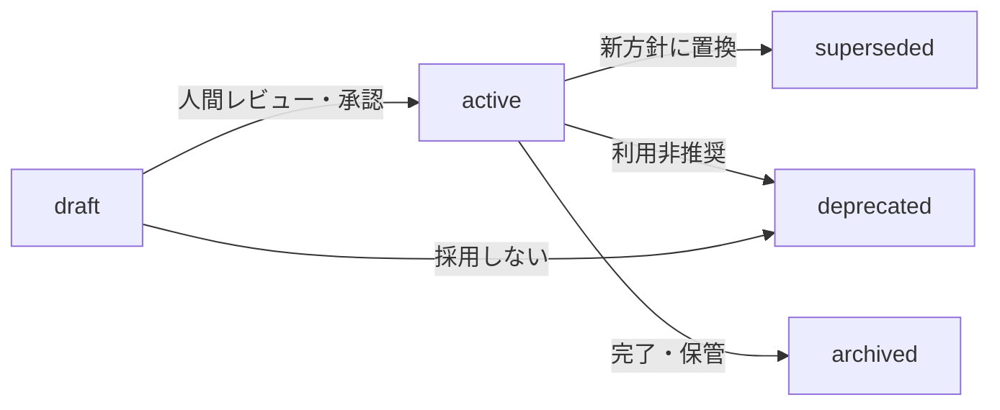
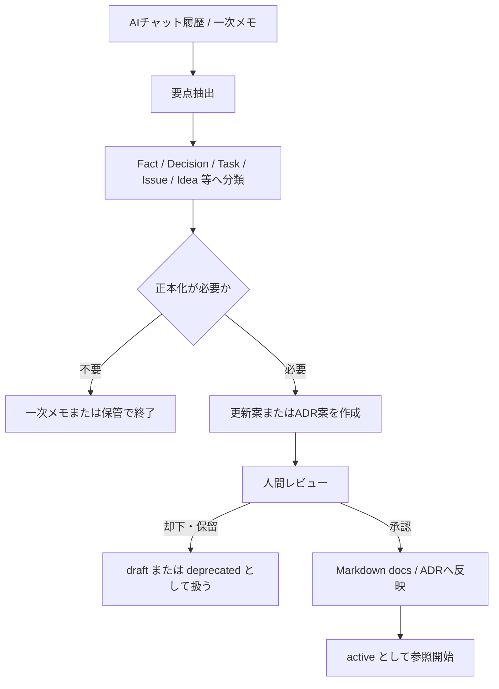

 title: Project Mnemosyne Memory Policy  
document_id: docs/memory/memory-policy.md  
status: draft  
version: 0.1.0  
created_at: 2026-06-04  
updated_at: 2026-06-04  
phase: "Phase 1: Memory Foundation"  
milestone: "M1-1: Memory Policy定義"

# Project Mnemosyne Memory Policy

## 1. 目的

本書は、Project Mnemosyneにおいて、**どの情報をどこに残し、どの情報を正しい情報源として扱うか**を定義する。

Project Mnemosyneでは、AIとの会話、設計判断、タスク、検討事項、記事メモなどを再利用可能な外部記憶として整理する。

ただし、すべての情報を同じ信頼度で扱うと、以下の問題が発生する。

- 会話中の仮説が確定事項として参照される
    
- 古い設計判断が現在有効な判断と混在する
    
- Notion、Markdown、AIチャット、将来のDB間で正しい情報源が分からなくなる
    
- AIが生成した内容が、人間の確認なしに事実として扱われる
    
- Context Packや検索結果が正本と誤認される
    

そのため、本書では以下を定義する。

1. 正本・副本・一次メモ・生成物の区分
    
2. 情報種別ごとの保存先と役割
    
3. AIに許可する操作範囲
    
4. 情報の状態および鮮度管理ルール
    
5. 情報が矛盾した場合の判断ルール
    
6. 会話や生成物を正本へ反映する際の原則
    
7. Phase 1で扱う範囲と将来フェーズへの境界
    

---

## 2. 適用範囲

### 2.1 対象

本書は、Project MnemosyneのPhase 1における以下の情報管理に適用する。

- プロジェクト概要
    
- 現在状況
    
- 有効な設計判断
    
- 次アクション
    
- 課題・未解決事項
    
- アイデア・検討候補
    
- 会話要約
    
- ADR
    
- AIへ渡す文脈情報
    
- AIが作成する文書案・修正案・差分案
    

### 2.2 Phase 1で対象外とするもの

Phase 1では、以下を実装対象外とする。

- PostgreSQLによる構造化記憶管理
    
- Vector Store / RAGによる検索基盤
    
- Memory API
    
- MCP Server
    
- AIによる正本文書への自動書き込み
    
- AIによる正本文書の自動削除
    
- Notionとの自動同期
    
- Context Packの自動生成処理
    

これらは将来フェーズで導入を検討するが、導入後も本書の基本原則である**正本の明確化**および**人間承認後の更新**を維持する。

---

## 3. 基本原則

### 3.1 AIに記憶を持たせるのではなく、AIが参照できる記憶基盤を作る

Project Mnemosyneの目的は、特定のAIチャットやAIサービスの内部記憶に依存することではない。

人間が確認可能で、再利用可能で、更新履歴を追跡できる形で情報を管理し、必要なときにAIへ参照させる。

---

### 3.2 会話をそのまま正本にしない

AIチャット履歴には、以下が混在する。

- 確定した判断
    
- 仮説
    
- 未整理のアイデア
    
- 質問
    
- 感情的なメモ
    
- 一時的な作業依頼
    
- 後に否定された案
    

したがって、AIチャット履歴は**一次メモ**として扱い、そのまま正本として参照しない。

正本として残す場合は、内容を整理し、必要に応じて分類・要約・ADR化したうえで、人間が確認して Markdown docs または ADR へ反映する。

---

### 3.3 正本と副本を明確に分ける

同じ情報が複数の場所に存在する場合、どれを正しい情報源とするかを明確にする。

Phase 1では、Markdown docs および ADR を正本とする。

Notion、Context Pack、将来のVector Storeなどは、閲覧性・検索性・AI入力効率を高めるための副本または生成物であり、正本そのものではない。

---

### 3.4 AIは更新案を作成できるが、正本を自律的に変更しない

AIは、情報整理、文書案作成、差分提案、矛盾候補の指摘を行ってよい。

一方で、正本として扱う文書への反映は、人間が内容を確認し、採用を判断した後に行う。

---

### 3.5 現在有効な情報と履歴情報を区別する

過去の判断や古い方針を削除して失うのではなく、状態を付与して履歴として保持する。

AIが作業時に参照すべき情報は、原則として `active` 状態の情報である。

---

## 4. 用語定義

|用語|定義|
|---|---|
|Memory|AIが後続作業で参照できるよう整理された情報単位|
|正本|内容の正しさを判断する際に基準とする公式な情報源|
|副本|正本を補助するための表示用・検索用・一覧管理用の複製または整理情報|
|一次メモ|検討途中の情報や未整理情報を含み、そのままでは正本として扱わない情報|
|生成物|正本や入力情報をもとに作成され、必要に応じて再生成可能な成果物|
|ADR|Architecture Decision Record。重要な設計判断と、その背景・理由・影響を記録する文書|
|Context Pack|AIへ渡すために、必要な文脈を集約・加工した生成物|
|Human Approval|AIが作成した案や抽出結果を、人間が確認し、正本への反映可否を判断すること|
|Freshness Status|情報が現在有効か、検討中か、置換済みかを表す状態|

---

## 5. 情報源の区分

### 5.1 Phase 1における情報源の扱い

|情報種別|Phase 1での役割|正本性|AI参照時の扱い|
|---|---|---|---|
|Markdown docs|プロジェクト概要、状態、判断、タスク、運用ルールの記録|正本|`active` の内容を優先して参照する|
|ADR|重要な設計判断と理由、代替案、影響の記録|正本|判断の根拠確認時に優先して参照する|
|AIチャット履歴|考察、相談、未整理情報、作業過程の記録|一次メモ|確定事項として扱わず、正本化候補の抽出元として使う|
|Context Pack|AIへ渡すための加工済み文脈|生成物|元となる正本との整合が取れている場合のみ作業用文脈として使う|
|Notion|可視化、一覧管理、運用補助|任意の副本|正本と矛盾する場合は正本を優先する|
|PostgreSQL|将来の構造化状態管理|Phase 1対象外|Phase 1では正本判定に使用しない|
|Vector Store|将来の検索用インデックス・検索副本|Phase 1対象外|Phase 1では使用しない|
|RAG検索結果|将来の検索応答用コンテキスト|Phase 1対象外|将来導入時も正本ではなく検索補助として扱う|
|MCP / API|将来の参照・接続インターフェース|Phase 1対象外|情報源ではなく接続手段として扱う|

---

### 5.2 正本

Phase 1における正本は、以下の2種類とする。

|正本|管理する内容|
|---|---|
|Markdown docs|プロジェクト概要、現在状況、タスク、課題、運用ルール、分類ルール、Context方針|
|ADR|重要な設計判断、選択肢、採用理由、却下理由、影響、変更履歴|

#### Markdown docs の例

```text
docs/phases/phase-1-memory-foundation.md
docs/memory/memory-policy.md
docs/memory/memory-taxonomy.md
docs/memory/memory-update-flow.md
docs/memory/context-source-priority.md
docs/projects/{project_code}/memory/project-summary.md
docs/projects/{project_code}/memory/current-status.md
docs/projects/{project_code}/memory/active-decisions.md
docs/projects/{project_code}/memory/next-actions.md
docs/projects/{project_code}/memory/ai-entrypoint.md
```

#### ADR の例

```text
docs/adr/ADR-001-docs-as-source-of-memory.md
docs/adr/ADR-002-memory-source-of-truth-boundary.md
docs/adr/ADR-003-human-approved-memory-update.md
```

---

### 5.3 副本

副本は、正本の内容を閲覧しやすくしたり、運用上扱いやすくしたりするための情報である。

Phase 1では、Notionを使用する場合に限り、任意の副本として扱う。

|副本候補|用途|Phase 1での扱い|
|---|---|---|
|Notion|タスク一覧、可視化、記事管理、進捗確認|任意。導入しなくてもPhase 1は完了可能|
|Vector Store|関連情報検索、類似検索|対象外|
|PostgreSQL上の構造化Memory|状態管理、履歴管理、検索メタデータ管理|対象外|

#### 副本の原則

- 副本は正本の代わりにならない。
    
- 副本にのみ存在する重要判断は、正本へ反映されるまで確定事項として扱わない。
    
- 副本と正本が矛盾する場合、正本を優先する。
    
- 副本の更新漏れがあっても、正本の内容を正しいものとする。
    

---

### 5.4 一次メモ

一次メモは、検討途中または未整理の情報であり、後から正本化候補を抽出するための材料である。

|一次メモ|含まれる情報|
|---|---|
|AIチャット履歴|質問、回答、検討過程、案、未確定判断、作業依頼|
|ラフメモ|アイデア、思いつき、論点整理前の記録|
|記事メモ|発信用素材、学び、開発中の気づき|

#### 一次メモの原則

- 一次メモは重要な入力情報であるが、正本ではない。
    
- 一次メモ内の記述だけを根拠に、現在有効な設計判断を断定しない。
    
- 正本化する場合は、情報を分類し、重複や矛盾を確認する。
    
- 重要判断を含む場合は、Markdown docs または ADR に反映する。
    

---

### 5.5 生成物

生成物は、正本や一次メモを入力として作成され、再作成可能な情報である。

|生成物|用途|正本性|
|---|---|---|
|Context Pack|AIが作業に必要な文脈を短時間で理解するための入力資料|正本ではない|
|AIによる文書ドラフト|人間がレビューするための文書案|承認・反映前は正本ではない|
|AIによる差分案|既存文書の修正候補|承認・反映前は正本ではない|
|会話要約案|会話から記憶化候補を抽出した整理結果|承認・反映前は正本ではない|

#### 生成物の原則

- 生成物は、元の正本より優先されない。
    
- Context Packの内容が正本と矛盾する場合、Context Packを修正または再生成する。
    
- AIが生成した内容は、人間の確認なしに `active` な記憶として扱わない。
    

---

## 6. 情報の参照優先順位

### 6.1 基本優先順位

AIまたは人間が情報を参照する際、同一論点について複数の情報が存在する場合は、原則として以下の順に優先する。

|優先順位|情報源|扱い|
|--:|---|---|
|1|`active` 状態のADR|重要判断の根拠として最優先|
|2|`active` 状態のMarkdown docs|現在の方針・状態・タスクの正本|
|3|`draft` 状態のMarkdown docs / ADR|検討中の案としてのみ参照|
|4|Notion等の副本|正本内容を補助的に確認するために参照|
|5|Context Pack|作業用入力として参照。正本確認が必要な場合は元文書へ戻る|
|6|AIチャット履歴・ラフメモ|背景確認や正本化候補の抽出元として参照|

---

### 6.2 ADRと通常Markdown docsの関係

ADRは、重要な設計判断の**理由と決定経緯**を記録する正本である。

通常のMarkdown docsは、現在の運用ルールや状態を読みやすく整理した正本である。

同一テーマについて両者に記述がある場合、以下のように扱う。

|確認したい内容|優先して参照する文書|
|---|---|
|なぜその判断を採用したか|ADR|
|現在どのルールで運用するか|`active` なMarkdown docs|
|現在の作業状態や次タスク|current-status / next-actions|
|判断の変更履歴|ADRおよび置換関係|

Markdown docsの運用記述がADRの決定内容と矛盾する場合は、単純にどちらかを採用せず、矛盾をIssueとして扱い、修正対象を明確にする。

---

### 6.3 情報が矛盾した場合の対応

情報の矛盾を発見した場合、AIは独自に正しい内容を決めて正本を書き換えてはならない。

以下の順で対応する。

1. 矛盾している文書名と該当論点を特定する。
    
2. 各文書の状態が `active` / `draft` / `superseded` / `deprecated` / `archived` のいずれかを確認する。
    
3. `active` な正本文書同士が矛盾する場合は、Issueとして提示する。
    
4. 新しい判断が既に存在する場合は、古い文書を `superseded` または `deprecated` に変更する案を提示する。
    
5. 人間が採用する内容を判断した後に、正本へ反映する。
    

---

## 7. AI操作権限

### 7.1 操作権限の基本ルール

|操作|内容|Phase 1での許可|条件|
|---|---|--:|---|
|`read`|正本文書、副本、一次メモを参照する|可|情報種別と状態を考慮して扱う|
|`draft`|新規文書案、修正案、差分案、要約案を作成する|可|正本反映前はドラフトとして扱う|
|`write`|正本文書へ内容を反映する|AI単独では不可|人間が確認・承認した内容のみ反映する|
|`delete`|正本、副本、履歴情報を削除する|原則不可|人間が明示的に管理判断を行う場合のみ対象となり得る|

---

### 7.2 `read` 権限

AIは、以下の目的で情報を参照してよい。

- プロジェクトの現在地を把握する
    
- 既存の判断や制約を確認する
    
- 新規文書案を作成する
    
- 既存文書との差分を整理する
    
- 矛盾候補や更新漏れを指摘する
    
- 次アクション候補を整理する
    

#### `read` 時の注意事項

AIは、参照した情報の状態を考慮しなければならない。

|状態|AIの扱い|
|---|---|
|`active`|現在有効な情報として扱う|
|`draft`|検討中の情報として扱い、確定事項とは断定しない|
|`superseded`|過去の判断または履歴としてのみ扱う|
|`deprecated`|原則として現在の判断根拠に使わない|
|`archived`|完了経緯や履歴確認が必要な場合のみ参照する|

---

### 7.3 `draft` 権限

AIは、以下の成果物をドラフトとして作成してよい。

- 新規Markdown文書案
    
- ADR案
    
- 既存文書の置き換え案
    
- 追記案
    
- 差分一覧
    
- 会話要約
    
- Decision / Task / Issue / Idea の抽出案
    
- Context Pack案
    
- ステータス変更案
    
- 矛盾解消案
    

#### `draft` 時の必須原則

- ドラフトは正本として扱わない。
    
- 未確定内容を `active` な判断として記述しない。
    
- 既存正本に対する変更内容が分かる形で提示する。
    
- 設計判断を追加・変更する場合は、ADR作成またはADR更新の必要性を示す。
    
- 古い情報を置換する場合は、置換対象と新しい参照先を明示する。
    

---

### 7.4 `write` 権限

Phase 1において、AIは正本へ自律的に書き込まない。

AIが作成した内容を正本へ反映するには、以下のいずれかが必要である。

- 人間がドラフト内容を確認し、採用を明示する
    
- 人間が修正内容を確定し、反映を指示する
    
- 人間が作成済み文書の内容を正本として登録する
    

#### 正本反映時に確認すべき事項

- 既存の `active` 情報と矛盾しないか
    
- 新しい判断であればADRが必要ではないか
    
- 置換される旧情報の状態変更が必要ではないか
    
- 副本やContext Packへの反映が必要ではないか
    
- 文書の状態が適切に設定されているか
    

---

### 7.5 `delete` 権限

AIは、以下の情報を原則として削除しない。

- ADR
    
- 正本Markdown docs
    
- 過去の判断履歴
    
- 置換済みの情報
    
- 会話をもとに作成された記憶化記録
    

古い情報が不要に見える場合でも、削除ではなく以下を優先する。

|状況|推奨対応|
|---|---|
|新しい判断に置換された|`superseded` に変更する|
|非推奨となった|`deprecated` に変更する|
|作業完了後に保管する|`archived` に変更する|
|誤記または重複がある|修正案または統合案を提示し、人間が判断する|

---

## 8. 情報の状態および鮮度管理

### 8.1 状態一覧

|状態|意味|AI参照時の扱い|主な利用対象|
|---|---|---|---|
|`draft`|検討中、レビュー前、未承認|確定事項として扱わない|新規文書案、ADR案、更新案|
|`active`|現在有効であり、参照すべき情報|優先的に参照する|現行方針、現在状態、有効な判断|
|`superseded`|より新しい判断または文書に置換された|履歴確認時のみ参照する|旧方針、旧仕様、旧判断|
|`deprecated`|古い、または今後使用を推奨しない|原則として根拠に使わない|採用しない運用、旧構成|
|`archived`|完了済みまたは保管対象|必要時のみ参照する|完了タスク、過去フェーズ記録|

---

### 8.2 状態遷移の基本ルール



---

### 8.3 状態変更の判断例

|状況|変更前|変更後|理由|
|---|---|---|---|
|新規Memory Policy案を作成した|なし|`draft`|まだレビュー前であるため|
|人間が内容を確認し、運用開始した|`draft`|`active`|現在有効な正本となるため|
|新版Memory Policyへ置き換えた|旧版 `active`|`superseded`|新版が正本となるため|
|採用しない案として残す|`draft`|`deprecated`|現行根拠に使わせないため|
|完了済みPhaseの作業メモを保存する|`active`|`archived`|現在の作業判断には不要であるため|

---

## 9. 正本化ルール

### 9.1 正本化とは

正本化とは、一次メモまたは生成物に含まれる情報を、人間が確認したうえで、現在参照すべき公式情報として Markdown docs または ADR に反映することである。

---

### 9.2 正本化が必要な情報

以下に該当する情報は、一次メモのまま放置せず、正本化候補として扱う。

|情報|正本化先の例|
|---|---|
|プロジェクトの目的・範囲・前提|`project-summary.md`|
|現在の進行状況・完了事項・ブロッカー|`current-status.md`|
|現在有効な判断|`active-decisions.md`|
|次に行う作業|`next-actions.md`|
|AIが最初に読むべき文脈|`ai-entrypoint.md`|
|重要な設計判断と理由|ADR|
|記憶の分類ルール|`memory-taxonomy.md`|
|正本更新の運用手順|`memory-update-flow.md`|
|矛盾時の参照優先順位|`context-source-priority.md`|

---

### 9.3 正本化しない情報

以下は、原則として正本化の対象外とする。

- 単なる挨拶や雑談
    
- 既存正本と同一内容の繰り返し
    
- 採用されなかった案で、今後の判断材料にもならないもの
    
- 作業途中の未整理な文章そのもの
    
- AIが推測で補完した内容
    
- 根拠が確認できない断定
    

ただし、採用されなかった案であっても、重要な設計判断の比較対象となった場合は、ADR内の選択肢・却下理由として記録してよい。

---

### 9.4 会話ログから正本への変換フロー



---

## 10. 情報種別ごとの保存方針

### 10.1 プロジェクト概要

|項目|方針|
|---|---|
|保存先|`docs/projects/{project_code}/memory/project-summary.md`|
|内容|目的、背景、対象範囲、主要成果物、重要制約|
|正本性|正本|
|更新契機|目的、スコープ、主要構成が変更された場合|

---

### 10.2 現在状況

|項目|方針|
|---|---|
|保存先|`docs/projects/{project_code}/memory/current-status.md`|
|内容|現在地、完了事項、進行中事項、ブロッカー、直近判断|
|正本性|正本|
|更新契機|マイルストーン完了、課題発生、作業開始・終了時|

---

### 10.3 有効な判断

|項目|方針|
|---|---|
|保存先|`docs/projects/{project_code}/memory/active-decisions.md`|
|内容|現在有効な判断の一覧と参照ADR|
|正本性|正本|
|更新契機|新しい判断の採用、既存判断の置換・廃止時|

---

### 10.4 次アクション

|項目|方針|
|---|---|
|保存先|`docs/projects/{project_code}/memory/next-actions.md`|
|内容|次に行う作業、優先順位、前提条件、完了条件|
|正本性|正本|
|更新契機|作業完了、新タスク追加、優先順位変更時|

---

### 10.5 設計判断

|項目|方針|
|---|---|
|保存先|`docs/adr/*.md`|
|内容|判断内容、背景、選択肢、採用理由、影響、状態|
|正本性|正本|
|更新契機|重要な設計方針の新規決定または変更時|

---

### 10.6 会話ログ

|項目|方針|
|---|---|
|保存先|AIチャット履歴、必要に応じて会話要約文書|
|内容|検討過程、相談内容、未整理情報|
|正本性|一次メモ|
|更新契機|必要な判断・タスク・課題を正本へ抽出する場合|

---

### 10.7 Context Pack

|項目|方針|
|---|---|
|保存先|Phase 2で定義する出力先|
|内容|AIへ渡すために必要情報を集約した文脈|
|正本性|生成物|
|更新契機|正本更新後、または対象タスク変更時|
|注意事項|Context Pack単独で方針を確定しない|

---

## 11. Phase 1における媒体別の判断

### 11.1 Markdown docs

Phase 1では、Markdown docsをプロジェクト記憶および運用ルールの中心的な正本とする。

#### 採用理由

- 人間が直接読める
    
- Gitで差分管理できる
    
- AIへそのまま参照させやすい
    
- 自動化前のルール検証に適する
    
- 特定SaaSへ依存しない
    

---

### 11.2 ADR

ADRは、重要判断の理由を残す正本とする。

以下に該当する内容は、通常のメモだけでなくADRとして残す。

- 正本と副本の境界
    
- AIの更新権限
    
- 文書配置方針
    
- Context階層の設計
    
- AgentとProject Contextの責務分離
    
- 将来フェーズで正本構成を変更する判断
    

---

### 11.3 Notion

Notionは、Phase 1では必須要素としない。

導入する場合は、以下の用途に限定する。

- 一覧性の高いビュー
    
- 進捗確認
    
- 記事管理
    
- タスクの可視化
    
- 人間向けダッシュボード
    

Notion上の内容が正本文書と矛盾する場合は、Markdown docs または ADR を優先する。

---

### 11.4 PostgreSQL

PostgreSQLは、将来的に構造化されたMemoryや状態管理の正本を担う候補である。

ただし、Phase 1では導入しない。

したがって、Phase 1においては、PostgreSQLを正本として参照する運用は存在しない。

将来導入する場合は、以下を別途決定する必要がある。

- Markdown docs とDBの責務境界
    
- Decision / Task / Issue 等の構造化単位
    
- 更新元と同期方向
    
- 状態管理方法
    
- DBとADRが矛盾した場合の優先順位
    

---

### 11.5 Vector Store / RAG

Vector StoreおよびRAGは、将来的に情報検索を効率化するための副本・検索機構である。

検索結果は、正本の内容を発見するための補助であり、検索結果自体を正本として扱わない。

---

## 12. AI利用時の遵守事項

AIは、Project Mnemosyneの記憶を参照または更新案作成に利用する際、以下を遵守する。

### 12.1 AIが行ってよいこと

- `active` な正本文書を参照して回答する
    
- `draft` の内容を検討案として整理する
    
- 文書ドラフトを作成する
    
- 正本との差分案を提示する
    
- 矛盾している情報を指摘する
    
- 古い情報の状態変更候補を提示する
    
- 会話から記憶化候補を分類する
    
- ADR作成が必要な判断を指摘する
    

### 12.2 AIが行ってはならないこと

- `draft` の内容を確定事項として断定する
    
- AIチャット履歴だけを根拠に現在の正本を上書きする
    
- Context Packを正本として扱う
    
- 副本の情報を正本より優先する
    
- 人間承認なしに重要判断を `active` として確定する
    
- 古い情報を根拠なく削除する
    
- 矛盾がある状態で独自に正しい方針を確定する
    
- 推測情報をFactまたはDecisionとして正本化する
    

---

## 13. 文書責務の境界

本書は、情報をどこに残し、何を正本とし、AIに何を許可するかを定義する。

詳細な分類方法、更新手順、矛盾解決手順、判断記録は以下の文書へ分離する。

|文書|責務|
|---|---|
|`docs/memory/memory-policy.md`|正本・副本・一次メモ・生成物、AI権限、状態管理の基本方針|
|`docs/memory/memory-taxonomy.md`|Fact / Decision / Task / Issue / Idea 等の分類基準|
|`docs/memory/memory-update-flow.md`|会話やメモから正本へ反映する実務フロー|
|`docs/memory/context-source-priority.md`|情報矛盾時の詳細な参照優先順位と判断手順|
|`docs/adr/ADR-001-docs-as-source-of-memory.md`|Markdown docsをPhase 1の記憶正本とする判断|
|`docs/adr/ADR-002-memory-source-of-truth-boundary.md`|正本・副本・生成物・将来DBの境界判断|
|`docs/adr/ADR-003-human-approved-memory-update.md`|AI更新案と人間承認を必須とする判断|

---

## 14. 関連ADR

M1-1では、本書とあわせて以下のADRを作成する。

|ADR|記録する判断|
|---|---|
|`ADR-001-docs-as-source-of-memory.md`|Phase 1ではMarkdown docsとADRを正本とする|
|`ADR-002-memory-source-of-truth-boundary.md`|Notion、Context Pack、将来のPostgreSQL、Vector Storeの位置づけを定義する|
|`ADR-003-human-approved-memory-update.md`|AIはdraftまでを担い、正本反映には人間承認を必要とする|

---

## 15. M1-1完了条件への対応

|完了条件|本書での対応箇所|
|---|---|
|「どれが正しい情報か」を迷わず判断できる|5. 情報源の区分、6. 情報の参照優先順位|
|AIに許可する操作範囲が明文化されている|7. AI操作権限、12. AI利用時の遵守事項|
|古い情報と現在有効な情報の区別方法が定義されている|8. 情報の状態および鮮度管理|
|正本化の考え方が定義されている|9. 正本化ルール|
|Phase 1と将来フェーズの境界が明確である|2. 適用範囲、11. Phase 1における媒体別の判断|

---

## 16. 本書のレビュー観点

本書を `active` とする前に、以下を確認する。

-  Phase 1では Markdown docs と ADR を正本とする方針に合意できるか
    
-  Notionを任意の副本として扱う方針に問題がないか
    
-  PostgreSQLをPhase 1対象外とし、将来の正本候補として扱う表現に問題がないか
    
-  Context Packを生成物として扱う方針に問題がないか
    
-  AIの `write` を人間承認後に限定する方針に問題がないか
    
-  `draft` / `active` / `superseded` / `deprecated` / `archived` の状態定義に不足がないか
    
-  後続文書である `memory-taxonomy.md`、`memory-update-flow.md`、`context-source-priority.md` との責務分離が妥当か
    
-  M1-1で作成するADRのファイル名と責務が確定しているか
    

---

## 17. 今後の更新候補

本書の確定後、以下を順次作成または更新する。

1. `docs/adr/ADR-001-docs-as-source-of-memory.md`
    
2. `docs/adr/ADR-002-memory-source-of-truth-boundary.md`
    
3. `docs/adr/ADR-003-human-approved-memory-update.md`
    
4. `docs/memory/memory-taxonomy.md`
    
5. `docs/memory/memory-update-flow.md`
    
6. `docs/memory/context-source-priority.md`
    

---

## 18. 変更履歴

|Version|Date|Status|Summary|
|---|---|---|---|
|0.1.0|2026-06-04|draft|M1-1 Memory Policy定義の初版ドラフトを作成|

## 補足判断

このドラフトでは、`Context Pack` を**副本ではなく生成物**として明確に分離しました。Context Packは、正本から作られる作業用入力であり、内容が古くなった場合は更新対象ではなく**再生成対象**として考える方が安全だからです。

また、既存資料間ではADR名に以下の揺れがあります。

|旧記載例|今回採用する名称|
|---|---|
|`ADR-001-docs-as-source-of-design.md`|`ADR-001-docs-as-source-of-memory.md`|
|`ADR-002-memory-source-of-truth.md`|`ADR-002-memory-source-of-truth-boundary.md`|

今回のM1-1では、`docs/phases/phase-1-memory-foundation.md` の成果物名を正として、**memory / source-of-truth-boundary** の名称に揃える方針が妥当です。M1-1は「設計全般」ではなく「記憶基盤における正本境界」を確定する工程であるためです。提示されたPhase計画上でも、M1-1成果物はこの名称で整理されています。

## 次に実施すべき作業

`memory-policy.md` の内容確認後は、記載した判断を理由付きで固定するため、以下の順でADRを作成するのが適切です。

1. `ADR-001-docs-as-source-of-memory.md`
    
2. `ADR-002-memory-source-of-truth-boundary.md`
    
3. `ADR-003-human-approved-memory-update.md`
    

## Conversation Memory

### fact

- `docs/phases/phase-1-memory-foundation.md` は完成済みであり、ユーザーは M1-0：Phase方針確定を完了扱いとして進める考えである。 / `docs/phases/phase-1-memory-foundation.md` is complete, and the user considers M1-0: Phase policy confirmation complete.
    
- M1-1：Memory Policy定義の成果物として、`docs/memory/memory-policy.md` と3件のADRが定義されている。 / M1-1: Memory Policy Definition includes `docs/memory/memory-policy.md` and three ADR documents as deliverables.
    
- Phase 1では、Markdown docs と ADR が初期正本であり、Notion は任意の副本、PostgreSQL と Vector Store は対象外として整理されている。 / In Phase 1, Markdown docs and ADRs are the initial sources of truth; Notion is an optional replica; PostgreSQL and Vector Store are out of scope.
    

### decision

- M1-0は完了扱いとして、M1-1の文書作成へ進む前提で整理した。 / M1-0 is treated as complete, and work proceeds to M1-1 document creation.
    
- `memory-policy.md` のドラフトでは、Context Packを副本ではなく「生成物」として明確に扱う構成を採用した。 / In the `memory-policy.md` draft, Context Pack is explicitly treated as a generated artifact, not a replica.
    
- ADRの名称は、Phase計画書に記載された `ADR-001-docs-as-source-of-memory.md`、`ADR-002-memory-source-of-truth-boundary.md`、`ADR-003-human-approved-memory-update.md` に合わせる方針を提示した。 / The proposed ADR filenames follow the Phase plan: `ADR-001-docs-as-source-of-memory.md`, `ADR-002-memory-source-of-truth-boundary.md`, and `ADR-003-human-approved-memory-update.md`.
    

### task

- `docs/memory/memory-policy.md` ドラフトの内容をレビューし、`active` 化に向けた修正要否を判断する。 / Review the `docs/memory/memory-policy.md` draft and decide whether revisions are needed before making it `active`.
    
- Memory Policy確定後、M1-1の3件のADRを作成する。 / After confirming the Memory Policy, create the three ADR documents for M1-1.
    
- 後続工程で `memory-taxonomy.md`、`memory-update-flow.md`、`context-source-priority.md` を作成する。 / In later work, create `memory-taxonomy.md`, `memory-update-flow.md`, and `context-source-priority.md`.
    

### preference

- ユーザーは、Phase単位・マイルストーン単位で成果物と完了条件を明確にしながら進めることを重視している。 / The user values proceeding by phase and milestone with explicit deliverables and completion criteria.
    
- ユーザーは、設計判断と運用ルールをMarkdown文書として再利用可能な形で整備することを重視している。 / The user values organizing design decisions and operating rules as reusable Markdown documents.
    

### constraint

- Phase 1では、RAG、API、MCP、UI、Agent実装、PostgreSQLによる構造化状態管理、Vector Storeを実装対象外とする。 / In Phase 1, RAG, API, MCP, UI, Agent implementation, PostgreSQL-based structured state management, and Vector Store are out of scope.
    
- AIは正本文書を参照し、ドラフトや差分案を作成できるが、人間承認なしに正本へ反映してはならない。 / AI may read source documents and create drafts or diffs, but must not update sources of truth without human approval.
    
- AIチャット履歴は一次メモであり、そのまま正本として扱わない。 / AI chat history is a primary memo and must not be treated directly as a source of truth.
    

### issue

- 過去資料ではADRファイル名に `design` / `memory`、`source-of-truth` / `source-of-truth-boundary` の表記揺れがある。 / Earlier documents contain naming differences in ADR filenames: `design` vs. `memory`, and `source-of-truth` vs. `source-of-truth-boundary`.
    
- Markdown docs と ADR の両方が正本となるため、同一論点で矛盾した場合の詳細手順は別文書で明確化する必要がある。 / Since both Markdown docs and ADRs are sources of truth, detailed procedures for contradictions on the same topic must be defined in a separate document.
    

### idea

- `context-source-priority.md` を後続成果物として作成し、矛盾時の参照優先順位を独立文書化する。 / Create `context-source-priority.md` as a later deliverable to independently define source priority when information conflicts.
    
- Context Packは更新対象ではなく、正本更新後に再生成する成果物として運用する。 / Operate Context Pack as an artifact regenerated after source updates, rather than as an independently maintained document.
    

### article_note

- AI外部記憶では「何を保存するか」より先に、「何を正しい情報として扱うか」を決めることが重要である。 / In AI external memory, deciding what is authoritative is more important than simply deciding what to store.
    
- 会話ログ、Context Pack、Notion、正本文書を同列に扱わず、一次メモ・生成物・副本・正本に分けることで、AIの誤参照を抑制できる。 / Separating chat logs, Context Packs, Notion, and source documents into primary memos, generated artifacts, replicas, and sources of truth helps prevent incorrect AI references.
    

### conversation_summary

- ユーザーは、Project Mnemosyne Phase 1のM1-0を完了扱いとし、M1-1：Memory Policy定義に着手した。今回、正本・副本・一次メモ・生成物、AI操作権限、情報鮮度管理、正本化ルール、Phase 1境界を含む `docs/memory/memory-policy.md` のドラフトを作成した。 / The user treated M1-0 of Project Mnemosyne Phase 1 as complete and started M1-1: Memory Policy Definition. This response produced a draft of `docs/memory/memory-policy.md` covering sources of truth, replicas, primary memos, generated artifacts, AI permissions, freshness states, promotion rules, and Phase 1 boundaries.
    

### test_result

- M1-1の要求事項である「正本判定」「AI操作範囲」「情報鮮度区分」は、作成したドラフト内の各章で対応済みである。 / The M1-1 requirements for source-of-truth judgment, AI operation scope, and information freshness classification are addressed in the draft sections.
    
- M1-0完了後にM1-1へ進む依存関係は、Phase作業計画のマイルストーン順序と整合している。 / The dependency of starting M1-1 after completing M1-0 is consistent with the milestone order in the Phase work plan.