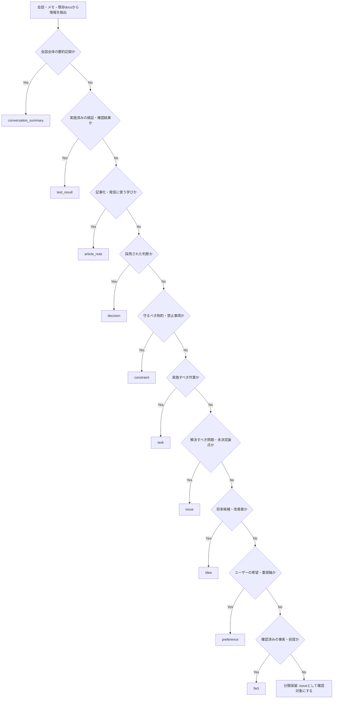
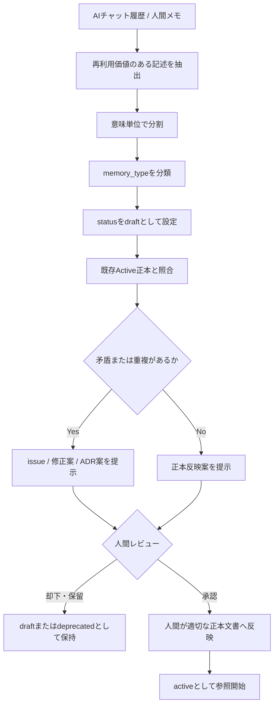

---

title: "Project Mnemosyne Memory Taxonomy"
document_id: "docs/memory/memory-taxonomy.md"
status: "draft"
version: "0.1.0"
created_at: "2026-06-04"
updated_at: "2026-06-04"
approved_at: null
phase: "Phase 1: Memory Foundation"
milestone: "M1-2: Memory Taxonomy定義"
related_documents:

* "docs/phases/phase-1-memory-foundation.md"
* "docs/memory/memory-policy.md"
* "docs/memory/context-source-priority.md"
* "docs/adr/ADR-001-docs-as-source-of-memory.md"
* "docs/adr/ADR-002-memory-source-of-truth-boundary.md"
* "docs/adr/ADR-003-human-approved-memory-update.md"

---

# Project Mnemosyne Memory Taxonomy

## 1. 目的

本書は、Project Mnemosyneにおいて、会話、メモ、既存docs、レビュー結果および検証結果から抽出した情報を、**後続のAI利用で再利用可能な記憶単位へ分類するための基準**を定義する。

Project Mnemosyneでは、AIとの会話から得られる情報をそのまま正本として扱わない。会話には、確定した判断、事実、作業依頼、未解決課題、将来案、個人的な希望、記事化候補、検証結果等が混在するためである。

本書により、以下を可能にする。

1. 任意の会話内容またはメモを、適切な `memory_type` へ分類できる。
2. 仮説、提案、希望、検討中の内容を、確定済みの `decision` として誤登録しない。
3. 会話要約から抽出された情報を、正本反映前の候補として安全に扱える。
4. Phase 2以降のContext Pack生成およびPhase 3以降の検索基盤で、情報種別を一貫して利用できる。

---

## 2. 適用範囲

### 2.1 対象

本書は、以下から抽出される記憶情報の分類に適用する。

* AIとの会話内容
* 人間が作成したメモ
* Markdown docs
* ADR
* Review文書
* Test Result文書
* 記事メモ
* AIが作成した会話要約案
* 将来のContext Packまたは検索結果へ含める記憶候補

### 2.2 対象外

本書では、以下を詳細には定義しない。

| 対象外                                | 委譲先                                                                          |
| ---------------------------------- | ---------------------------------------------------------------------------- |
| 正本・副本・一次メモ・生成物の境界                  | `docs/memory/memory-policy.md`                                               |
| AIのread / draft / write / delete権限 | `docs/memory/memory-policy.md` および `ADR-003-human-approved-memory-update.md` |
| 情報源が矛盾した場合の詳細な優先順位および解消手順          | `docs/memory/context-source-priority.md`                                     |
| 会話から正本文書へ反映する具体手順                  | `docs/memory/memory-update-flow.md`                                          |
| Context Pack生成方式                   | Phase 2成果物                                                                   |
| 検索用chunkおよびmetadataの実装仕様           | Phase 3成果物                                                                   |

---

## 3. 前提となる記憶管理方針

本書は、M1-1で確定したMemory PolicyおよびADRを前提とする。

### 3.1 正本と一次メモの関係

| 情報源           | 位置づけ        | Taxonomy上の扱い                   |
| ------------- | ----------- | ------------------------------ |
| Markdown docs | 正本          | `active` な分類済み情報の保存先           |
| ADR           | 正本          | 重要な `decision` とその理由・影響・履歴の保存先 |
| AIチャット履歴      | 一次メモ        | 分類対象となる入力。単独では確定根拠にしない         |
| AIが作成した要約・分類案 | 生成物またはdraft | 人間レビュー前は正本として扱わない              |
| Context Pack  | 生成物         | 正本から必要情報を抽出したAI入力用成果物          |
| Notion        | 任意の副本       | 正本と矛盾する場合は正本を優先する              |

### 3.2 AIの分類結果の扱い

AIは、会話や既存文書から `fact`、`decision`、`task` 等の候補を抽出してよい。

ただし、AIが抽出した分類結果は、正本へ反映されるまでは承認済み情報ではない。

```text
内容上の分類：decision
情報状態　　　：draft
保存位置　　　：AIドラフトまたは会話要約案
正本反映後　　：active な decision として参照可能
```

### 3.3 Statusとの分離

`memory_type` は「情報の意味」を表す。
`status` は「その情報が現在どの扱いにあるか」を表す。

両者を混同しない。

| 項目            | 表すもの        | 例                                |
| ------------- | ----------- | -------------------------------- |
| `memory_type` | 情報の意味分類     | `decision`、`issue`、`test_result` |
| `status`      | 有効性・鮮度・承認状態 | `draft`、`active`、`superseded`    |

---

## 4. Taxonomy設計原則

### 4.1 内容分類と文書役割を分離する

Project Mnemosyneでは、以下の2種類の分類を分けて扱う。

| 分類軸             | 目的              | 例                                                     |
| --------------- | --------------- | ----------------------------------------------------- |
| `memory_type`   | 情報内容の意味を分類する    | `fact`、`decision`、`task`                              |
| `document_role` | 情報を保存する文書の役割を示す | `project_summary`、`current_status`、`active_decisions` |

例えば、`current-status.md` には `fact`、`task`、`issue` が同時に含まれ得る。
したがって、`current_status` を `memory_type` と同列に扱わず、保存先文書の役割として扱う。

### 4.2 1つの記憶単位には1つの主分類を付与する

1つの記憶単位に複数の意味が混在する場合は、原則として分割する。

#### 分割前

```text
Phase 2ではContext Builderを実装することに決まり、
Vector Storeの採用方式はまだ決まっていない。
```

#### 分割後

| memory_type | 内容                             |
| ----------- | ------------------------------ |
| `decision`  | Phase 2ではContext Builderを実装する。 |
| `issue`     | Vector Storeの採用方式は未決定である。      |

### 4.3 推測をFactまたはDecisionとして扱わない

以下の表現は、そのままでは `fact` または `decision` として扱わない。

* 〜と思う
* 〜かもしれない
* 〜したい
* 〜がよさそう
* 〜ではないか
* 〜を検討したい
* 〜の可能性がある

これらは、内容に応じて `idea`、`preference`、`issue` または `draft` 状態の候補として扱う。

### 4.4 Decisionは内容分類と承認状態を分けて扱う

会話内で明示的に採用された方針は、内容上は `decision` に分類できる。

ただし、その内容が正本へ反映されていない場合、情報状態は `draft` とする。

| 状況                            | memory_type | status       | 扱い      |
| ----------------------------- | ----------- | ------------ | ------- |
| 「この方針で進めます」と会話で明示された          | `decision`  | `draft`      | 正本反映候補  |
| 人間承認後、Active ADRまたは正本文書へ反映された | `decision`  | `active`     | 現在有効な判断 |
| 新方針に置換された                     | `decision`  | `superseded` | 履歴として参照 |

---

## 5. 標準Memory Type一覧

Phase 1では、再利用可能な記憶単位の標準分類を以下の10種類とする。

| memory_type            | 定義                     | 代表例                                |
| ---------------------- | ---------------------- | ---------------------------------- |
| `fact`                 | 確認された事実、現状、前提情報        | ATSはLINE Botを利用する                  |
| `decision`             | 採用された判断、方針、仕様選択        | Markdown docsとADRを初期正本とする          |
| `task`                 | 実施すべき作業、未完了の対応         | `context-source-priority.md` を作成する |
| `preference`           | ユーザーまたは運用主体が重視する希望・進め方 | 技術選定より先に運用ルールを固めたい                 |
| `constraint`           | 守るべき制約、禁止事項、前提条件       | AIは正本へ直接writeしない                   |
| `issue`                | 解決が必要な問題、矛盾、懸念、未決定論点   | 記憶配置を集中管理するか未決定である                 |
| `idea`                 | 将来候補、改善案、未採用の提案        | UIでContext Previewを表示する            |
| `article_note`         | 記事化・発信・記録へ利用できる学びや論点   | 正本性を決めずにRAGを導入すると古い判断を検索する危険がある    |
| `conversation_summary` | 会話全体または作業区切りを要約した入力記録  | M1-1で正本境界とAI更新権限を確定した              |
| `test_result`          | 実施した確認、レビュー、検証の結果      | ATSテンプレートで必要文脈を再構築できた              |

---

## 6. Memory Type詳細定義

## 6.1 `fact`

### 定義

`fact` は、会話または正本文書内で確認された事実、現在の状態、前提情報を表す。

### 分類条件

以下を満たす情報を `fact` とする。

* 観測済みまたは確認済みの事実である。
* 採用判断そのものではない。
* 将来の実施予定や提案ではない。
* 情報源が確認可能である。

### 含める例

| 内容                                        | 理由                |
| ----------------------------------------- | ----------------- |
| Project MnemosyneはAI外部記憶基盤を構築するプロジェクトである。 | プロジェクト定義として確認済み   |
| M1-1では `memory-policy.md` とADR 3件を作成した。   | 実施済み成果物に関する事実     |
| Phase 1ではMarkdown文書を中心に扱う。                | Active方針から確認可能な前提 |

### 含めない例

| 内容                   | 分類先                   | 理由           |
| -------------------- | --------------------- | ------------ |
| Markdown docsを正本とする。 | `decision`            | 採用された方針である   |
| Phase 2でCLIを作成する。    | `task` または `decision` | 実施予定または方針である |
| PostgreSQLを使うとよさそう。  | `idea`                | 未採用の提案である    |

### 代表的な保存先

* `project-summary.md`
* `current-status.md`
* Review結果
* Test Resultの前提条件

---

## 6.2 `decision`

### 定義

`decision` は、複数の選択肢、検討事項または実装方針に対して、採用された判断を表す。

### 分類条件

以下のいずれかを満たす内容を `decision` 候補とする。

* 人間が明示的に「採用する」「この方針で進める」と判断した。
* Active ADRまたはActiveな正本文書に、採用方針として記載されている。
* 既存の判断を置換・廃止する意思決定である。

ただし、会話から抽出しただけのDecision候補は、正本反映前は `draft` とする。

### 含める例

| 内容                                   | status              |
| ------------------------------------ | ------------------- |
| Markdown docsおよびADRをPhase 1の初期正本とする。 | `active`：ADR反映済みの場合 |
| AIは正本文書へ直接writeせず、draft作成までとする。      | `active`：ADR反映済みの場合 |
| M1-2では内容分類と文書役割を分離する。                | `draft`：本書承認前       |

### 含めない例

| 内容                     | 分類先          | 理由         |
| ---------------------- | ------------ | ---------- |
| Vector Storeを使うのもよさそう。 | `idea`       | 採用されていない   |
| DB方式はまだ比較が必要である。       | `issue`      | 判断が未完了である  |
| 技術選定を急ぎたくない。           | `preference` | 希望・重視事項である |

### ADR化を検討すべきDecision

以下に該当する `decision` は、原則としてADR化を検討する。

* 正本・副本・生成物の境界を変更する判断
* AIの操作権限を変更する判断
* Context階層または検索方針に影響する判断
* Project配置方式を変更する判断
* 後続Phaseの設計へ継続的な影響を与える判断
* 既存Active Decisionを置換する判断

### 代表的な保存先

* `active-decisions.md`
* ADR
* `memory-policy.md`
* Phase文書の確定方針部分

---

## 6.3 `task`

### 定義

`task` は、実行が必要な未完了の作業、対応、確認または成果物作成を表す。

### 分類条件

以下を満たす情報を `task` とする。

* 実行すべき行為が明確である。
* 完了・未完了を判定可能である。
* 単なる希望または将来アイデアではない。

### 含める例

| 内容                                              | 理由            |
| ----------------------------------------------- | ------------- |
| `docs/memory/context-source-priority.md` を作成する。 | 明確な成果物作成作業    |
| M1-2完了後、M1-3のテンプレート整備へ進む。                       | 次工程として予定された作業 |
| Active化前にTaxonomyの分類基準をレビューする。                  | 完了判定可能な確認作業   |

### 含めない例

| 内容                            | 分類先          | 理由                |
| ----------------------------- | ------------ | ----------------- |
| UIでContext Previewを見られると便利そう。 | `idea`       | 実行対象として確定していない    |
| 正本の境界が不明確である。                 | `issue`      | 解決対象であり作業そのものではない |
| 人間可読性を重視したい。                  | `preference` | 進め方の希望である         |

### Taskの最小記載項目

| 項目               | 必須性 | 内容               |
| ---------------- | --: | ---------------- |
| `title`          |  必須 | 実施すべき作業          |
| `status`         |  必須 | 未着手、進行中、完了等の管理状態 |
| `phase`          |  推奨 | 関連Phase          |
| `output`         |  推奨 | 成果物              |
| `done_condition` |  推奨 | 完了判定条件           |
| `source_path`    |  推奨 | 作業根拠となる文書        |

### 代表的な保存先

* `next-actions.md`
* `current-status.md` の進行中事項
* Phase作業計画
* Review文書の対応事項一覧

---

## 6.4 `preference`

### 定義

`preference` は、ユーザーまたは運用主体が望む進め方、重視する考え方、選好を表す。

### 分類条件

以下を満たす情報を `preference` とする。

* 禁止事項や必須条件ではなく、望ましい進め方である。
* Decisionとして採用済みの仕様ではない。
* 将来の提案そのものではなく、判断時の重視軸である。

### 含める例

| 内容                            | 理由       |
| ----------------------------- | -------- |
| 技術を先に固定せず、正本境界と運用ルールを先に整理したい。 | 判断時の重視軸  |
| 人間が読みやすいMarkdown形式を優先したい。     | 望ましい運用形式 |
| AI利用前に出典や警告を確認できる形を重視したい。     | 運用上の希望   |

### 含めない例

| 内容                   | 分類先               | 理由           |
| -------------------- | ----------------- | ------------ |
| AIは正本へ直接writeしない。    | `constraint`      | 守るべき制約である    |
| Markdown docsを正本とする。 | `decision`        | 採用済み方針である    |
| Preview UIを作る。       | `task` または `idea` | 実施作業または提案である |

### 代表的な保存先

* `project-summary.md`
* Agent利用方針
* 要件定義書の設計原則
* Conversation Summaryから抽出した利用者希望

---

## 6.5 `constraint`

### 定義

`constraint` は、システム、運用、Phase境界または安全性の観点から守らなければならない制約、禁止事項、前提条件を表す。

### 分類条件

以下を満たす情報を `constraint` とする。

* 違反してはならない条件である。
* 設計または作業実行の境界として作用する。
* 希望ではなく、遵守が必要なルールである。

### 含める例

| 内容                                     | 理由          |
| -------------------------------------- | ----------- |
| AIはPhase 1で正本文書へ直接writeしない。            | 操作権限上の禁止事項  |
| 生のAIチャット履歴を正本として扱わない。                  | 情報源境界上の制約   |
| Phase 1ではRAG、Memory API、MCPを実装対象に含めない。 | Phaseスコープ制約 |

### 含めない例

| 内容                       | 分類先          | 理由         |
| ------------------------ | ------------ | ---------- |
| Markdown docsを正本として採用する。 | `decision`   | 選択された方針である |
| AIの直接writeは危険ではないか。      | `issue`      | 懸念または論点である |
| 人間レビューを大切にしたい。           | `preference` | 希望・価値観である  |

### 代表的な保存先

* `memory-policy.md`
* ADR
* Phase文書の対象外・制約
* Agent共通ルール

---

## 6.6 `issue`

### 定義

`issue` は、解決が必要な問題、矛盾、懸念、未決定事項、ブロッカーまたは確認不足の論点を表す。

### 分類条件

以下のいずれかを満たす情報を `issue` とする。

* 結論が出ておらず、判断が必要である。
* 正本文書間に矛盾が存在する。
* 作業進行を妨げる問題がある。
* 情報不足により確定できない事項がある。
* リスクとして対処または監視が必要である。

### 含める例

| 内容                                                | 理由      |
| ------------------------------------------------- | ------- |
| プロジェクト記憶をMnemosyneへ集中管理するか、各Project側に配置するか未決定である。 | 未決定論点   |
| Active ADRとActiveな運用文書で記載が矛盾している。                 | 正本間矛盾   |
| Conversation Summaryをどの承認状態から検索対象にするか未定である。       | 後続判断が必要 |

### 含めない例

| 内容                | 分類先        | 理由        |
| ----------------- | ---------- | --------- |
| 文書配置方式を比較する。      | `task`     | 解決のための作業  |
| 各Project側を正本とする案。 | `idea`     | 選択肢または提案  |
| 各Project側を正本とする。  | `decision` | 採用済み判断の場合 |

### Issueからの派生

Issueは、解決過程で以下へ変化し得る。

```text
issue
  ↓ 検討案が生じる
idea
  ↓ 採用判断が行われる
decision
  ↓ 実行作業が必要になる
task
  ↓ 実施・確認される
test_result / fact
```

### 代表的な保存先

* `current-status.md`
* Review文書
* Phase文書の未決定事項
* ADRのAlternatives / Open Issues

---

## 6.7 `idea`

### 定義

`idea` は、将来的に検討可能な案、改善候補、代替案、構想または採否未決定の提案を表す。

### 分類条件

以下を満たす情報を `idea` とする。

* 実現価値があり得るが、採用は決まっていない。
* 実行タスクとして着手が確定していない。
* 課題そのものではなく、解決策または発展案である。

### 含める例

| 内容                            | 理由     |
| ----------------------------- | ------ |
| UIでContext Previewを表示する。      | 将来機能候補 |
| Phase 3でHybrid Searchを比較検証する。 | 技術候補   |
| 将来的にNotionを副本として同期する。         | 拡張構想   |

### 含めない例

| 内容                           | 分類先        | 理由        |
| ---------------------------- | ---------- | --------- |
| Context Previewを実装することに決定した。 | `decision` | 採用済み      |
| Context Previewを作成する。        | `task`     | 実行対象として確定 |
| Previewで古い情報が混在する可能性がある。     | `issue`    | 懸念・問題     |

### 代表的な保存先

* `current-status.md` の検討候補
* roadmap
* Phase文書の将来拡張
* 記事メモ内の今後の展望

---

## 6.8 `article_note`

### 定義

`article_note` は、開発記録、設計上の学び、失敗と改善、発信用の論点、記事に再利用できる素材を表す。

### 分類条件

以下を満たす情報を `article_note` とする。

* 記事、ブログ、note、発表資料等へ再利用する価値がある。
* プロジェクト進行の正本判断そのものではない。
* 体験・学び・説明可能な論点として整理できる。

### 含める例

| 内容                                | 理由           |
| --------------------------------- | ------------ |
| AI外部記憶では、検索技術より先に正本境界を決める必要がある。   | 設計上の学び       |
| 会話ログをそのまま記憶にすると、提案とDecisionが混在する。 | 記事化可能な失敗回避論点 |
| M1-1で「AIはdraftまで」と決めた理由を記事化できる。   | 発信素材         |

### 含めない例

| 内容                | 分類先                     | 理由        |
| ----------------- | ----------------------- | --------- |
| AIは正本へ直接writeしない。 | `constraint`            | 運用制約そのもの  |
| 記事ドラフトを作成する。      | `task`                  | 実行すべき作業   |
| 記事化したい。           | `preference` または `idea` | 希望または候補段階 |

### 代表的な保存先

* 記事メモ
* note発信用docs
* Conversation Summary内の学び抽出欄
* Project振り返り文書

---

## 6.9 `conversation_summary`

### 定義

`conversation_summary` は、一定範囲の会話内容について、目的、経緯、確定事項、検討事項、次の論点を要約した入力記録を表す。

### 位置づけ

Conversation Summaryは、会話ログを再読しなくても文脈を復元しやすくするための整理情報である。

ただし、Conversation Summary自体は、ActiveなADRまたは正本文書より優先されない。Summary内に含まれるDecisionやTaskを正本として利用する場合は、必要に応じて正本文書へ反映する。

### 含める例

| 内容                                                    | 理由       |
| ----------------------------------------------------- | -------- |
| M1-1ではMemory PolicyとADR 3件を作成し、正本境界とAI操作権限をActive化した。 | 会話区切りの要約 |
| 本チャットではM1-2としてMemory Taxonomyのドラフトを作成した。              | 作業経緯の要約  |

### Conversation Summary内の分類ブロック

Conversation Summaryには、以下の分類済み情報を含めてよい。

```md
## Conversation Memory

### fact
- ...

### decision
- ...

### task
- ...

### preference
- ...

### constraint
- ...

### issue
- ...

### idea
- ...

### article_note
- ...

### conversation_summary
- ...

### test_result
- ...
```

### 注意事項

* Summaryに記載された `decision` は、正本反映前であれば `draft` 扱いとする。
* SummaryがActive ADRと矛盾する場合、ADRまたはActive正本文書を優先し、Summary側を更新候補とする。
* 生の会話ログに戻らなければ判断できない重要事項は、正本化またはADR化を検討する。

### 代表的な保存先

* Conversation Summary文書
* Session Context
* Recent Conversation Context
* Phaseレビュー記録

---

## 6.10 `test_result`

### 定義

`test_result` は、実施した検証、レビュー、適用確認、動作確認または品質確認の結果を表す。

### 分類条件

以下を満たす情報を `test_result` とする。

* 確認対象と確認方法が存在する。
* 実施済みの結果が記録されている。
* 成功、失敗、条件付き成功、未確認等の判定がある。

### 含める例

| 内容                                   | 理由       |
| ------------------------------------ | -------- |
| ATSの会話内容をテンプレートへ分類でき、主要文脈を再構築できた。    | 適用検証結果   |
| ActiveなADRを優先した場合、古い会話ログの判断を採用しなかった。 | 参照優先検証結果 |
| Taxonomyレビューにより、文書役割と内容分類の混同が解消された。  | レビュー結果   |

### 含めない例

| 内容               | 分類先                | 理由           |
| ---------------- | ------------------ | ------------ |
| ATSでテンプレートを試す。   | `task`             | 未実施の作業       |
| ATSで分類できるはずである。  | `idea` または `issue` | 未検証の推測       |
| ATSがLINE Botである。 | `fact`             | 検証結果ではなく前提事実 |

### Test Resultの最小記載項目

| 項目                | 内容                                          |
| ----------------- | ------------------------------------------- |
| `test_target`     | 確認対象                                        |
| `test_purpose`    | 確認目的                                        |
| `input`           | 入力または条件                                     |
| `expected_result` | 期待結果                                        |
| `actual_result`   | 実結果                                         |
| `judgement`       | Pass / Conditional Pass / Fail / Not Tested |
| `related_sources` | 関連文書またはADR                                  |
| `follow_up`       | 必要な追加対応                                     |

### 代表的な保存先

* `docs/review/*.md`
* Phase完了レビュー
* ATS適用検証結果
* 将来の検索品質検証記録

---

## 7. 分類判断ルール

## 7.1 基本判断フロー



## 7.2 複数分類が混在する場合

1つの文章に複数の意味が含まれる場合、以下の優先順ではなく、**意味単位で分割**する。

#### 入力例

```text
Markdown docsを正本とすることに決めたので、
次にContext Source Priorityを作成する。
ただし、Project別配置方式はまだ未決定である。
```

#### 分類結果

| memory_type | 内容                                  | status               |
| ----------- | ----------------------------------- | -------------------- |
| `decision`  | Markdown docsを正本とする。                | `active` または `draft` |
| `task`      | `context-source-priority.md` を作成する。 | `draft`              |
| `issue`     | Project別配置方式は未決定である。                | `draft`              |

## 7.3 分類できない場合

分類が確定できない情報は、無理に `fact` または `decision` として登録しない。

| 状況               | 扱い                                 |
| ---------------- | ---------------------------------- |
| 発言の意図が不明確である     | `issue` として確認事項にする                 |
| 採用されたか提案段階か不明である | `idea` または `issue` とし、Decision化しない |
| 事実確認ができない        | `draft` 状態の `issue` とする            |
| 正本文書と会話内容が矛盾する   | `issue` とし、人間レビューを求める              |

---

## 8. 誤分類防止ルール

## 8.1 `decision` と `idea` の判別

| 判定観点  | `decision`        | `idea`              |
| ----- | ----------------- | ------------------- |
| 採用状態  | 採用済み              | 未採用                 |
| 表現例   | 〜とする、〜を採用する、〜で進める | 〜もあり、〜を検討したい、〜がよさそう |
| 正本反映  | Active化後は参照根拠になる  | そのままでは根拠にしない        |
| AIの扱い | 正本反映前は `draft`    | 候補として保持             |

### 誤登録防止ルール

以下の内容を、明示的な採用確認なしに `active` な `decision` として扱ってはならない。

* 技術候補
* 将来拡張案
* 会話中の思いつき
* 比較中の代替案
* AIが提案した改善案
* ユーザーが「気になる」「ありかも」と述べた内容

---

## 8.2 `decision` と `constraint` の判別

| 判定観点 | `decision`                      | `constraint`           |
| ---- | ------------------------------- | ---------------------- |
| 意味   | 採用した方針                          | 守らなければならない境界           |
| 例    | Markdown docsを初期正本とする           | AIは正本へ直接writeしない       |
| 関係   | Decisionの結果、Constraintが生じる場合がある | Decisionを実行する際の制限として働く |

同じ判断から複数の記憶を抽出してよい。

| memory_type  | 内容                          |
| ------------ | --------------------------- |
| `decision`   | 人間承認を経た文書のみを正本へ反映する方針を採用する。 |
| `constraint` | AIは正本へ直接writeしない。           |

---

## 8.3 `task` と `idea` の判別

| 判定観点 | `task`                     | `idea`                        |
| ---- | -------------------------- | ----------------------------- |
| 実施意思 | 実施が決まっている                  | 検討候補                          |
| 成果物  | 定義可能                       | 未定の場合が多い                      |
| 完了判定 | 可能                         | 不要または未定                       |
| 例    | `memory-taxonomy.md` を作成する | UIでMemory Browserを作るとよいかもしれない |

---

## 8.4 `issue` と `task` の判別

| 判定観点 | `issue`       | `task`          |
| ---- | ------------- | --------------- |
| 意味   | 解決すべき問題       | 解決のための行動        |
| 例    | 文書配置方式が未決定である | 文書配置方式の比較案を作成する |
| 終了条件 | 判断または解消が必要    | 作業完了が必要         |

---

## 8.5 `fact` と `test_result` の判別

| 判定観点 | `fact`            | `test_result`                        |
| ---- | ----------------- | ------------------------------------ |
| 意味   | 確認された状態・前提        | 検証行為とその結果                            |
| 例    | ATSはLINE Botを利用する | ATSにTaxonomyテンプレートを適用し分類可能であることを確認した |
| 必須情報 | 内容と根拠             | 条件・期待・実結果・判定                         |

---

## 8.6 `preference` と `constraint` の判別

| 判定観点 | `preference`         | `constraint`     |
| ---- | -------------------- | ---------------- |
| 強制力  | 望ましい                 | 必須または禁止          |
| 例    | Markdownで人間可読性を重視したい | AIは正本へ直接writeしない |
| 違反時  | 再検討可能                | 方針違反または安全性違反となる  |

---

## 9. Memory TypeとStatusの組合せ

## 9.1 Status一覧

M1-1のMemory Policyに従い、Phase 1では以下のstatusを使用する。

| status       | 意味                    | AI参照時の扱い     |
| ------------ | --------------------- | ------------ |
| `draft`      | 抽出済みまたは作成済みだが、未承認・検討中 | 確定事項として扱わない  |
| `active`     | 人間承認を経て、現在有効である       | 通常参照の主要根拠とする |
| `superseded` | 新しい情報に置換済みである         | 履歴参照時のみ扱う    |
| `deprecated` | 非推奨または不採用である          | 現在判断の根拠に用いない |
| `archived`   | 完了済みまたは保管対象である        | 必要時のみ参照する    |

### 使用しないstatus

Phase 1では、`accepted` および `proposed` を独立したstatusとして使用しない。

| 候補語        | Phase 1での扱い                |
| ---------- | -------------------------- |
| `accepted` | 承認済みで現在有効な場合は `active` とする |
| `proposed` | 未承認の提案は `draft` とする        |

## 9.2 代表的な組合せ

| memory_type            | `draft` | `active` | `superseded` | `deprecated` | `archived` |
| ---------------------- | ------: | -------: | -----------: | -----------: | ---------: |
| `fact`                 |       可 |        可 |            可 |         条件付き |          可 |
| `decision`             |       可 |        可 |            可 |            可 |          可 |
| `task`                 |       可 |        可 |         条件付き |            可 |          可 |
| `preference`           |       可 |        可 |            可 |            可 |          可 |
| `constraint`           |       可 |        可 |            可 |            可 |          可 |
| `issue`                |       可 |        可 |         条件付き |            可 |          可 |
| `idea`                 |       可 |     条件付き |            可 |            可 |          可 |
| `article_note`         |       可 |        可 |         条件付き |            可 |          可 |
| `conversation_summary` |       可 |     条件付き |            可 |            可 |          可 |
| `test_result`          |       可 |        可 |         条件付き |            可 |          可 |

### 補足

* `idea` を `active` とする場合は、「現在検討対象として維持する案」という意味であり、採用済みDecisionを意味しない。
* `conversation_summary` を `active` として管理する場合も、ADRや正本文書より高い根拠性を持たない。
* 完了した `task` は、単に残し続けるのではなく、必要に応じて `test_result`、`fact` または完了記録へ転記する。

---

## 10. 文書役割とMemory Typeの対応

## 10.1 Document Role一覧

| document_role          | 文書例                           | 主な目的                  |
| ---------------------- | ----------------------------- | --------------------- |
| `policy`               | `memory-policy.md`            | 運用原則・境界・権限を定義する       |
| `taxonomy`             | `memory-taxonomy.md`          | 分類ルールを定義する            |
| `priority_rule`        | `context-source-priority.md`  | 矛盾時の参照手順を定義する         |
| `project_summary`      | `project-summary.md`          | プロジェクトの比較的安定した概要を記録する |
| `current_status`       | `current-status.md`           | 現在地、進行中事項、課題を記録する     |
| `active_decisions`     | `active-decisions.md`         | 現在有効な判断を一覧化する         |
| `next_actions`         | `next-actions.md`             | 実施すべき作業を管理する          |
| `adr`                  | `ADR-*.md`                    | 重要判断の理由・影響・履歴を記録する    |
| `review_result`        | `docs/review/*.md`            | レビュー結果および対応要否を記録する    |
| `test_result`          | `docs/review/*validation*.md` | 検証結果を記録する             |
| `conversation_summary` | 会話整理文書                        | 会話から抽出した文脈を記録する       |
| `article_note`         | 発信用メモ                         | 記事化可能な学びを記録する         |

## 10.2 文書ごとに主に含まれるMemory Type

| 文書                    | 主に格納するmemory_type                | 補助的に含み得るmemory_type         |
| --------------------- | -------------------------------- | --------------------------- |
| `project-summary.md`  | `fact`、`preference`、`constraint` | `decision`                  |
| `current-status.md`   | `fact`、`issue`、`task`            | `decision`、`test_result`    |
| `active-decisions.md` | `decision`、`constraint`          | `fact`                      |
| `next-actions.md`     | `task`                           | `issue`、`constraint`        |
| `memory-policy.md`    | `decision`、`constraint`          | `fact`                      |
| `memory-taxonomy.md`  | `decision`、`constraint`          | `fact`                      |
| ADR                   | `decision`、`constraint`          | `fact`、`issue`、`idea`       |
| Review文書              | `issue`、`task`、`test_result`     | `decision`                  |
| Conversation Summary  | `conversation_summary`           | 全分類の抽出候補                    |
| 記事メモ                  | `article_note`                   | `fact`、`idea`、`test_result` |

---

## 11. 会話から記憶へ変換する手順

## 11.1 基本フロー



## 11.2 抽出時の最低確認事項

| No. | 確認事項                 | 判定内容               |
| --: | -------------------- | ------------------ |
|   1 | 情報は再利用価値があるか         | 一時的雑談ではなく後続作業に有効か  |
|   2 | 1記憶単位に複数の意味が混在していないか | 必要なら分割する           |
|   3 | Factと推測が混在していないか     | 推測はFactへ入れない       |
|   4 | Decisionとして採用済みか     | 採用不明ならIdeaまたはIssue |
|   5 | Taskとして実施が決まっているか    | 未確定ならIdea          |
|   6 | 既存のActive正本と矛盾しないか   | 矛盾時はIssue化         |
|   7 | ADR化すべき重要判断か         | 境界変更等はADR案を作成      |
|   8 | 正本反映前であることを明示しているか   | AI抽出物はdraftとして扱う   |

---

## 12. 参照優先順位との接続

## 12.1 基本方針

分類済み記憶をAIが参照する際は、情報の内容だけでなく、情報源とstatusを考慮する。

詳細な優先順位、矛盾検出および解消手順は、`docs/memory/context-source-priority.md` に委譲する。

### Taxonomy側で確定する最低原則

| ID       | 原則                                                               |
| -------- | ---------------------------------------------------------------- |
| TAX-P-01 | `active` な正本文書およびADRを、一次メモ・副本・生成物より優先する。                         |
| TAX-P-02 | 生のAIチャット履歴を、ActiveなDecisionの根拠として単独利用しない。                        |
| TAX-P-03 | `draft` のDecision候補を、現在有効な判断として扱わない。                             |
| TAX-P-04 | `superseded` または `deprecated` の情報を、通常の現在判断の根拠として用いない。            |
| TAX-P-05 | 会話要約とActive正本が矛盾する場合、Active正本を優先し、要約側を修正候補とする。                   |
| TAX-P-06 | ActiveなADRとActiveなMarkdown正本文書が矛盾する場合、AIは自動決定せず `issue` として提示する。 |

## 12.2 初期参照順位案

以下は、`context-source-priority.md` で詳細化する初期順位案である。

```text
1. active な ADR および active な運用正本文書
2. active-decisions.md
3. current-status.md
4. プロジェクト固有の設計docs
5. review memo / test result
6. reviewed済みの conversation summary
7. 生のAIチャット履歴
```

### 補足

* 1位のActive正本同士で矛盾がある場合は、順位で自動解決しない。
* ADRは重要判断の理由・変更履歴を確認するための正本である。
* `active-decisions.md` は、現在有効な判断一覧を短時間で確認するための正本である。
* Conversation Summaryは文脈復元に利用できるが、Active正本より優先しない。
* 生のAIチャット履歴は、抽出元としてのみ利用する。

---

## 13. 記憶抽出フォーマット

会話またはメモから記憶化候補を抽出する場合、以下の形式を使用できる。

```md
## Memory Extraction Draft

### Source Metadata
- source_type: conversation | memo | document | review | test
- source_path:
- extracted_at:
- extracted_by: AI
- review_status: draft

### Extracted Memories

#### Item 1
- memory_type:
- status: draft
- title:
- content:
- evidence:
- recommended_destination:
- related_adr:
- requires_human_approval: true
- notes:

#### Item 2
- memory_type:
- status: draft
- title:
- content:
- evidence:
- recommended_destination:
- related_adr:
- requires_human_approval: true
- notes:

### Potential Conflicts
- none / ...

### Recommended Document Updates
- ...

### ADR Required
- yes / no
- reason:
```

---

## 14. 分類例

## 14.1 Project Mnemosyneに関する例

| 入力文                                       | memory_type            | status               | 理由               |
| ----------------------------------------- | ---------------------- | -------------------- | ---------------- |
| Project MnemosyneはAI外部記憶基盤を構築するプロジェクトである。 | `fact`                 | `active` または `draft` | プロジェクトの前提情報      |
| Markdown docsとADRを初期正本とする。                | `decision`             | `active`             | ADRでActive化された判断 |
| AIは正本へ直接writeしない。                         | `constraint`           | `active`             | 運用上守るべき禁止事項      |
| `context-source-priority.md` を作成する。       | `task`                 | `draft`              | M1-2の未完了成果物      |
| Project記憶を集中管理するかは未決定である。                 | `issue`                | `draft`              | 判断が必要な論点         |
| UIでContext Previewを表示する。                  | `idea`                 | `draft`              | 将来候補             |
| 正本境界を決めずに検索を導入すると、古い判断を拾う危険がある。           | `article_note`         | `draft`              | 記事化可能な設計上の学び     |
| M1-1で正本境界と人間承認原則を整理した。                    | `conversation_summary` | `draft`              | 会話区切りの要約         |
| Taxonomy適用により、DecisionとIdeaを分離できた。        | `test_result`          | `draft`              | 検証実施後に記録する内容     |

## 14.2 ATS適用例

| 入力文                             | memory_type   | 理由          |
| ------------------------------- | ------------- | ----------- |
| ATSはLINEで行動報告を受け付ける。            | `fact`        | プロジェクト前提    |
| PostgreSQLをポイント記録の正本とする。        | `decision`    | 採用済み設計判断の場合 |
| 同一イベントの二重登録を防止しなければならない。        | `constraint`  | システム上の必須条件  |
| `processed_events` による冪等性を確認する。 | `task`        | 実施すべき検証     |
| cooldown判定で二重登録が防止されることを確認した。   | `test_result` | 実施済み確認結果    |
| 行動報告を促すために夜まとめ報告を追加する案。         | `idea`        | 未採用の改善候補    |
| 子どもの入力負荷を下げる導線を重視したい。           | `preference`  | 判断時の重視軸     |
| 未報告の行動をどう扱うかが未確定である。            | `issue`       | 解決が必要な論点    |

---

## 15. Review Checklist

本書または本書に基づく記憶抽出結果をレビューする際は、以下を確認する。

### 15.1 Taxonomy定義レビュー

|  No. | 確認項目                                      | 判定  |
| ---: | ----------------------------------------- | --- |
| R-01 | 標準memory_typeが10種類で定義されているか               | 未確認 |
| R-02 | `memory_type` と `document_role` が分離されているか | 未確認 |
| R-03 | `memory_type` と `status` が分離されているか        | 未確認 |
| R-04 | `decision` と `idea` の誤分類防止ルールがあるか         | 未確認 |
| R-05 | `task`、`issue`、`constraint` の境界が説明可能か     | 未確認 |
| R-06 | 会話要約を正本より優先しないルールがあるか                     | 未確認 |
| R-07 | 生の会話ログをActive Decisionの根拠にしないルールがあるか      | 未確認 |
| R-08 | AI抽出結果を正本反映前は `draft` とするルールがあるか          | 未確認 |
| R-09 | Active正本間の矛盾をAIが自動解消しないルールがあるか            | 未確認 |
| R-10 | Phase 2・Phase 3で再利用可能な分類となっているか           | 未確認 |

### 15.2 記憶抽出結果レビュー

|  No. | 確認項目                          | 判定  |
| ---: | ----------------------------- | --- |
| E-01 | 抽出対象の情報源が記載されているか             | 未確認 |
| E-02 | 1項目に複数の意味分類が混在していないか          | 未確認 |
| E-03 | 推測が `fact` として登録されていないか       | 未確認 |
| E-04 | 未採用案が `decision` として登録されていないか | 未確認 |
| E-05 | 完了済み作業が未完了の `task` として残っていないか | 未確認 |
| E-06 | 既存のActive正本との重複・矛盾を確認したか      | 未確認 |
| E-07 | ADR化が必要な重要判断を見落としていないか        | 未確認 |
| E-08 | 正本反映前の情報に `draft` が付与されているか   | 未確認 |
| E-09 | 反映先文書が適切に選定されているか             | 未確認 |
| E-10 | 人間承認前にActive情報として参照されないか      | 未確認 |

---

## 16. M1-2完了条件への対応

| 完了条件                         | 本書での対応                                        |
| ---------------------------- | --------------------------------------------- |
| 任意の会話内容をどの分類に置くか判断できる        | 第5章、第6章、第7章、第14章で分類定義・判断フロー・例を定義              |
| 仮説をDecisionとして誤登録しないルールがある   | 第4章、第7章、第8章でDecision化条件と誤分類防止を定義              |
| 古い会話ログよりADRを優先するルールが明文化されている | 第12章でActive正本・ADRを一次メモより優先する基本原則を定義           |
| M1-1の人間承認境界と整合する             | 第3章、第9章、第11章でAI抽出物をdraftとし、人間反映後にactiveとする    |
| 後続Phaseで利用可能な分類体系となっている      | 第4章および第10章で内容分類と文書役割を分離し、検索・Context利用へ接続可能とした |

---

## 17. 後続成果物への引継ぎ

## 17.1 `context-source-priority.md` へ引き継ぐ内容

本書では分類体系と参照優先の最低原則を定義した。以下は、別成果物で詳細化する。

| 引継ぎ事項                     | 内容                               |
| ------------------------- | -------------------------------- |
| Active正本文書間の矛盾検出手順        | ADRとMarkdown docsの矛盾をどのように確認するか  |
| 同一分類内の優先順位                | 複数のDecision、Task、Issueが競合した場合の扱い |
| 更新日時・置換関係の評価              | `superseded_by` 等を用いた鮮度判断        |
| Conversation Summaryの参照条件 | reviewed済み情報をいつ利用可能とするか          |
| Context Pack作成時の採用ルール     | どの分類をどのContext層へ含めるか             |

## 17.2 M1-3 Template整備へ引き継ぐ内容

テンプレート文書には、必要に応じて以下の分類欄を反映する。

| テンプレート                             | 反映すべき主分類                         |
| ---------------------------------- | -------------------------------- |
| `project-summary.template.md`      | `fact`、`preference`、`constraint` |
| `current-status.template.md`       | `fact`、`issue`、`task`            |
| `active-decisions.template.md`     | `decision`、`constraint`          |
| `next-actions.template.md`         | `task`                           |
| `conversation-summary.template.md` | 全10分類                            |
| `test-result.template.md`          | `test_result`                    |

---

## 18. 未決定事項

本ドラフト時点では、以下を未決定事項として残す。

| ID         | 論点                                               | 現時点の扱い                    | 判断時期                |
| ---------- | ------------------------------------------------ | ------------------------- | ------------------- |
| TAX-OI-001 | Memory単位をMarkdown上でどの粒度まで構造化するか                  | 分類ルールのみ定義し、保存形式は未確定       | Template整備またはデータ設計時 |
| TAX-OI-002 | `preference` をProject記憶へ常設するか、Agent Context側へ置くか | 標準分類には含める                 | Context設計詳細化時       |
| TAX-OI-003 | `article_note` を検索対象へ含める条件                       | 標準分類には含めるが、検索対象条件は未確定     | Phase 3             |
| TAX-OI-004 | Reviewed済みConversation Summaryの承認状態管理            | `draft` / `active` 原則のみ定義 | 運用フロー整備時            |
| TAX-OI-005 | DB化時のmemory_type enumおよびdocument_role管理方式        | Phase 1対象外                | 後続データ設計時            |

---

## 19. Change History

| Version | Date       | Status | Summary                                         |
| ------- | ---------- | ------ | ----------------------------------------------- |
| 0.1.0   | 2026-06-04 | draft  | M1-2用初版。10分類、Status分離、Decision誤登録防止、参照優先基本原則を定義 |
