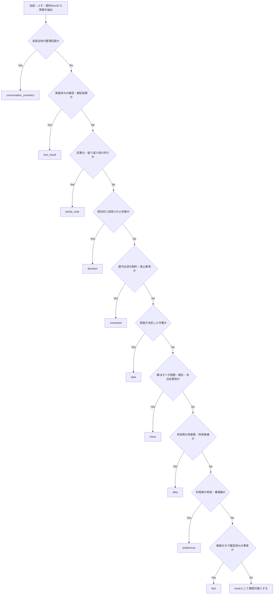

# Project Mnemosyne Memory Taxonomy

## 1. 目的

本書は、Project Mnemosyneにおいて、会話、メモ、既存docs、レビュー結果および検証結果から得られる情報を、後続のAI利用で再利用可能な記憶単位へ分類するための標準ルールを定義する。

本書の目的は、単に分類名を並べることではない。未整理の会話情報に混在する、事実、採用済み判断、作業、未解決事項、提案、制約、学びおよび検証結果を分離し、未承認情報や仮説を現在有効な判断として再利用しないための境界を作ることである。

---

## 2. 適用範囲

### 2.1 対象

本書は、以下の情報を分類または正本反映候補として整理する場合に適用する。

- AIチャット履歴および人間メモ
- Markdown docsおよびADR
- Review文書およびTest Result文書
- Conversation Summary
- 記事メモ
- 将来のContext Packまたは検索結果へ収録する記憶候補

### 2.2 本書で定義しないもの

| 対象 | 委譲先 |
|---|---|
| 正本・副本・一次メモ・生成物の境界 | `docs/memory/memory-policy.md` |
| 情報源の参照優先および正本間競合の処理 | `docs/memory/context-source-priority.md` |
| 正本更新の実務フロー | `docs/memory/memory-update-flow.md` |
| Context Packの生成方式 | Phase 2成果物 |
| 検索用metadataおよび索引設計 | Phase 3成果物 |

---

## 3. M1-2で確定する設計判断

| ID | 決定事項 |
|---|---|
| TAX-D-001 | 標準 `memory_type` は、`fact / decision / task / preference / constraint / issue / idea / article_note / conversation_summary / test_result` の10種類とする。 |
| TAX-D-002 | `memory_type` は情報の意味、`status` は記憶または文書の有効性・承認状態、`document_role` は保存先文書の責務を表し、相互に分離する。 |
| TAX-D-003 | `status` は `draft / active / superseded / deprecated / archived` の5種類とし、`accepted` および `proposed` は独立したstatusとして使用しない。 |
| TAX-D-004 | `task` の実行進捗は `task_status` で管理し、共通 `status` と混同しない。 |
| TAX-D-005 | Conversation Summaryは `review_status` を持ち、`reviewed` または `reflected` の場合に限り条件付きで参照可能とする。 |
| TAX-D-006 | Conversation Summary内のDecisionまたはConstraintは、正本文書またはADRへ反映されるまで現在有効な判断根拠として扱わない。 |
| TAX-D-007 | AIが会話等から抽出した分類案は、正本へ反映されるまでは `draft` とする。 |
| TAX-D-008 | 仮説、提案、希望、比較中の案を、明示的な採用判断および正本反映なしに `active` な `decision` として扱わない。 |

---

## 4. 管理軸の分離

### 4.1 管理軸

| 管理軸 | 表すもの | 例 |
|---|---|---|
| `memory_type` | 情報内容の意味分類 | `decision`、`issue`、`test_result` |
| `status` | 文書または分類済み記憶の有効性・承認状態 | `draft`、`active`、`superseded` |
| `task_status` | `task` の実行進捗 | `todo`、`in_progress`、`done` |
| `review_status` | Conversation Summaryの確認・正本反映状態 | `draft`、`reviewed`、`reflected` |
| `document_role` | 情報を格納する文書の役割 | `active_decisions`、`current_status` |

### 4.2 分離例

| 内容 | memory_type | status | 追加状態 |
|---|---|---|---|
| `context-source-priority.md` を作成する作業が承認され、未着手である | `task` | `active` | `task_status: todo` |
| 会話から「Markdown docsを正本とする」と抽出したが未反映である | `decision` | `draft` | なし |
| 人間が内容を確認した会話要約だが、抽出Decisionは未反映である | `conversation_summary` | `active` | `review_status: reviewed` |
| 必要な内容が正本へ反映済みの会話要約である | `conversation_summary` | `active` | `review_status: reflected` |

---

## 5. 標準Memory Type

| memory_type | 定義 | 例 | 単独で現在判断の根拠にできるか |
|---|---|---|---:|
| `fact` | 確認された事実、現状、前提情報 | ATSはLINE Botを利用する | `active` で根拠付きの場合のみ可 |
| `decision` | 採用された判断、方針、仕様選択 | Markdown docsとADRを初期正本とする | `active` の正本である場合のみ可 |
| `task` | 実施すべき未完了作業または対応 | M1-3でテンプレートを作成する | 判断根拠ではなく作業指示として利用 |
| `preference` | 利用者または運用主体が重視する希望・選好 | 技術選定より運用ルールを先に固めたい | 不可 |
| `constraint` | 守るべき制約、禁止事項、前提条件 | AIは正本へ直接writeしない | `active` の正本である場合のみ可 |
| `issue` | 解決が必要な問題、矛盾、懸念、未決定論点 | 正本配置方式が未決定である | 不可 |
| `idea` | 将来候補、改善案、未採用の提案 | UIでContext Previewを表示する | 不可 |
| `article_note` | 記事化・発信・振り返りに利用できる学び | 正本境界を先に決める必要がある | 不可 |
| `conversation_summary` | 会話の目的・経緯・抽出候補を整理した入力記録 | M1-2の議論要約 | 不可。参照条件は第9章に従う |
| `test_result` | 実施した確認、レビュー、検証の結果 | ATSへテンプレートを適用できた | 結果根拠として利用可。方針決定は別途必要 |

---

## 6. Memory Type詳細ルール

### 6.1 `fact`

`fact` は、確認済みの事実、現状または前提情報を表す。

#### 必須判断

- 推測、期待、希望ではないこと。
- 参照元または確認根拠を追跡できること。
- 変化し得る事実には、確認時点を付与すること。

#### 推奨項目

| 項目 | 内容 |
|---|---|
| `source_path` | 根拠文書または検証記録 |
| `as_of` | 当該事実が有効であると確認した時点 |
| `evidence` | 根拠となる記載または結果 |

### 6.2 `decision`

`decision` は、検討対象に対して採用された判断を表す。

#### Decisionとして分類可能な条件

- 人間が明示的に採用を判断した内容である、または
- ActiveなADRまたはActiveな正本文書に採用方針として記載されている。

#### 状態ルール

| 状況 | memory_type | status | 扱い |
|---|---|---|---|
| 会話で採用意思が示されたが正本未反映 | `decision` | `draft` | 正本反映候補 |
| 正本文書またはADRへ反映済み | `decision` | `active` | 現在有効な判断 |
| 新判断に置換された | `decision` | `superseded` | 履歴確認用 |
| 不採用または非推奨となった | `decision` | `deprecated` | 現在判断に不使用 |

#### ADR化を検討するDecision

- 正本・副本・生成物の境界を変更する判断
- AI操作権限を変更する判断
- 記憶配置方式を変更する判断
- Context生成または検索の安全境界を変更する判断
- 既存Active Decisionを置換する判断

### 6.3 `task`

`task` は、実行すべき作業または確認対応を表す。

#### 必須項目

| 項目 | 用途 |
|---|---|
| `title` | 実行する作業 |
| `status` | 記憶としての有効状態 |
| `task_status` | 作業進捗 |
| `output` | 生成または更新する成果物 |
| `done_condition` | 完了判定 |
| `source_path` | 作業の根拠 |

#### `task_status`

| task_status | 意味 |
|---|---|
| `todo` | 実施が決定しているが未着手 |
| `in_progress` | 実施中 |
| `blocked` | 依存事項またはIssueにより進行不能 |
| `done` | 完了条件を満たした |
| `cancelled` | 実施しないと判断した |
| `deferred` | 後続Phaseまたは将来へ延期した |

#### 完了後の扱い

完了したTaskは `task_status: done` として完了履歴を残してよい。ただし、次アクション表示ではActive Taskから除外し、必要に応じて完了によって確認された事実を `fact`、検証結果を `test_result`、採用判断を `decision` として別途反映する。

### 6.4 `preference`

`preference` は、望ましい進め方または判断時の重視軸である。制約または採用済みDecisionではない。

- `preference` のみを根拠に、仕様・権限・方針を確定しない。
- Preferenceを方針として採用する場合は、別途 `decision` として正本化する。

### 6.5 `constraint`

`constraint` は、守らなければならない制約または禁止事項である。

- Constraintは、根拠となるDecisionまたは方針文書と対応付けることが望ましい。
- 制約の変更は、元となる重要判断へ影響する場合、ADR要否を確認する。

### 6.6 `issue`

`issue` は、判断または対処が必要な問題、競合、リスク、未決定論点である。

- 解決策は `idea` または `task` として分けて記録する。
- 正本間競合のIssue化は `context-source-priority.md` に従う。
- Issueの対応進捗を管理する必要がある場合は、用途別の進捗項目を追加する。正本間競合では `conflict_status` を使用する。

### 6.7 `idea`

`idea` は、将来候補または未採用の提案である。

- Ideaを採用判断なしにTaskまたはDecisionへ格上げしない。
- Ideaを実施対象にする場合は、判断結果に応じて `decision` または `task` を作成する。

### 6.8 `article_note`

`article_note` は、記事化・振り返り・発信用に再利用できる学びまたは論点である。

- 記事化価値のある内容でも、運用ルールの根拠としては利用しない。
- Article Noteに含まれる設計判断を再利用する場合は、正本文書またはADRを確認する。

### 6.9 `conversation_summary`

`conversation_summary` は、一定範囲の会話について、経緯、確認事項、抽出候補、未決事項および次の作業を整理した入力記録である。

Conversation Summaryは、会話ログより参照しやすい整理情報であるが、正本文書またはADRの代替ではない。参照可能条件は第9章に定義する。

### 6.10 `test_result`

`test_result` は、実施済みの確認、レビューまたは検証結果である。

#### 推奨項目

| 項目 | 内容 |
|---|---|
| `test_target` | 確認対象 |
| `purpose` | 確認目的 |
| `input` | 条件または入力 |
| `expected_result` | 期待結果 |
| `actual_result` | 実結果 |
| `judgement` | `pass / conditional_pass / fail / not_tested` |
| `related_sources` | 関連正本またはADR |
| `follow_up` | 必要な追加対応 |

---

## 7. 分類判断フロー



### 7.1 分割原則

1つの文章に複数の意味が含まれる場合は、1つのMemoryに複数分類を付与するのではなく、意味単位で分割する。

| 入力 | 分類結果 |
|---|---|
| 「Phase 2でContext Builderを作ることに決めたが、Vector Storeの方式は未決定である。」 | `decision`: Phase 2でContext Builderを作る。 / `issue`: Vector Store方式は未決定である。 |

---

## 8. Status管理

### 8.1 共通 `status`

`status` は、分類済み記憶または正本文書が現在どの有効状態にあるかを示す。作業進捗や会話要約の確認進捗には使用しない。

| status | 意味 | AI参照時の扱い |
|---|---|---|
| `draft` | 未承認、検討中、正本反映前 | 確定事項として扱わない |
| `active` | 人間承認済みで現在有効 | 通常参照の主要根拠とする |
| `superseded` | 新しい情報または判断に置換済み | 履歴確認時のみ扱う |
| `deprecated` | 非推奨または不採用 | 現在判断の根拠に用いない |
| `archived` | 完了済みまたは保管対象 | 必要な履歴確認時のみ扱う |

### 8.2 使用しない状態語

| 状態語 | 扱い |
|---|---|
| `accepted` | 承認済みで現在有効な場合は `active` とする |
| `proposed` | 未承認の提案は `draft` とする |

### 8.3 AI抽出物の状態

AIが会話、メモまたは既存文書から新たに抽出・生成したMemory候補は、内容分類にかかわらず、正本反映前は `status: draft` とする。

---

## 9. Conversation Summary参照ルール

### 9.1 `review_status`

Conversation Summaryは、共通 `status` に加えて、会話内容の確認および正本反映状態を示す `review_status` を持つ。

| review_status | 意味 | 通常参照 | Decision / Constraint根拠としての利用 |
|---|---|---:|---:|
| `draft` | AI生成直後または未レビュー | 不可 | 不可 |
| `reviewed` | 人間が会話要約としての正確性を確認済み | 会話経緯・候補抽出の補助として可 | 不可 |
| `reflected` | 必要なDecision、Constraint、Task、Issue等の正本反映要否を確認し、必要反映を完了済み | 文脈復元用として可 | Summary自体ではなく反映先正本を根拠とする |
| `archived` | 履歴保管対象 | 履歴確認時のみ可 | 不可 |

### 9.2 確定ルール

| ID | ルール |
|---|---|
| CS-R-001 | `review_status: draft` のConversation Summaryを通常Contextまたは通常検索の参照元に含めない。 |
| CS-R-002 | `review_status: reviewed` のConversation Summaryは、会話経緯の確認と正本更新候補の抽出に限り参照できる。 |
| CS-R-003 | `review_status: reflected` のConversation Summaryは文脈復元に利用できるが、現在有効なDecisionまたはConstraintの根拠は反映先のActive正本文書またはADRとする。 |
| CS-R-004 | Summary内に記載されたDecisionまたはConstraintを、Summaryのみを根拠に `active` と判断しない。 |
| CS-R-005 | Active正本とSummaryが矛盾する場合、Active正本を優先し、Summaryを修正候補または履歴として扱う。 |

---

## 10. 誤分類防止ルール

### 10.1 Decisionへ格上げしてはならない内容

以下は、明示的な採用判断および正本反映が確認できるまで、`active` な `decision` として扱わない。

- 「〜したい」「〜がよさそう」「〜かもしれない」等の希望・推測
- AIが提案した改善案
- 比較中の技術候補
- 将来拡張案
- ReviewまたはConversation Summary上の候補Decision
- 記事メモ内で説明目的に記載された方針

### 10.2 判別表

| 区分 | 判断の有無 | 実施の有無 | 根拠性 |
|---|---:|---:|---|
| `decision` | 採用済み | 任意 | Active正本化後に根拠となる |
| `constraint` | ルールとして確定済み | 任意 | Active正本化後に遵守対象となる |
| `task` | 実施が決定済み | 未完了または進行中 | 作業指示 |
| `idea` | 未採用 | 未確定 | 候補 |
| `preference` | 採否判断ではない | 任意 | 重視軸 |
| `issue` | 判断または解消が必要 | 未解決 | 問題・論点 |
| `test_result` | 判断とは別 | 実施済み | 確認結果 |

---

## 11. Document Roleとの対応

`document_role` は保存先文書の責務であり、`memory_type` ではない。

| document_role | 文書例 | 主に格納するmemory_type |
|---|---|---|
| `policy` | `memory-policy.md` | `decision`、`constraint`、`fact` |
| `taxonomy` | `memory-taxonomy.md` | `decision`、`constraint` |
| `priority_rule` | `context-source-priority.md` | `decision`、`constraint`、`issue` |
| `project_summary` | `project-summary.md` | `fact`、`preference`、`constraint` |
| `current_status` | `current-status.md` | `fact`、`issue`、`task` |
| `active_decisions` | `active-decisions.md` | `decision`、`constraint` |
| `next_actions` | `next-actions.md` | `task` |
| `adr` | `ADR-*.md` | `decision`、`constraint`、`fact` |
| `review_result` | `docs/review/*.md` | `issue`、`task`、`test_result` |
| `conversation_summary` | Conversation Summary文書 | `conversation_summary` および分類候補 |
| `article_note` | 発信用メモ | `article_note` |

---

## 12. 参照優先との接続

分類済みMemoryの参照順序、Active正本間の競合検知、Issue化、修正手順およびContext Packへの受け渡しは、`docs/memory/context-source-priority.md` に従う。

Taxonomyとして、以下の最低原則を確定する。

| ID | 原則 |
|---|---|
| TAX-P-001 | `active` な正本文書およびADRを、一次メモ、副本、生成物より優先する。 |
| TAX-P-002 | 生のAIチャット履歴を、ActiveなDecisionまたはConstraintの単独根拠にしない。 |
| TAX-P-003 | `draft` のDecision候補を、現在有効な判断として扱わない。 |
| TAX-P-004 | `superseded`、`deprecated`、`archived` の情報を通常の現在判断の根拠に用いない。 |
| TAX-P-005 | Conversation Summaryは、第9章の参照条件を満たす場合のみ補助参照できる。 |
| TAX-P-006 | Activeな正本同士が同一論点で矛盾する場合、AIは自動決定せず `issue` として提示する。 |
| TAX-P-007 | 競合中のDecisionまたはConstraintは、解消するまで通常Context Packの確定情報として扱わない。 |

---

## 13. 記憶抽出フォーマット

```md
## Memory Extraction Draft

### Source Metadata
- source_type: conversation | memo | document | review | test
- source_path:
- extracted_at:
- extracted_by: AI
- status: draft

### Extracted Memories

#### Item 1
- memory_type:
- status: draft
- title:
- content:
- source_path:
- evidence:
- as_of:
- task_status: null
- review_status: null
- recommended_destination:
- related_adr:
- requires_human_approval: true
- notes:

### Potential Conflicts
- none / ...

### Recommended Document Updates
- ...

### ADR Required
- yes / no
- reason:
```

Conversation Summaryそのものを作成する場合のみ、Itemまたは文書metadataへ `review_status: draft` を設定する。Taskの場合のみ、`task_status` を設定する。

---

## 14. M1-3以降への引継ぎ

### 14.1 Template整備

| テンプレート | 必須反映事項 |
|---|---|
| `project-summary.template.md` | `fact` の `source_path` / `as_of` |
| `current-status.template.md` | `issue`、`task_status`、正本競合Issue参照 |
| `active-decisions.template.md` | `related_adr`、`status`、`supersedes` |
| `next-actions.template.md` | `task_status`、`output`、`done_condition` |
| `conversation-summary.template.md` | `review_status` とDecision非根拠ルール |
| `test-result.template.md` を作成する場合 | `judgement` と関連正本 |

### 14.2 Phase 2 / Phase 3

| Phase | 引継ぎ事項 |
|---|---|
| Phase 2 | Context Pack生成時に `status`、`task_status`、`review_status`、競合Issueを区別する |
| Phase 3 | 検索metadataで `memory_type`、`status`、`review_status`、`source_path`、競合警告を保持する |
| Phase 3 | `accepted` / `proposed` の状態表現が残る要件文書は、`active` / `draft` に統一する |

---

## 15. M1-2完了条件への対応

| 完了条件 | 対応 |
|---|---|
| 任意の会話内容をどの分類に置くか判断できる | 第5〜7章および第10章で定義 |
| 仮説をDecisionとして誤登録しないルールがある | 第6.2節、第8.3節、第10章で定義 |
| 古い会話ログよりADRを優先するルールが明文化されている | 第12章および `context-source-priority.md` で定義 |
| Task進捗と記憶statusが混同されない | 第4章、第6.3節、第8章で `task_status` を分離 |
| Conversation Summaryの参照可能条件が定義されている | 第9章で `review_status` と参照ルールを定義 |

---

## 16. Change History

| Version | Date | Status | Summary |
|---|---|---|---|
| 0.1.0 | 2026-06-04 | draft | 10分類、Status分離、Decision誤登録防止、参照優先基本原則を定義 |
| 1.0.0 | 2026-06-04 | active | `task_status` 分離、Conversation Summaryの `review_status` と参照条件、Context競合情報の非確定利用原則を確定しActive化 |
