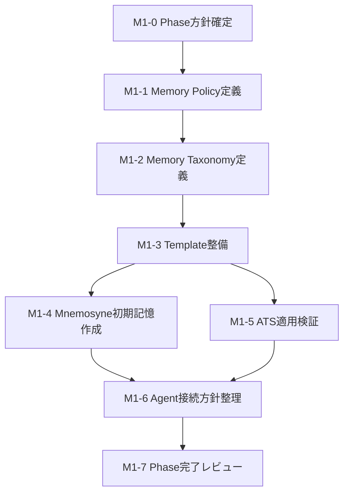
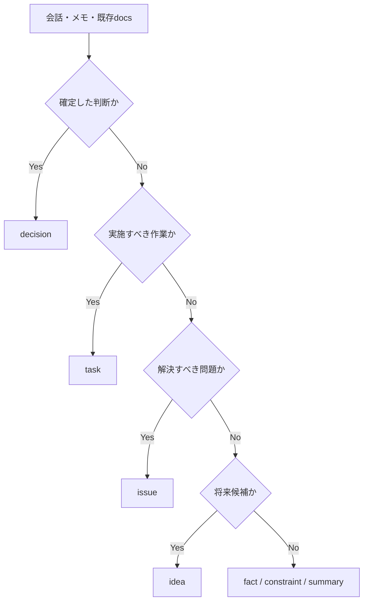
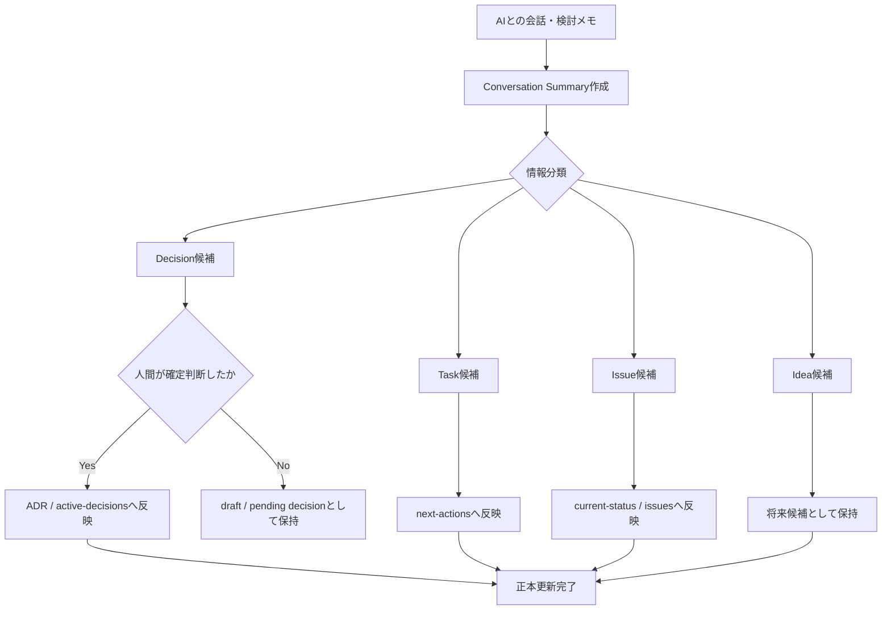

# Project Mnemosyne

## Phase 1：Memory Foundation 作業計画書ドラフト

### 副題：記憶の器を作る

---

## 0. 本計画書の位置づけ

本書は、**Project Mnemosyne の Phase 1 を実際に進めるための作業計画書**である。

従来の企画では、Phase 1 は以下の内容として定義されていた。

* `docs/memory` の作成
* `docs/adr` の整備
* Notion の Project / Task / Decision DB 作成
* 会話ログを要約し、Decision / Task に分解
* AI外部記憶の正本構造を作る

また、RAG、Memory API、MCP、自動更新は後続Phaseに回し、Phase 1 + Phase 2 を初期MVPとする方針であった。

今回、**汎用的な専門Agent × プロジェクト固有Context** という方向性が明確になったため、Phase 1では単にATS用の記憶を作るのではなく、将来複数プロジェクト・複数Agentから利用できるように、**記憶構造と運用ルールをプロジェクト非依存で定義する**。

---

# 1. Phase 1 概要

## 1.1 Phase名称

| 項目         | 内容                                      |
| ---------- | --------------------------------------- |
| Phase      | Phase 1                                 |
| 名称         | Memory Foundation                       |
| 副題         | 記憶の器を作る                                 |
| 主目的        | AIが参照する記憶の正本構造と、人間が管理できる更新ルールを定義する      |
| 実装レベル      | ドキュメント・運用設計中心                           |
| コード実装      | 原則なし                                    |
| 次Phaseとの接続 | Phase 2でContext Pack Builderを実装できる状態を作る |

---

## 1.2 Phase 1 の一言定義

```text
AIに何を渡すかを自動化する前に、
何を記憶として残し、何を正として扱うかを決めるフェーズ。
```

---

## 1.3 Phase 1 で解決する課題

| 課題                    | Phase 1での解決内容                                                  |
| --------------------- | -------------------------------------------------------------- |
| 会話ログに判断が埋もれる          | Decision / Task / Issue / Idea に分類するルールを定義                     |
| プロジェクトごとに情報構造がバラバラになる | 共通の `docs/memory` テンプレートを定義                                    |
| 古い方針をAIが拾う            | `active / draft / superseded / deprecated / archived` の状態管理を定義 |
| AIが勝手に更新すると危険         | AIはdraft作成まで、人間承認後に正本へ反映する方針をADR化                              |
| 将来Agentが何を読むべきか不明     | 記憶文書の役割と参照優先順位を定義                                              |
| Phase 2実装の入力がない       | Project Registry / Context Packに必要な情報構造を定義                     |

---

# 2. Phase 1 の設計判断

## 2.1 Phase 1 は「記憶の自動化」ではなく「記憶の標準化」

Phase 1で実装すべきものは、RAGやMCPではありません。

```text
Phase 1：
人間が見てもAIが見ても意味がぶれない記憶構造を作る

Phase 2：
その記憶構造からContext Packを生成する

Phase 3以降：
検索・API・MCP・Agent連携を自動化する
```

Phase 1の時点で自動化へ進むと、**何を正として検索・生成するのかが未定義のまま機能だけが増える**ため、後から整理コストが大きくなります。

---

## 2.2 対象は「Mnemosyne本体」と「検証用プロジェクト1件」

Phase 1では、以下の二つを扱う構成を推奨します。

| 対象                | 役割                    |
| ----------------- | --------------------- |
| Project Mnemosyne | 記憶基盤そのものの設計対象         |
| ATS               | 実際のプロジェクト情報を当てはめる検証対象 |

理由は、Mnemosyneだけで設計すると抽象論で終わる一方、ATSだけで作るとATS専用構造に寄りやすいためです。

```text
共通構造の定義：Mnemosyne
実用性の検証：ATS
```

なお、TapLog、note発信、動画制作については、Phase 1では対象外とし、**テンプレートが適用できるかを確認する将来対象**として扱います。

---

## 2.3 Notion DB は「必須成果物」から「任意成果物」へ下げることを推奨

従来企画では、Phase 1に Notion の Project / Task / Decision DB 作成が含まれていました。

ただし、今回の目的が**作業計画と記憶構造の確立**であるなら、初回からNotionを必須にする必要性は低いです。

### 推奨方針

| 対象                     | Phase 1での扱い            |
| ---------------------- | ---------------------- |
| GitHub管理のMarkdown docs | 必須。設計・記憶の正本            |
| ADR                    | 必須。判断の正本               |
| Notion                 | 任意。運用ビューとして必要になった時点で作成 |
| PostgreSQL             | 対象外                    |
| pgvector / RAG         | 対象外                    |
| API / MCP              | 対象外                    |
| Agent実行                | 対象外                    |
| Context Pack CLI       | Phase 2対象              |

Phase 1では、Notionへ転記する前に、まずMarkdownだけで**情報分類と更新運用が成立するか**を確認すべきです。

---

# 3. Phase 1 の目的

## 3.1 主目的

```text
プロジェクトごとの文脈・判断・状態・次アクションを、
AIが再利用できる形で整理するための標準構造と運用ルールを定義する。
```

---

## 3.2 具体目的

| No.   | 目的                                                                            |
| ----- | ----------------------------------------------------------------------------- |
| P1-01 | Project Mnemosyneにおける記憶の正本・副本・一次メモの役割を定義する                                    |
| P1-02 | プロジェクトごとに共通利用できる `docs/memory` 構成を定義する                                        |
| P1-03 | Decision / Task / Issue / Idea / Fact の分類ルールを定義する                             |
| P1-04 | 情報の状態管理と優先順位ルールを定義する                                                          |
| P1-05 | AIによる参照・草案作成・反映承認の境界を定義する                                                     |
| P1-06 | ATSを使い、記憶テンプレートが実運用に耐えるか確認する                                                  |
| P1-07 | Phase 2でProject Registry / Agent Registry / Context Pack Builderを設計できる入力を準備する |

---

# 4. Phase 1 のスコープ

## 4.1 Phase 1 に含めるもの

| 分類          | 内容                                                                   |
| ----------- | -------------------------------------------------------------------- |
| 方針設計        | 正本・副本・参照優先順位・状態管理                                                    |
| 文書構造        | `docs/memory`、`docs/adr`、`docs/phases` の構成                           |
| テンプレート      | project-summary / current-status / active-decisions / next-actions 等 |
| ADR         | 記憶基盤に関する初期判断記録                                                       |
| 運用手順        | 会話から記憶へ変換する流れ                                                        |
| 検証          | ATSの既存情報をテンプレートに当てはめる                                                |
| Phase 2入力整理 | Project Registry / Agent Registryに必要な項目整理                            |

---

## 4.2 Phase 1 に含めないもの

| 対象外                         | 理由                       |
| --------------------------- | ------------------------ |
| Context Pack自動生成CLI         | Phase 2で実装する機能           |
| Agent Registry実装            | Phase 2でContext生成と合わせて扱う |
| Project Registry実装          | Phase 2で設定ファイル化する        |
| RAG / Embedding / Vector DB | 情報量が増えてから必要になる           |
| PostgreSQLによる記憶管理           | Phase 1ではMarkdownで十分検証可能 |
| MCP Server                  | Context取得方式が固まった後に実装すべき  |
| GitHub / Notion自動更新         | AIのdraft運用検証後に検討         |
| UI                          | CLIまたは手動運用を検証してから検討      |

---

# 5. Phase 1 の完了条件

## 5.1 Definition of Done

Phase 1は、以下をすべて満たした時点で完了とする。

| No.    | 完了条件                                                                                       |
| ------ | ------------------------------------------------------------------------------------------ |
| DoD-01 | `docs/memory` 配下の基本文書テンプレートが定義されている                                                        |
| DoD-02 | 記憶の正本・副本・一次メモの扱いが `memory-policy.md` に明文化されている                                             |
| DoD-03 | 情報種別と状態管理ルールが明文化されている                                                                      |
| DoD-04 | AIはdraftのみ作成し、正本反映は人間承認後とする方針がADR化されている                                                    |
| DoD-05 | Mnemosyne自身の `project-summary`、`current-status`、`active-decisions`、`next-actions` が記述済みである |
| DoD-06 | ATSを検証対象として、同じテンプレート構造で最低1セットの記憶文書が作成されている                                                 |
| DoD-07 | Phase 2で必要となるProject Registry / Agent Registryの入力項目が整理されている                                |
| DoD-08 | 「このプロジェクトについてAIに説明するには何を渡せばよいか」が文書のみで判断できる                                                 |
| DoD-09 | RAG、API、MCP、自動更新をPhase 1に持ち込んでいない                                                          |

---

# 6. 成果物一覧

## 6.1 必須成果物

### A. Phase管理文書

| ファイル                                       | 目的                          |
| ------------------------------------------ | --------------------------- |
| `docs/phases/phase-1-memory-foundation.md` | 本Phaseの目的・タスク・完了条件を管理する正本文書 |

---

### B. 記憶基盤の共通方針文書

| ファイル                                     | 目的                                           |
| ---------------------------------------- | -------------------------------------------- |
| `docs/memory/memory-policy.md`           | 記憶として残す情報、正本・副本、状態管理、AI更新ルールを定義              |
| `docs/memory/memory-taxonomy.md`         | Decision / Task / Issue / Idea / Fact 等の分類定義 |
| `docs/memory/memory-update-flow.md`      | 会話やメモを正本へ変換する更新手順                            |
| `docs/memory/context-source-priority.md` | 情報が矛盾した場合の参照優先順位を定義                          |

従来企画では `memory-policy.md` が想定されていましたが、実作業では分類ルール・更新手順・参照優先順位を分離しておく方が運用しやすいため、成果物を追加することを推奨します。

---

### C. プロジェクト記憶テンプレート

| ファイル                                                     | 目的                    |
| -------------------------------------------------------- | --------------------- |
| `docs/templates/memory/project-summary.template.md`      | プロジェクトの不変に近い概要を記録     |
| `docs/templates/memory/current-status.template.md`       | 現在地・進行中事項・ブロッカーを記録    |
| `docs/templates/memory/active-decisions.template.md`     | 現在有効な判断を一覧化           |
| `docs/templates/memory/next-actions.template.md`         | 直近の作業候補と優先順位を記録       |
| `docs/templates/memory/ai-entrypoint.template.md`        | AIが最初に読むべき情報と利用ルールを記録 |
| `docs/templates/memory/conversation-summary.template.md` | 会話内容を再利用可能な形に整理       |

---

### D. Mnemosyne自身の初期記憶文書

| ファイル                                                 | 目的            |
| ---------------------------------------------------- | ------------- |
| `docs/projects/mnemosyne/memory/project-summary.md`  | Mnemosyneの概要  |
| `docs/projects/mnemosyne/memory/current-status.md`   | Mnemosyneの現在地 |
| `docs/projects/mnemosyne/memory/active-decisions.md` | 採用済みの設計判断     |
| `docs/projects/mnemosyne/memory/next-actions.md`     | 次に進める作業       |
| `docs/projects/mnemosyne/memory/ai-entrypoint.md`    | AI参照時の入口      |

---

### E. ATSによる検証用記憶文書

| ファイル                                           | 目的                |
| ---------------------------------------------- | ----------------- |
| `docs/projects/ats/memory/project-summary.md`  | ATSを外部プロジェクトとして記録 |
| `docs/projects/ats/memory/current-status.md`   | ATSの現状を記録         |
| `docs/projects/ats/memory/active-decisions.md` | ATSの主要設計判断を記録     |
| `docs/projects/ats/memory/next-actions.md`     | ATSの次アクションを記録     |
| `docs/projects/ats/memory/ai-entrypoint.md`    | ATSに対するAI利用入口     |

---

### F. ADR

| ファイル                                                      | 判断内容                                          |
| --------------------------------------------------------- | --------------------------------------------- |
| `docs/adr/ADR-001-docs-as-source-of-memory.md`            | Markdown docs を記憶構造の正本とする                     |
| `docs/adr/ADR-002-memory-source-of-truth-boundary.md`     | docs / ADR / Notion / DB / Context Pack の責務境界 |
| `docs/adr/ADR-003-human-approved-memory-update.md`        | AIはdraftまで、正本更新は人間承認後とする                      |
| `docs/adr/ADR-004-project-independent-memory-template.md` | プロジェクト横断で同一テンプレートを利用する                        |
| `docs/adr/ADR-005-agent-context-separation.md`            | 専門AgentとProject Contextを分離する方針を採用する           |

`ADR-005` は、今回明確になった「汎用的な専門Agent × プロジェクトContext」という設計方針を、後続Phaseへ確実に引き渡すための追加成果物です。

---

## 6.2 任意成果物

| ファイル / 機能          | 扱い                        |
| ------------------ | ------------------------- |
| Notion Project DB  | Phase 1後半で必要性が見えた場合のみ作成   |
| Notion Decision DB | Markdown運用で不足する場合のみ作成     |
| Notion Task DB     | ATS等の既存タスク管理と重複しないか確認後に作成 |
| README更新           | リポジトリを実際に作成する場合に追加        |

---

# 7. 推奨ディレクトリ構成

```text
project-mnemosyne/
  README.md

  docs/
    project-plan.md
    architecture.md
    roadmap.md

    phases/
      phase-1-memory-foundation.md
      phase-2-context-forge.md

    adr/
      ADR-001-docs-as-source-of-memory.md
      ADR-002-memory-source-of-truth-boundary.md
      ADR-003-human-approved-memory-update.md
      ADR-004-project-independent-memory-template.md
      ADR-005-agent-context-separation.md

    memory/
      memory-policy.md
      memory-taxonomy.md
      memory-update-flow.md
      context-source-priority.md

    templates/
      memory/
        project-summary.template.md
        current-status.template.md
        active-decisions.template.md
        next-actions.template.md
        ai-entrypoint.template.md
        conversation-summary.template.md

    projects/
      mnemosyne/
        memory/
          project-summary.md
          current-status.md
          active-decisions.md
          next-actions.md
          ai-entrypoint.md

      ats/
        memory/
          project-summary.md
          current-status.md
          active-decisions.md
          next-actions.md
          ai-entrypoint.md
```

## 7.1 従来案からの変更点

従来案では、各プロジェクトリポジトリ内に `docs/memory` を置くイメージでした。

今回のPhase 1では、まずMnemosyne側に検証用として、

```text
docs/projects/{project_code}/memory/
```

を置く案を推奨します。

### 理由

| 観点        | Mnemosyne側に集約する利点            |
| --------- | ---------------------------- |
| 検証の容易さ    | テンプレート変更と記憶文書を同一リポジトリで比較できる  |
| ATSへの影響   | 開発中のATSリポジトリに試験的文書を持ち込まずに済む  |
| 横断設計      | 複数プロジェクト共通構造を確認しやすい          |
| Phase 2接続 | Project Registryの入力構造を検討しやすい |

### 将来の選択肢

Phase 2以降で、正本配置を以下のどちらにするか改めて判断します。

```text
案A：Mnemosyneで全プロジェクト記憶を集中管理
案B：各プロジェクトのdocs/memoryを正本とし、Mnemosyneは参照・集約する
```

これはPhase 1で断定せず、ADRの検討事項として残して構いません。

---

# 8. マイルストーン

## 8.1 マイルストーン一覧

| Milestone | 名称                | 目的                | 主成果物                                              | 完了判断                           |
| --------- | ----------------- | ----------------- | ------------------------------------------------- | ------------------------------ |
| M1-0      | Phase方針確定         | Phase 1の境界を固定する   | `phase-1-memory-foundation.md`                    | 対象・対象外・DoDが確定                  |
| M1-1      | Memory Policy定義   | 正本・副本・更新権限を定義     | `memory-policy.md`、ADR-001〜003                    | 記憶管理ルールが説明可能                   |
| M1-2      | Memory Taxonomy定義 | 記憶の分類と状態を標準化      | `memory-taxonomy.md`、`context-source-priority.md` | 会話内容を分類できる                     |
| M1-3      | Template整備        | 複数プロジェクト共通の書式を作る  | `docs/templates/memory/*`                         | 新規プロジェクトへ適用可能                  |
| M1-4      | Mnemosyne初期記憶作成   | 基盤自身の状態を記録        | `docs/projects/mnemosyne/memory/*`                | 自プロジェクト説明が再利用可能                |
| M1-5      | ATS適用検証           | 実プロジェクトでテンプレートを検証 | `docs/projects/ats/memory/*`                      | ATS文脈をテンプレートで再構築可能             |
| M1-6      | Agent接続方針整理       | Phase 2の入力を準備     | ADR-004〜005、Phase 2引継ぎメモ                          | Agent × Project Context設計に接続可能 |
| M1-7      | Phase完了レビュー       | Phase 2着手可否を判断    | レビュー記録、残課題一覧                                      | DoD達成を確認                       |

---

## 8.2 マイルストーン依存関係



---

# 9. 詳細作業手順

## M1-0：Phase方針確定

### 目的

Phase 1の実施範囲が拡大し続けないように、先に境界と完了条件を固定する。

### 入力

* Project Mnemosyne企画書
* 今回整理した「専門Agent × Project Context」の考え方
* ATSを優先したいという既存方針

### 実施内容

| 手順 | 作業内容                                                  |
| -- | ----------------------------------------------------- |
| 1  | Phase 1の目的を「記憶構造と運用ルールの定義」に固定する                       |
| 2  | RAG / API / MCP / UI / Agent実装を対象外として明記する             |
| 3  | 検証対象を Mnemosyne + ATS に限定する                           |
| 4  | Notionを必須から任意へ変更するかを決定する                              |
| 5  | Definition of Doneを確定する                               |
| 6  | `docs/phases/phase-1-memory-foundation.md` を正本として作成する |

### 成果物

```text
docs/phases/phase-1-memory-foundation.md
```

### 完了条件

* Phase 1で何を作るかが一覧化されている
* Phase 1で作らないものが明記されている
* ATS開発への影響を最小限にする前提が記載されている

---

## M1-1：Memory Policy定義

### 目的

どの情報をどこに残し、どれを正として扱うのかを明確にする。

### 実施内容

#### 1. 正本・副本・一次メモを定義する

| 情報種別          | Phase 1での役割           | 正本性        |
| ------------- | --------------------- | ---------- |
| Markdown docs | プロジェクト概要・状態・判断・タスクの記録 | 正本         |
| ADR           | 重要設計判断と理由の記録          | 正本         |
| AIチャット履歴      | 考察・相談・未整理情報           | 一次メモ       |
| Context Pack  | AIへ渡す加工済み文脈           | 生成物        |
| Notion        | 可視化・一覧管理              | 任意の副本      |
| PostgreSQL    | 将来の構造化状態管理            | Phase 1対象外 |
| Vector Store  | 将来の検索用副本              | Phase 1対象外 |

この「正本・副本」思想は、従来企画でも `GitHub docs / ADR / PostgreSQL` を正本、`Notion / Vector Store / Context Pack` を副本・生成物として整理していました。

#### 2. AIの更新権限を定義する

```text
read:
  AIは正本文書を参照してよい

draft:
  AIは新規文書案・修正案・差分案を作成してよい

write:
  人間が確認・承認した後に正本へ反映する

delete:
  原則としてAIに実行させない
```

#### 3. 情報の鮮度ルールを定義する

| 状態           | 意味         | AI参照時の扱い    |
| ------------ | ---------- | ----------- |
| `draft`      | 検討中        | 確定事項として扱わない |
| `active`     | 現在有効       | 優先的に参照      |
| `superseded` | 新しい判断に置換済み | 履歴としてのみ参照   |
| `deprecated` | 非推奨・古い情報   | 原則根拠に使わない   |
| `archived`   | 完了・保管済み    | 必要時のみ参照     |

### 成果物

```text
docs/memory/memory-policy.md
docs/adr/ADR-001-docs-as-source-of-memory.md
docs/adr/ADR-002-memory-source-of-truth-boundary.md
docs/adr/ADR-003-human-approved-memory-update.md
```

### 完了条件

* 「どれが正しい情報か」を迷わず判断できる
* AIに許可する操作範囲が明文化されている
* 古い情報と現在有効な情報の区別方法が定義されている

---

## M1-2：Memory Taxonomy定義

### 目的

会話やメモを、再利用可能な情報単位に変換するための分類ルールを作る。

### 情報分類案

| memory_type            | 内容          | 例                            |
| ---------------------- | ----------- | ---------------------------- |
| `fact`                 | 事実・前提       | ATSはLINE Botで動作する            |
| `decision`             | 採用済み判断      | docsを設計の正とする                 |
| `task`                 | 実行すべき作業     | Phase 2でContext Builderを実装する |
| `issue`                | 未解決の問題      | プロジェクト記憶を集中管理するか未決定          |
| `idea`                 | 将来候補        | UIでContext Previewを表示する      |
| `constraint`           | 制約          | AIは正本へ直接writeしない             |
| `conversation_summary` | 会話を要約した入力記録 | Agent設計に関する議論要約              |
| `test_result`          | 検証結果        | ATSテンプレート適用結果                |

企画段階のデータ設計でも、`fact / decision / task / preference / constraint / issue / idea / article_note / conversation_summary / test_result` といった分類案が示されていました。

### 分類判断フロー



### 参照優先順位

矛盾する情報が存在する場合は、以下の順序で扱う。

```text
1. Accepted / Active な ADR
2. memory-policy / active-decisions
3. current-status
4. プロジェクト固有の設計docs
5. review memo
6. conversation summary
7. 生のAIチャット履歴
```

### 成果物

```text
docs/memory/memory-taxonomy.md
docs/memory/context-source-priority.md
```

### 完了条件

* 任意の会話内容をどの分類に置くか判断できる
* 仮説をDecisionとして誤登録しないルールがある
* 古い会話ログよりADRを優先するルールが明文化されている

---

## M1-3：Template整備

### 目的

Mnemosyne、ATS、TapLog、note発信など、異なる対象へ同一構造を適用できるようにする。

---

### 1. `project-summary.template.md`

#### 役割

プロジェクトの概要や根本目的など、頻繁には変わらない情報を保持する。

#### 記載項目

```md
# Project Summary

## Project Metadata
- project_code:
- project_name:
- status:
- project_type:

## Purpose

## Background

## Target Users / Stakeholders

## Core Concepts

## Scope

## Out of Scope

## Source of Truth

## Related Projects
```

---

### 2. `current-status.template.md`

#### 役割

そのプロジェクトの現在地をAIに短時間で把握させる。

#### 記載項目

```md
# Current Status

## Status Metadata
- updated_at:
- status:
- current_phase:

## Current Objective

## Completed Recently

## In Progress

## Blockers / Issues

## Pending Decisions

## Next Review Point
```

---

### 3. `active-decisions.template.md`

#### 役割

現在有効な判断だけを一覧化し、古い会話情報との衝突を防ぐ。

#### 記載項目

```md
# Active Decisions

| ID | Decision | Reason | Source ADR | Status | Updated At |
|---|---|---|---|---|---|

## Superseded Decisions

| ID | Old Decision | Replaced By | Note |
|---|---|---|---|
```

---

### 4. `next-actions.template.md`

#### 役割

プロジェクトの直近行動をAIが誤解なく扱えるようにする。

#### 記載項目

```md
# Next Actions

## Priority Definition

| Priority | Meaning |
|---|---|
| P0 | 次に必ず実施 |
| P1 | P0完了後に実施 |
| P2 | 必要性を確認して実施 |
| Later | 将来候補 |

## Active Tasks

| Priority | Task | Purpose | Input | Output | Completion Criteria | Status |
|---|---|---|---|---|---|---|

## Deferred Tasks

## Not Doing Now
```

---

### 5. `ai-entrypoint.template.md`

#### 役割

AIがそのプロジェクトについて支援する際の入口になる。

#### 記載項目

```md
# AI Entrypoint

## What This Project Is

## What the AI Should Read First

1. project-summary.md
2. current-status.md
3. active-decisions.md
4. next-actions.md

## Important Constraints

## Available Document Sources

## Rules for Drafting Changes

## Known Risks of Misinterpretation
```

---

### 6. `conversation-summary.template.md`

#### 役割

チャットをそのまま残すのではなく、再利用可能な記憶候補へ変換する。

#### 記載項目

```md
# Conversation Summary

## Metadata
- date:
- related_project:
- topic:
- source:

## Discussion Summary

## Confirmed Decisions

## Candidate Decisions

## New Tasks

## Issues / Open Questions

## Ideas for Later

## Docs to Update

## Review Status
- draft / reviewed / reflected / archived
```

---

### 成果物

```text
docs/templates/memory/project-summary.template.md
docs/templates/memory/current-status.template.md
docs/templates/memory/active-decisions.template.md
docs/templates/memory/next-actions.template.md
docs/templates/memory/ai-entrypoint.template.md
docs/templates/memory/conversation-summary.template.md
```

### 完了条件

* 新しいプロジェクトを追加する際に、テンプレートをコピーして初期記憶を作成できる
* ATSとMnemosyneの両方に適用できる
* Phase 2で機械的に読み込める一定の章構成になっている

---

## M1-4：Mnemosyne初期記憶作成

### 目的

Project Mnemosyne自身を、設計した記憶構造の最初の利用対象とする。

### 実施内容

| 文書                    | 記載すべき内容                                         |
| --------------------- | ----------------------------------------------- |
| `project-summary.md`  | 外部記憶基盤の目的、背景、対象範囲、Phase構成                       |
| `current-status.md`   | 企画段階からPhase 1作業計画へ移行したこと                        |
| `active-decisions.md` | docs正本、AI draft only、専門AgentとProject Contextの分離 |
| `next-actions.md`     | Phase 1マイルストーンと着手順                              |
| `ai-entrypoint.md`    | AIがMnemosyne相談時に読むべき文書と参照ルール                    |

### 特に記録すべきActive Decision

| Decision ID | 内容                             |
| ----------- | ------------------------------ |
| MD-001      | Mnemosyneは複数プロジェクト向けの外部記憶基盤である |
| MD-002      | Phase 1では自動化より先に記憶構造を定義する      |
| MD-003      | Markdown docs と ADR を初期の正本とする  |
| MD-004      | AIは更新草案を作成できるが、正本反映は人間承認後とする   |
| MD-005      | 専門Agent定義とProject Contextを分離する |
| MD-006      | Phase 1の検証対象としてATSを使用する        |

### 成果物

```text
docs/projects/mnemosyne/memory/project-summary.md
docs/projects/mnemosyne/memory/current-status.md
docs/projects/mnemosyne/memory/active-decisions.md
docs/projects/mnemosyne/memory/next-actions.md
docs/projects/mnemosyne/memory/ai-entrypoint.md
```

### 完了条件

* 新しいチャットで上記文書を提示すれば、Mnemosyneの現在地を再説明せずに相談開始できる
* Phase 1の未完了タスクが `next-actions.md` で把握できる

---

## M1-5：ATS適用検証

### 目的

テンプレートが抽象論ではなく、実際の複雑なプロジェクトへ適用可能か検証する。

### 対象とするATS情報

| 分類               | ATSでの具体例                                     |
| ---------------- | -------------------------------------------- |
| Project Summary  | 家庭内ポイント制度をLINE Botとして実装するアプリ                 |
| Current Status   | MVP実装・責務整理・ドキュメント整備の進捗                       |
| Active Decisions | PostgreSQL正本、Notion副本、docs設計正本、UseCase境界、冪等性 |
| Next Actions     | 実装・テスト・docs更新の優先タスク                          |
| AI Entrypoint    | ATS相談時に参照すべき設計文書一覧                           |

### 実施手順

| 手順 | 内容                                              |
| -- | ----------------------------------------------- |
| 1  | ATSの既存企画・設計判断・現在タスクを抽出する                        |
| 2  | Templateに従って5つのmemory文書へ整理する                    |
| 3  | 曖昧な内容を `decision` にせず、`issue` または `idea` として分ける |
| 4  | 同一内容が複数docsに存在する場合、正本候補を記録する                    |
| 5  | AIにATSの質問を行う際、memory文書だけで十分かを確認する               |
| 6  | 不足情報があればテンプレート側を改訂する                            |

### 検証シナリオ例

| No.  | AIへ確認する質問                 | 確認観点                                    |
| ---- | ------------------------- | --------------------------------------- |
| T-01 | ATSの現在のMVPスコープを整理して       | project-summary / current-status で回答可能か |
| T-02 | action_selectの重要な設計判断は何か  | active-decisions が十分か                   |
| T-03 | 次に進めるべき作業は何か              | next-actions が有効か                       |
| T-04 | 古い案と現在の判断が競合した場合どう扱うか     | status / priority ルールが機能するか             |
| T-05 | 実装レビューAgentに渡すべき追加docsは何か | Phase 2のContext設計へ接続できるか                |

### 成果物

```text
docs/projects/ats/memory/project-summary.md
docs/projects/ats/memory/current-status.md
docs/projects/ats/memory/active-decisions.md
docs/projects/ats/memory/next-actions.md
docs/projects/ats/memory/ai-entrypoint.md
docs/review/phase-1-ats-template-validation.md
```

### 完了条件

* ATSの重要な前提・現在地・判断・次アクションを5文書で再現できる
* テンプレートの不足や過剰項目が洗い出されている
* Phase 2で必要となるContext取得項目が整理できる

---

## M1-6：Agent接続方針整理

### 目的

Phase 1で作った記憶構造を、将来の汎用的な専門Agentへ接続できるようにする。

### Phase 1で決めること

ここではAgentを実装しません。
ただし、**Agentがどの記憶を必要とするかを整理する**ところまでは実施します。

### Agent利用マッピング案

| Agent種別     | 必須参照文書                                              | 任意参照文書                            | Phase 2以降の用途 |
| ----------- | --------------------------------------------------- | --------------------------------- | ------------ |
| ADR整理Agent  | project-summary / active-decisions / ADR            | current-status / related docs     | ADR草案作成      |
| 実装レビューAgent | project-summary / current-status / active-decisions | architecture / source / test docs | レビュー報告       |
| 要件定義Agent   | project-summary / current-status / next-actions     | issues / ideas                    | 要件文書作成       |
| タスク分解Agent  | current-status / next-actions / active-decisions    | roadmap                           | 作業計画作成       |
| 記事化Agent    | project-summary / conversation summaries            | decisions / development logs      | note記事草案     |

### Phase 2へ渡すべき設計入力

| 入力項目                   | 内容                                       |
| ---------------------- | ---------------------------------------- |
| `project_code`         | `mnemosyne`、`ats` 等                      |
| `project_name`         | 表示名称                                     |
| `memory_root`          | 記憶文書の保存先                                 |
| `required_memory_docs` | 常時読み込む文書                                 |
| `optional_sources`     | タスクに応じて追加するdocs                          |
| `agent_code`           | `adr_writer`、`implementation_reviewer` 等 |
| `context_requirements` | Agentごとの必須文脈                             |
| `output_type`          | ADR、レビュー、記事、タスクリスト等                      |
| `write_policy`         | draftのみ等                                 |

### 成果物

```text
docs/adr/ADR-004-project-independent-memory-template.md
docs/adr/ADR-005-agent-context-separation.md
docs/phases/phase-2-input-requirements.md
```

### 完了条件

* AgentとProject Contextを分離する理由がADRとして残っている
* Phase 2で `projects.yaml` と `agents.yaml` を設計できる材料が揃っている
* Phase 1の文書構造がAgent利用に不足しないことを確認できている

---

## M1-7：Phase完了レビュー

### 目的

Phase 1を終了してPhase 2へ進める状態かを確認する。

### レビューチェックリスト

| No.  | 確認項目                                      | 判定  |
| ---- | ----------------------------------------- | --- |
| R-01 | Phase 1の目的・対象外・完了条件が文書化されている              | 未確認 |
| R-02 | memory-policy が作成されている                    | 未確認 |
| R-03 | memory-taxonomy が作成されている                  | 未確認 |
| R-04 | context-source-priority が作成されている          | 未確認 |
| R-05 | memory用テンプレートが6種類作成されている                  | 未確認 |
| R-06 | Mnemosyneの初期記憶文書が作成されている                  | 未確認 |
| R-07 | ATSの検証用記憶文書が作成されている                       | 未確認 |
| R-08 | ADR-001〜005が作成されている                       | 未確認 |
| R-09 | ATS適用検証結果が記録されている                         | 未確認 |
| R-10 | Phase 2の入力要件が整理されている                      | 未確認 |
| R-11 | Notion / DB / RAG / API / MCPへ不必要に着手していない | 未確認 |

### Phase 2着手判断

| 判定             | 条件                             |
| -------------- | ------------------------------ |
| Go             | DoDを満たし、ATS検証で致命的な構造不足がない      |
| Conditional Go | 一部テンプレート修正をPhase 2初期で実施する前提で進む |
| No Go          | 正本ルール、分類、更新運用が固まっていない          |

---

# 10. 作業順序とタスク管理表

## 10.1 実施順

| 順番 | タスク                      | 優先度 | 成果物                                               | 前提   |
| -: | ------------------------ | --- | ------------------------------------------------- | ---- |
|  1 | Phase 1計画書を確定する          | P0  | `phase-1-memory-foundation.md`                    | なし   |
|  2 | Memory Policyを定義する       | P0  | `memory-policy.md`、ADR-001〜003                    | 1    |
|  3 | Taxonomyと参照優先順位を定義する     | P0  | `memory-taxonomy.md`、`context-source-priority.md` | 2    |
|  4 | Memoryテンプレートを作成する        | P0  | templates 6文書                                     | 2, 3 |
|  5 | Mnemosyneの初期記憶を作成する      | P0  | Mnemosyne memory 5文書                              | 4    |
|  6 | ATSの初期記憶を作成する            | P1  | ATS memory 5文書                                    | 4    |
|  7 | ATSでテンプレート検証を行う          | P1  | validation report                                 | 6    |
|  8 | Agent Context分離方針をADR化する | P1  | ADR-004〜005                                       | 5, 7 |
|  9 | Phase 2入力要件を整理する         | P1  | `phase-2-input-requirements.md`                   | 8    |
| 10 | Phase 1完了レビューを行う         | P0  | review result                                     | 全タスク |

---

## 10.2 作業チケット案

| Ticket ID | タイトル               | 内容                   | 完了条件          |
| --------- | ------------------ | -------------------- | ------------- |
| P1-T01    | Phase 1正本文書作成      | 本計画をdocs化            | 目的・スコープ・DoD確定 |
| P1-T02    | Memory Policy作成    | 正本・副本・AI権限定義         | ADRとの整合確認     |
| P1-T03    | Taxonomy作成         | 記憶分類・状態ルール定義         | 会話分類可能        |
| P1-T04    | Source Priority定義  | 矛盾時の優先順位定義           | 判断ルールが明確      |
| P1-T05    | Template作成         | memory文書6種作成         | 複数project対応   |
| P1-T06    | Mnemosyne Memory作成 | 自プロジェクトへ適用           | 新規チャット再開可能    |
| P1-T07    | ATS Memory作成       | ATSへ適用               | 重要文脈を再現可能     |
| P1-T08    | ATS検証レビュー          | 不足項目確認               | 改善案記録         |
| P1-T09    | ADR-004〜005作成      | テンプレート共通化・Agent分離    | Phase 2方針確定   |
| P1-T10    | Phase 2入力要件作成      | Registry/Builder入力整理 | 実装検討可能        |
| P1-T11    | Phase 1完了判定        | DoD確認                | Go/No Go判定    |

---

# 11. 記憶更新の運用フロー

## 11.1 会話から正本へ反映する流れ



---

## 11.2 運用ルール

| ルール  | 内容                                           |
| ---- | -------------------------------------------- |
| U-01 | 生チャットログをそのまま正本にしない                           |
| U-02 | AIが提案した判断は、承認されるまで `draft` とする               |
| U-03 | 重要な設計判断はADRとして残す                             |
| U-04 | 現在有効な判断は `active-decisions.md` に一覧化する        |
| U-05 | 直近の作業は `next-actions.md` に整理する               |
| U-06 | 古い判断を削除せず `superseded` として履歴を残す              |
| U-07 | プロジェクトの状態が大きく変化したら `current-status.md` を更新する |
| U-08 | Context生成やAgent利用は、正本更新後の文書を入力とする            |

---

# 12. Phase 2 への引継ぎ事項

Phase 1完了後、Phase 2では **Context Forge** として以下を扱います。

## 12.1 Phase 2で実装するもの

| 項目               | 内容                             |
| ---------------- | ------------------------------ |
| Project Registry | プロジェクトコードと記憶文書保存先の管理           |
| Agent Registry   | 専門Agentごとの役割・必要Context・出力形式管理  |
| Context Builder  | Project × Agent × Task から文脈を集約 |
| Context Preview  | AIへ渡す情報を人間が確認できる形式で出力          |
| Context Pack生成   | ChatGPT / Cursor等へ渡すMarkdown生成 |

従来企画ではPhase 2を、`docs/memory` とADRを読み取り、Context Packを生成するフェーズとして想定していました。今回の追加設計により、Phase 2ではこれを **Project Contextだけでなく、Agent Contextとの組合せで生成する構造**へ発展させます。

---

## 12.2 Phase 1では決めず、Phase 2で決める論点

| 論点                      | Phase 1での扱い          |
| ----------------------- | -------------------- |
| `projects.yaml` の具体スキーマ | 必要項目だけ整理し、実装はPhase 2 |
| `agents.yaml` の具体スキーマ   | Agent利用マッピングまで整理     |
| Context Packの最終フォーマット   | 必要セクション候補のみ整理        |
| トークン上限への対処              | Phase 2で設計           |
| タスクに応じた関連docs自動選択       | Phase 3候補            |
| RAG導入タイミング              | 文書量増加後に再判断           |

---

# 13. リスクと対策

| リスク             | 内容                  | 対策                              |
| --------------- | ------------------- | ------------------------------- |
| 文書を増やしすぎる       | 記憶管理のための文書管理が負担になる  | Phase 1では必須文書を限定し、ATSで有効性を検証    |
| ATSに引っ張られすぎる    | 共通構造がATS専用になる       | Mnemosyne自身にも同じテンプレートを適用        |
| 抽象化しすぎる         | 実運用で役に立たない構造になる     | ATS検証を必須にする                     |
| Notionまで作り込み始める | 正本と副本が初期から混在する      | Phase 1はMarkdownを中心とし、Notionは任意 |
| Agent実装へ先走る     | 記憶構造が固まらないまま機能実装へ進む | Agentは要件整理のみ、実装はPhase 2以降       |
| 会話要約の更新が面倒になる   | 記録運用が続かない           | 全会話ではなく、判断・タスクが発生した会話のみ対象にする    |
| 古い情報が残る         | AIが過去方針を参照する        | status と superseded ルールを必須化     |

---

# 14. 推奨する最初の着手単位

Phase 1を一気に進めるのではなく、最初は以下の単位で着手するのが適切です。

## 最初の作業ブロック

```text
P1-T01：phase-1-memory-foundation.md の確定
P1-T02：memory-policy.md の作成
P1-T03：memory-taxonomy.md の作成
P1-T04：context-source-priority.md の作成
```

### この単位を先に行う理由

* テンプレート作成前に、記憶の扱い方を確定できる
* ATSへ適用する際の分類基準がぶれない
* Agent設計へ進む前に、AIへ渡す情報の品質基準を作れる
* Notionやコード実装に脱線しない

その後、以下の順に進めます。

```text
方針定義
  ↓
テンプレート作成
  ↓
Mnemosyneへ適用
  ↓
ATSへ適用・検証
  ↓
Agent接続方針整理
  ↓
Phase 2着手判断
```

---

# 15. 現時点での推奨判断

## 15.1 Phase 1 の方針

| 判断項目       | 推奨                                                          |
| ---------- | ----------------------------------------------------------- |
| Phase 1の中心 | 記憶構造・分類・更新ルールの標準化                                           |
| 初期正本       | Markdown docs + ADR                                         |
| 初期検証対象     | Mnemosyne + ATS                                             |
| Notion     | 必須から外し、必要性確認後に導入                                            |
| DB         | 導入しない                                                       |
| RAG / MCP  | 導入しない                                                       |
| Agent      | 実装せず、必要Contextだけ整理                                          |
| Phase 2接続  | Project Registry + Agent Registry + Context Pack Builderへ接続 |

---

## 15.2 Phase 1 の成果イメージ

Phase 1完了時には、次の状態になっていることを目指します。

```text
Project Mnemosyneについて相談するとき、
project-summary / current-status / active-decisions / next-actions を見せれば、
AIが現在地を正しく理解できる。

ATSについて相談するときも、
同じ構造の文書を見せれば、
ATS固有の文脈を復元できる。

そのうえでPhase 2では、
専門Agentとプロジェクトを選ぶだけで、
必要文脈を集めるContext Pack Builderを実装できる。
```

---

# 16. 保存用ファイル名の推奨

本内容を正式に保存する場合のファイル名は、以下を推奨します。

```text
docs/phases/phase-1-memory-foundation.md
```

次に作成するべき文書は以下です。

```text
docs/memory/memory-policy.md
docs/memory/memory-taxonomy.md
docs/memory/context-source-priority.md
```

この3文書が確定すれば、テンプレート作成とATS適用検証へ進めます。

---

## まとめ / Summary

**日本語：**
Phase 1は、RAGやMCP、Agent実装を始めるフェーズではなく、AIが参照する記憶の正本構造・分類・更新ルールを確定するフェーズとするのが適切です。まずMarkdown docsとADRを正本とし、Mnemosyne自身とATSを使ってテンプレートを検証します。Phase 1完了後に、Project Registry・Agent Registry・Context Pack Builderを扱うPhase 2へ進める構成が最も安全です。

**English:**
Phase 1 should not start with RAG, MCP, or agent implementation. It should define the source-of-truth documents, memory types, and update rules for AI context. Markdown documents and ADRs should be the first source of truth. Mnemosyne and ATS should be used to test the templates. After Phase 1, Phase 2 can build the Project Registry, Agent Registry, and Context Pack Builder.
